# DailyAssist

# 📚简介
本项目为Qt实现日历行程软件。
- 日历显示、增加/删除行程
- 增加删除定时任务，支持关机，重启，锁屏，注销等操作
- 支持动态多语言
- 支持切换布局
- 支持启动密码设置
- 支持开机自启动
- 动态切换效果

# 📦软件架构
- Qt 5.9 + msvc 2015
- Windows(x32, x64)/Linux(x32, x64) 
- 理论上Qt 5.6以上msvc编译器都支持

# 🛠️主要技术

| 模块                |     介绍                                                                          |
| -------------------|---------------------------------------------------------------------------------- |
| qss                   |     样式表，本程序所有窗体、控件的样式都由qss设计                                           |
| signal\slot                |     控件、窗体间通信，事件处理                                               |
| QThread              |     异步处理                                                                     |    
| iconfont      |     阿里巴巴矢量图标库，主要用于按钮及标签上图标等显示                                     |
| sqlite      |     存储数据库                                     |

# 🗺️软件展示

### 日历行程
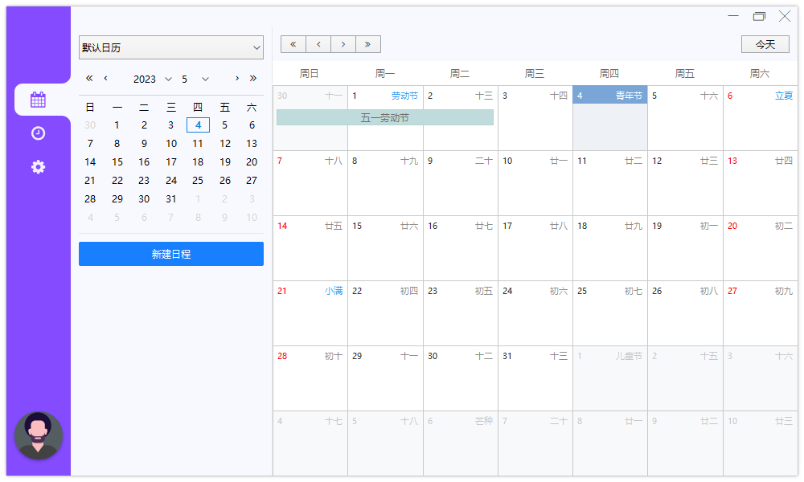

### 新建日程
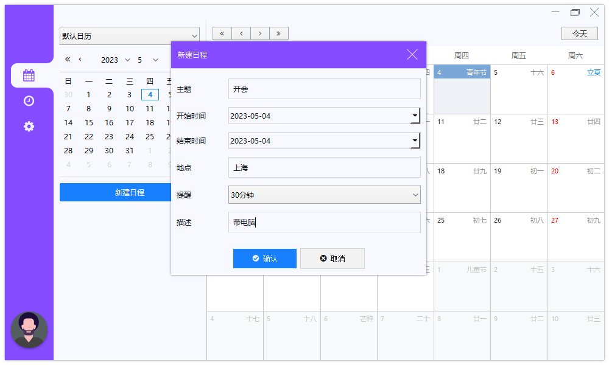

### 定时提醒
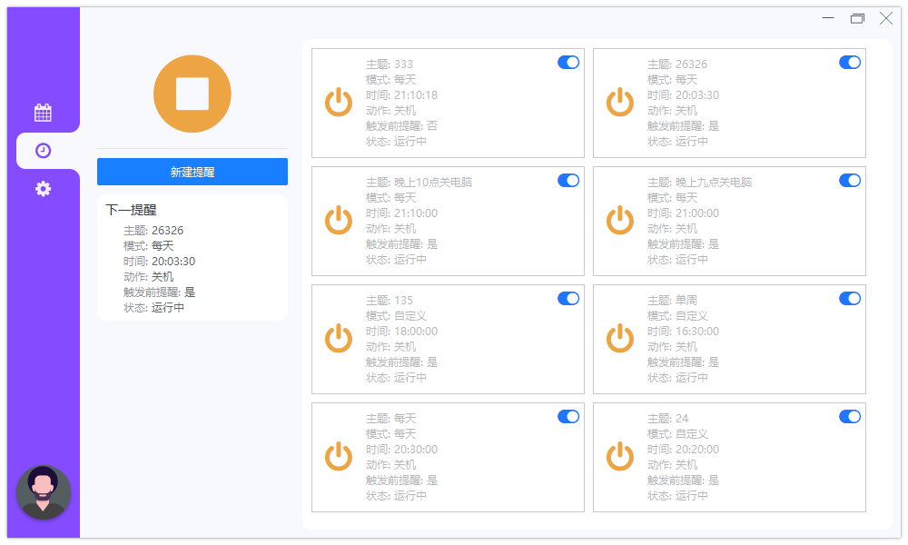

### 新建提醒
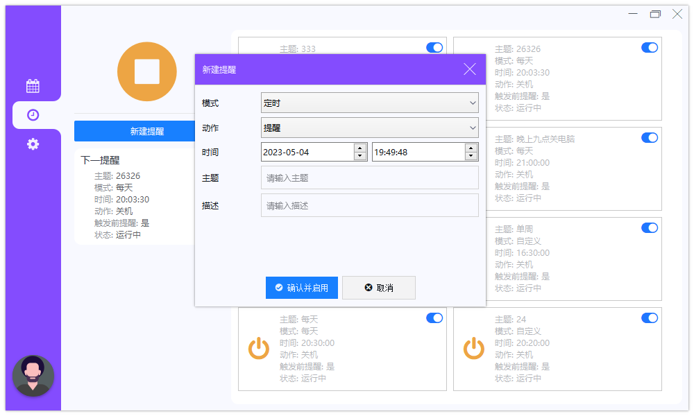

### 系统设置
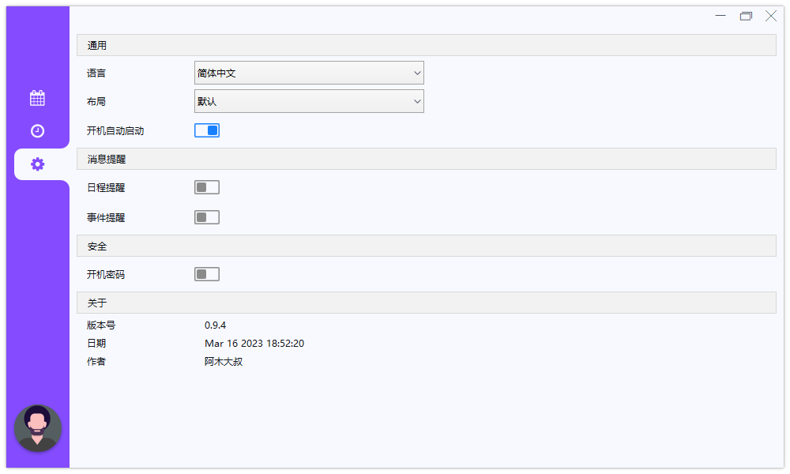

### 英文界面

### 布局2
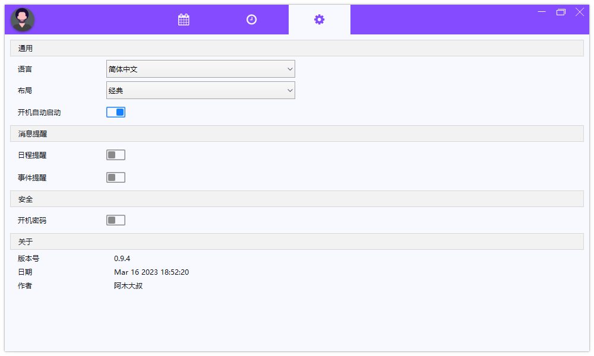

### 布局3
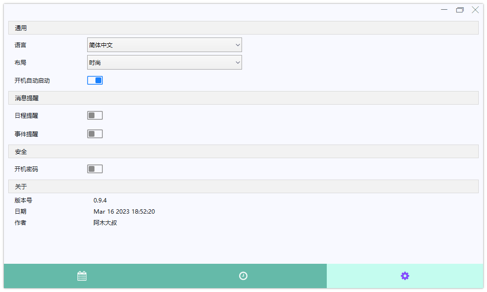

### 图形密码
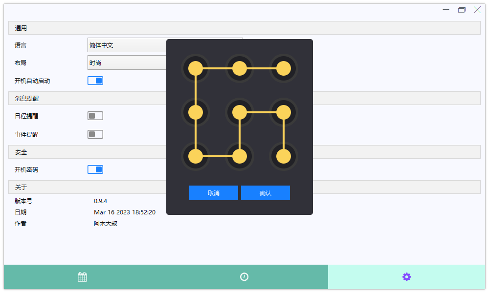

### 英文界面

### 日历行程
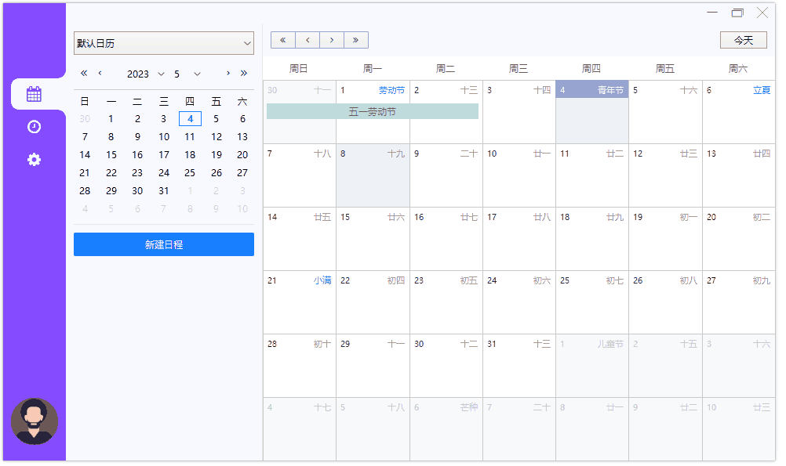

### 定时提醒
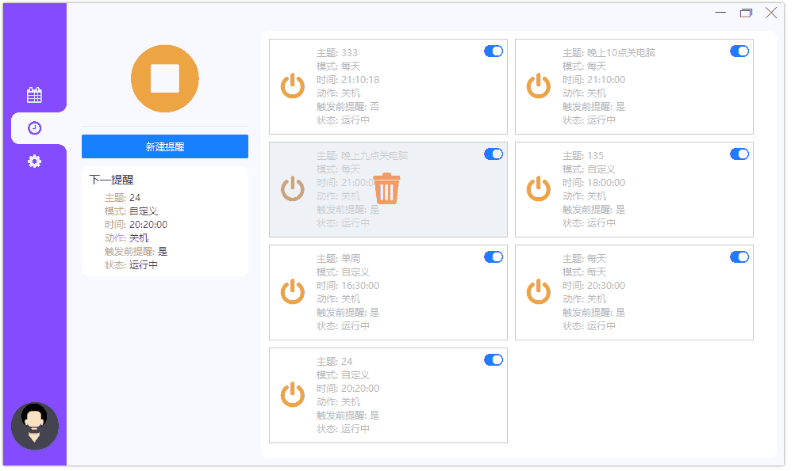

### 系统设置
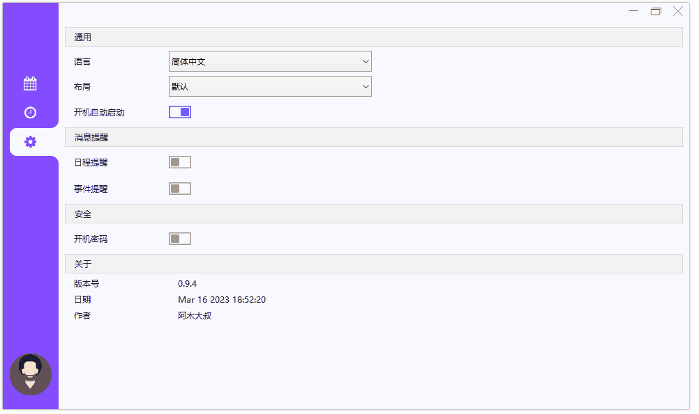

# 📝参考网址

#### [📗qt官网](https://doc.qt.io/)

# 📌CSDN

#### [🎉欢迎关注CSDN](https://blog.csdn.net/qq_25549309)

# 🧡Star

#### 如果你觉得项目用来学习不错，可以给项目点点star，谢谢。
