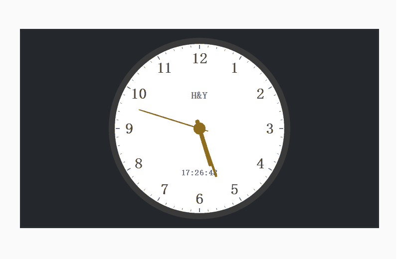

# CarCompass

# 📚简介
本项目为Qt实现汽车导航仪界面，目前还不太完善，持续更新中。。。

# 📦软件架构
- Qt 5.9 + msvc 2015
- Windows(x32, x64)/Linux(x32, x64) 
- 理论上Qt 5.6以上msvc编译器都支持

# 🛠️主要技术

| 模块                |     介绍                                                                          |
| -------------------|---------------------------------------------------------------------------------- |
| qss                   |     样式表，本程序所有窗体、控件的样式都由qss设计                                           |
| signal\slot                |     控件、窗体间通信，事件处理                                               |
| QThread              |     异步处理                                                                     |                                       |
| QPainter        |     部分窗口的绘制，例如实时天气界面                                          |
| iconfont      |     阿里巴巴矢量图标库，主要用于按钮及标签上图标等显示                                     |

# 🗺️软件截图

### 开机动画

### 语音输入

### 下拉菜单

### 电话

### 音乐

### 系统设置

### 屏幕保护

# 📝参考网址

#### [📗qt官网](https://doc.qt.io/)

# 📌CSDN

#### [🎉欢迎关注CSDN](https://blog.csdn.net/qq_25549309)

# 🧡Star

#### 如果你觉得项目用来学习不错，可以给项目点点star，谢谢。