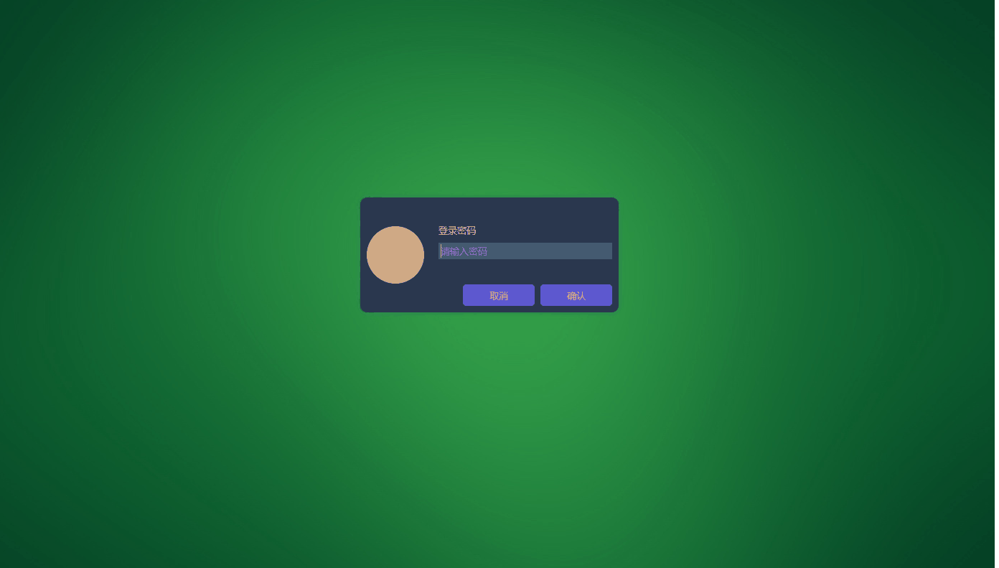
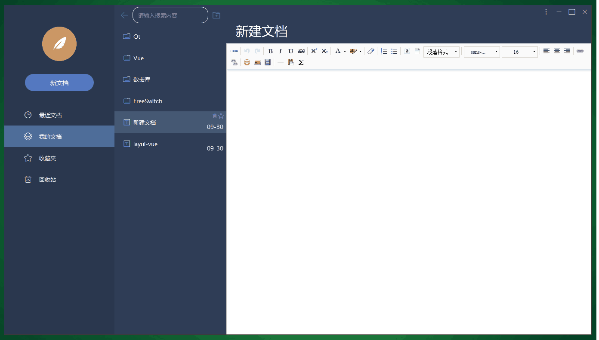
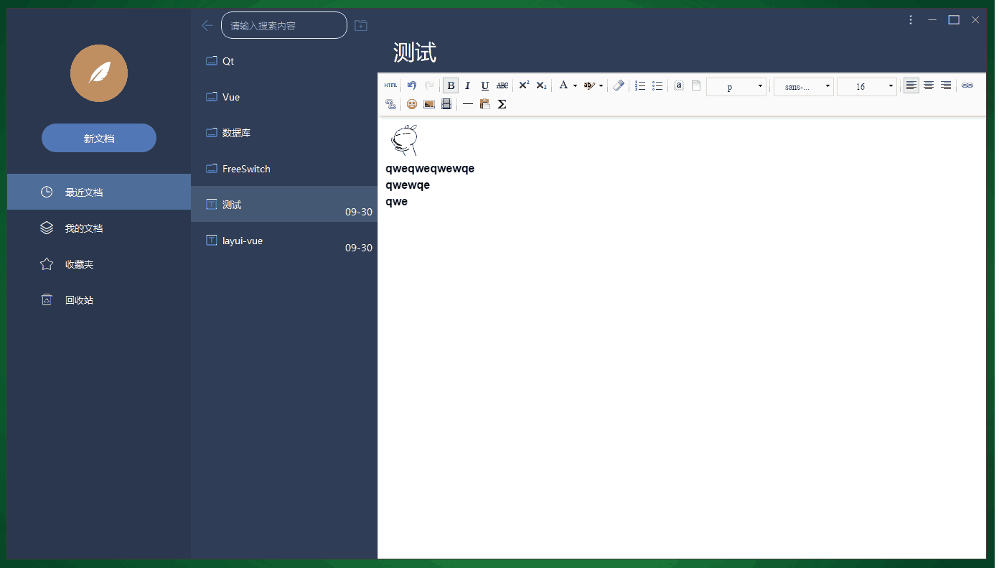
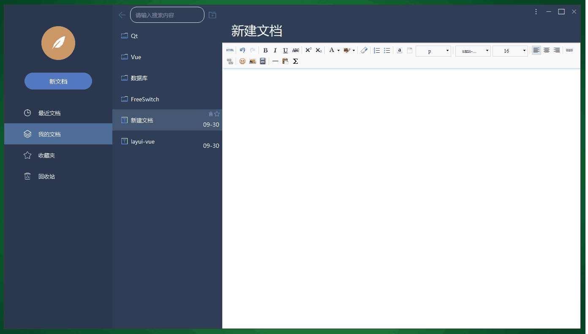
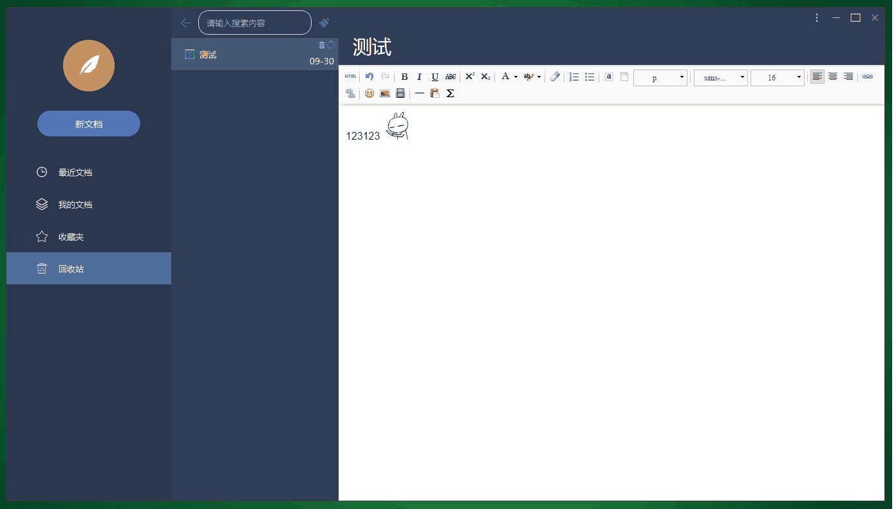
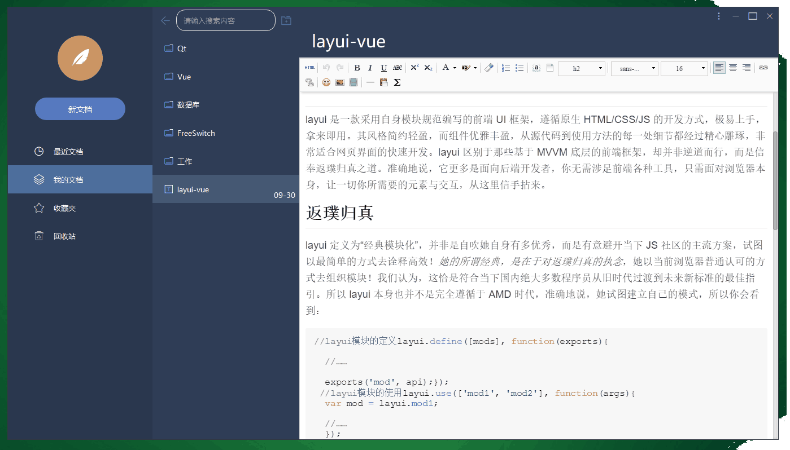
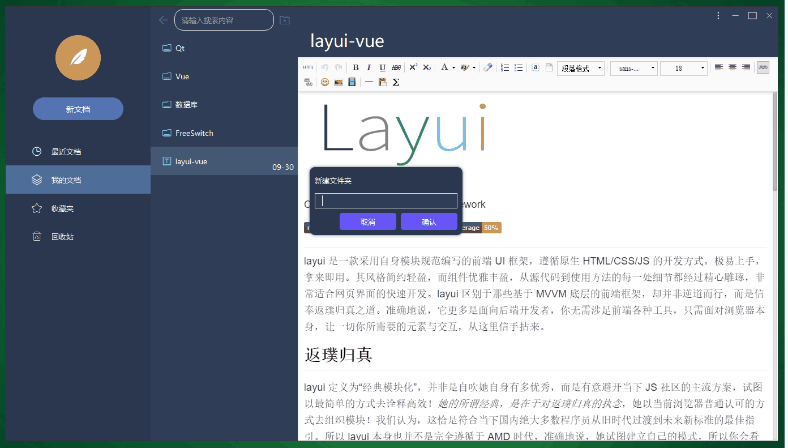
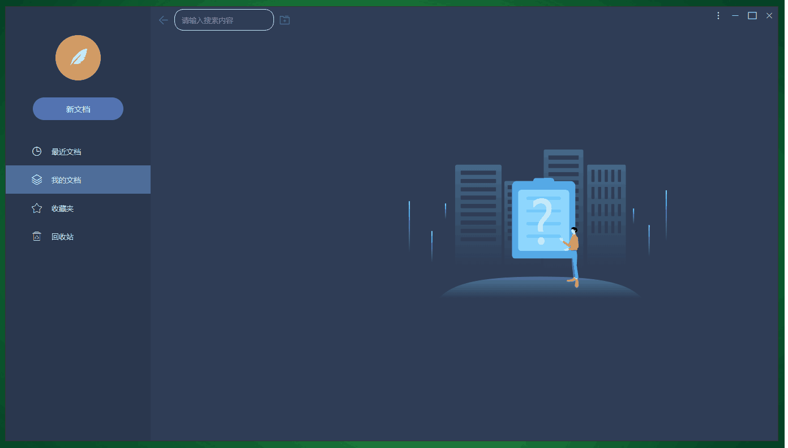
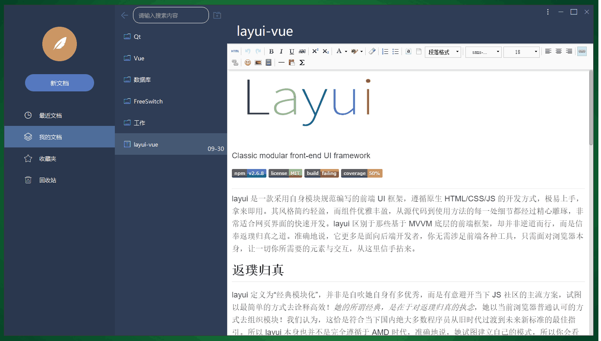
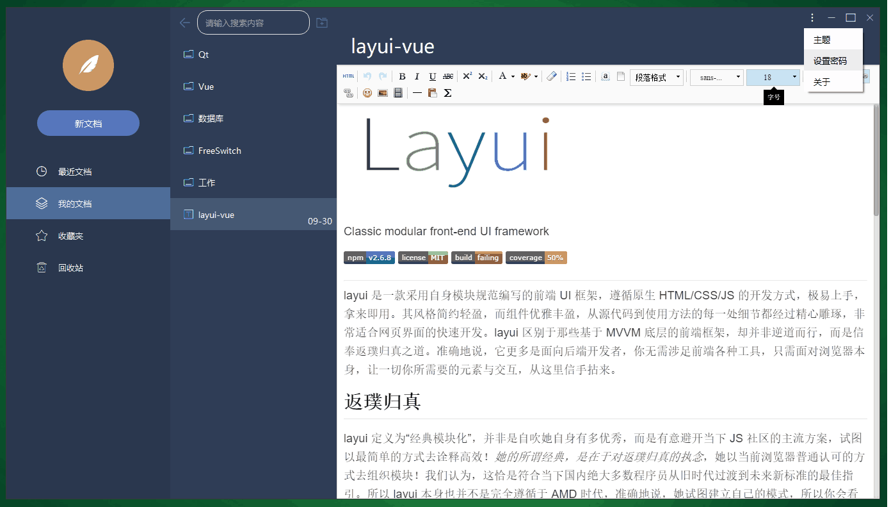

# EasyNote

# 📚简介
本项目为Qt实现笔记本软件。
- 支持富文本笔记
- 支持最近文档，收藏夹，回收站，文件分类等
- 支持全局笔记搜索，删除，收藏笔记
- 支持回收站还原笔记
- 支持设置启动密码
- 支持切换主题
- 支持图案密码登录

# 📦软件架构
- Qt 5.9 + msvc 2015
- Windows(x32, x64)/Linux(x32, x64) 
- 理论上Qt 5.6以上msvc编译器都支持

# 🛠️主要技术

| 模块                |     介绍                                                                          |
| -------------------|---------------------------------------------------------------------------------- |
| qss                   |     样式表，本程序所有窗体、控件的样式都由qss设计                                           |
| signal\slot                |     控件、窗体间通信，事件处理                                               |
| QThread              |     异步处理                                                                     |    
| iconfont      |     阿里巴巴矢量图标库，主要用于按钮及标签上图标等显示                                     |
| sqlite      |     存储数据库                                     |

# 🗺️软件展示

### 登录

### 图案密码登录

### 新建文档

### 最近文档、收藏夹、回收站

### 删除文档

### 还原文档

### 全局搜索

### 新建文件夹

### 切换文件夹

### 切换主题

### 设置登录密码

### 关于

# 📝参考网址

#### [📗qt官网](https://doc.qt.io/)

# 📌CSDN

#### [🎉欢迎关注CSDN](https://blog.csdn.net/qq_25549309)

# 🧡Star

#### 如果你觉得项目用来学习不错，可以给项目点点star，谢谢。
