# WeCom_copy

# 📚简介
本项目为Qt实现企业微信界面项目，纯界面逻辑，不包含真实业务逻辑。主要用于学习QWidget的使用，包含绘制，布局，信号，事件，重写，多线程，qss等技术使用。

# 💾体验程序
-  [安装包地址](https://gitee.com/hudejie/wecom-copy/raw/master/setup/Setup.exe)

# 📦软件架构
- Qt 5.9 + msvc 2015
- Windows(x32, x64)/Linux(x32, x64) 

# 🛠️主要技术

| 模块                |     介绍                                                                          |
| -------------------|---------------------------------------------------------------------------------- |
| qss                   |     样式表，本程序所有窗体、控件的样式都由qss设计                                           |
| signal\slot                |     控件、窗体间通信，事件处理                                               |
| QThread              |     异步处理                                                                     |
| QNetworkAccessManager|     网络请求，主要用于聊天机器人及实时天气获取                                               |
| QPainter        |     部分窗口的绘制，例如实时天气界面                                          |
| iconfont      |     阿里巴巴矢量图标库，主要用于按钮及标签上图标等显示                                     |
| webenginewidgets        |     实现嵌入html，主要用于聊天界面                                          |
| webchannel      |     和js进行通信，用于聊天界面交互                                     |

# 🗺️软件截图

### 导航

### 基础框架
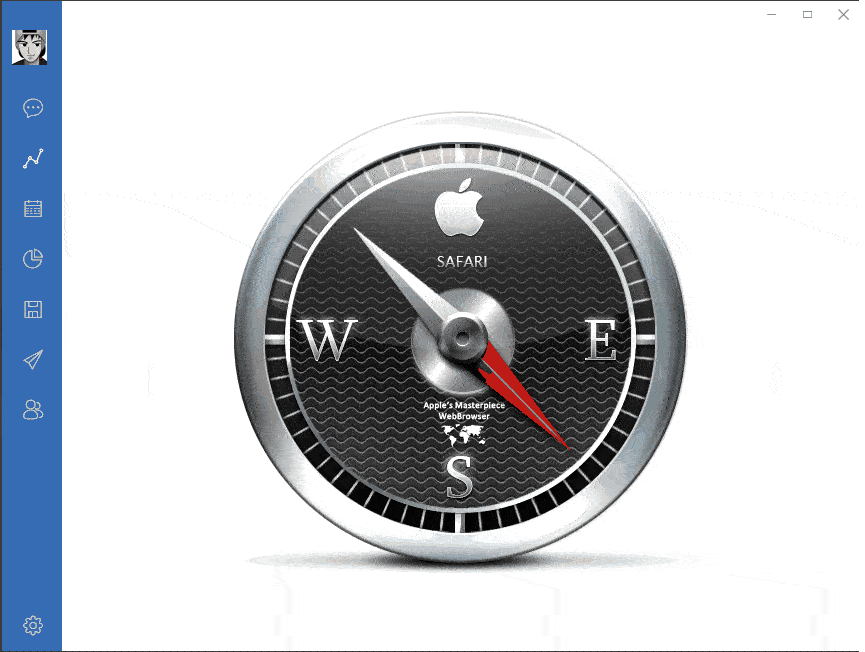

### 用户详情
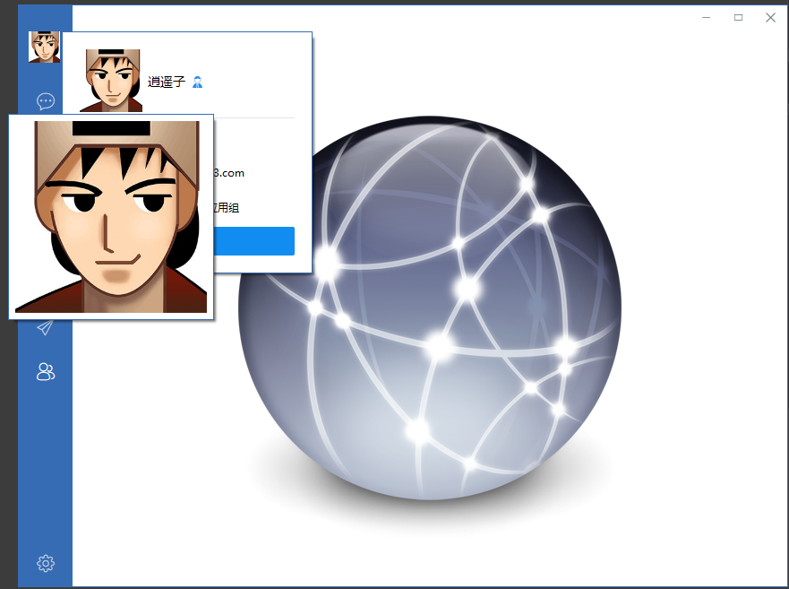

### 好友列表
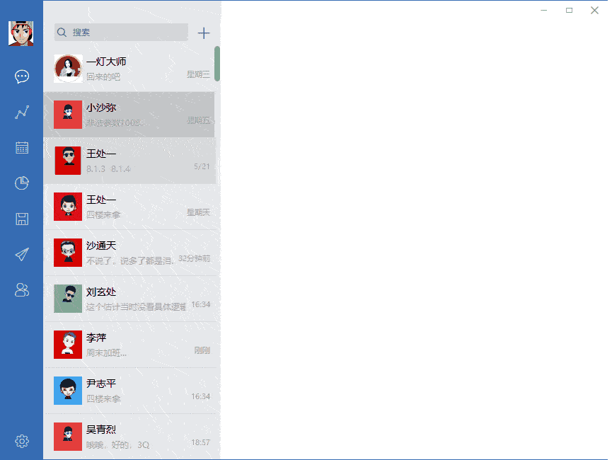

### 模拟登录
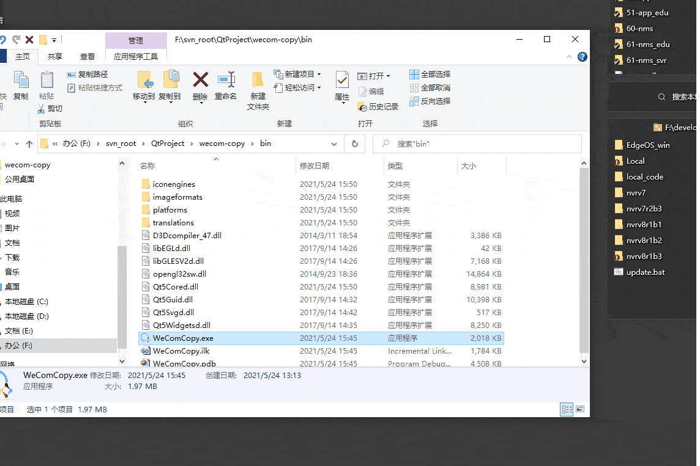

### 聊天对话框
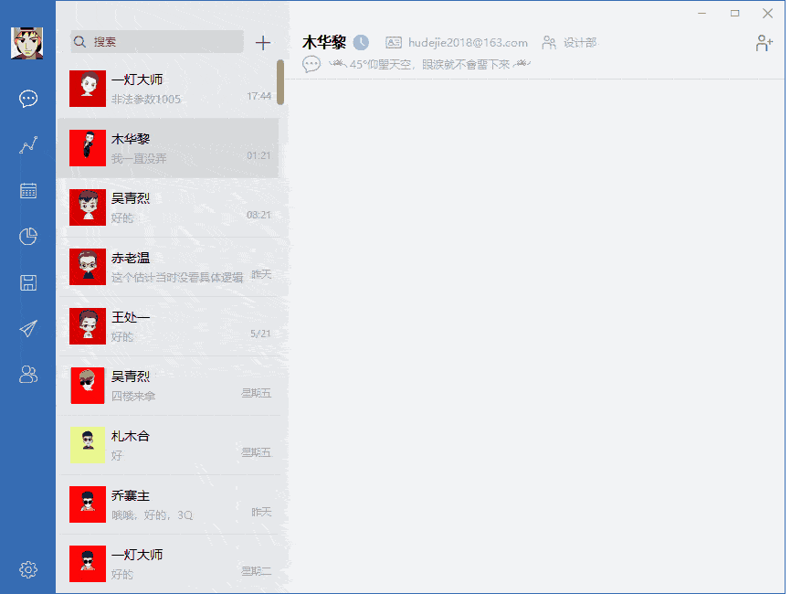

### 聊天界面
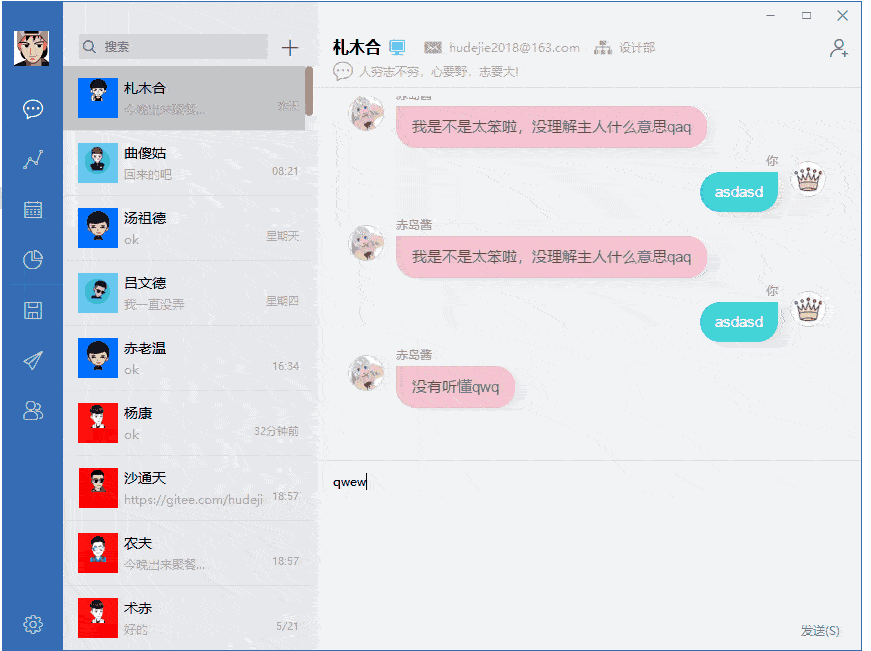

### 智能机器人
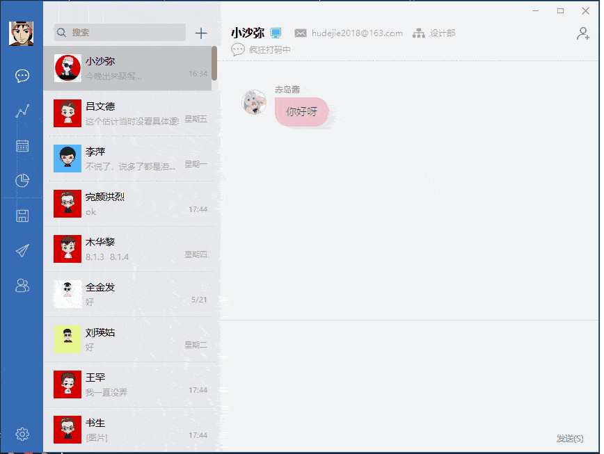

### 天气预报
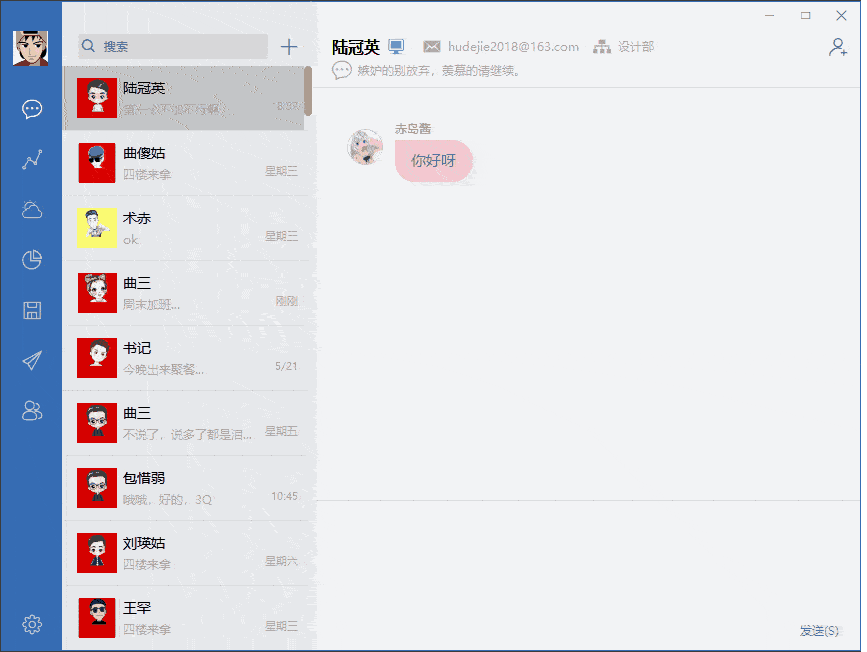

### 自绘时钟
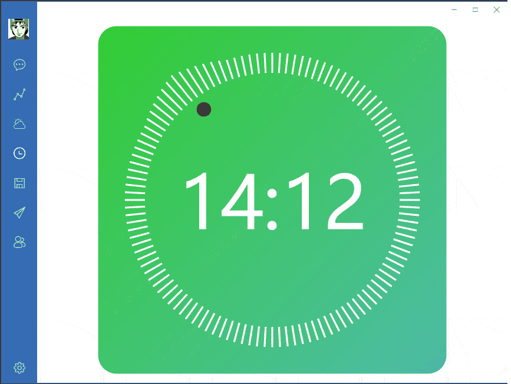

### iconfont图标展示
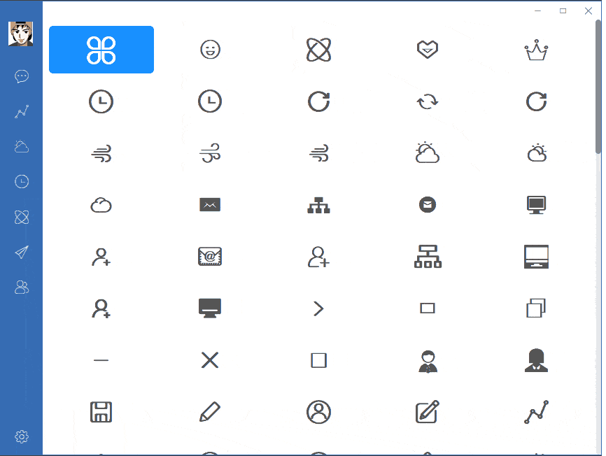

### 逗逗猫（小猫眼睛随着鼠标位置转动）

### 组件
#### 通知提醒框
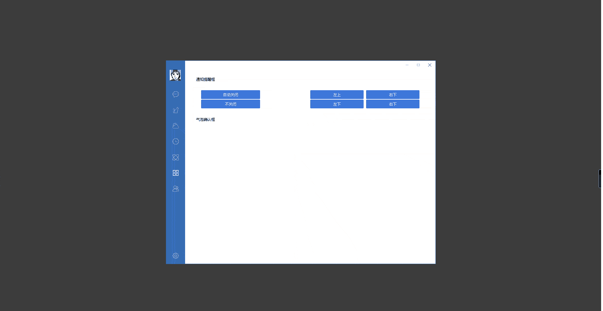

#### 气泡确认框
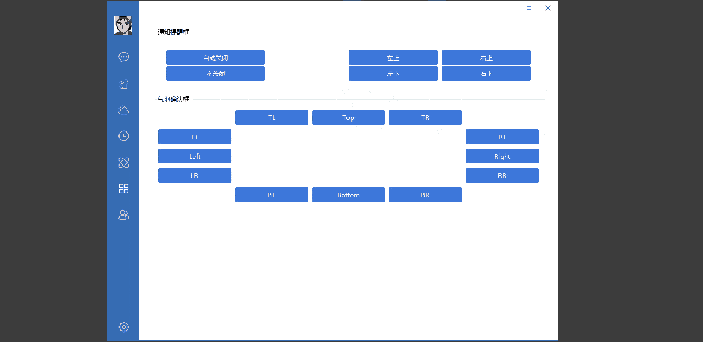

#### 滑动输入条
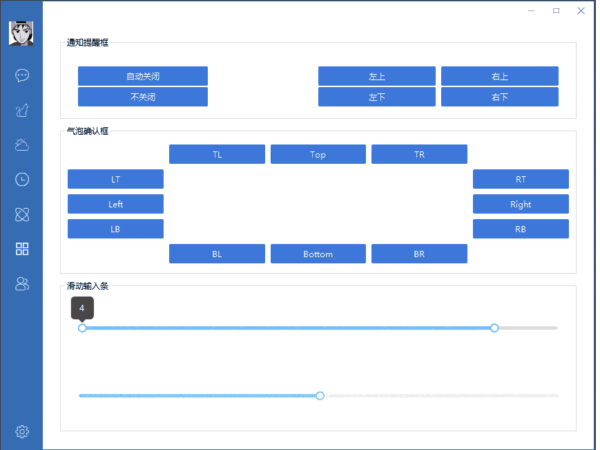

### 动态主页

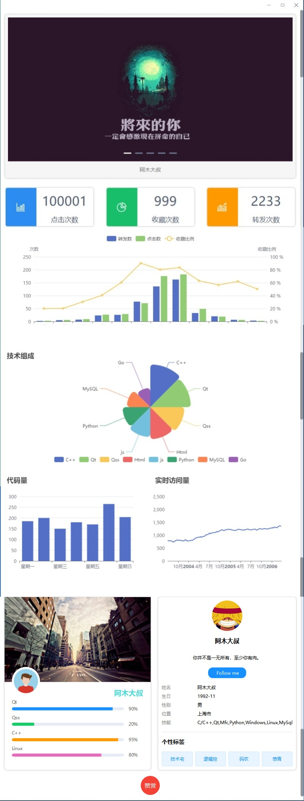

### ECharts表格

### 轮播图
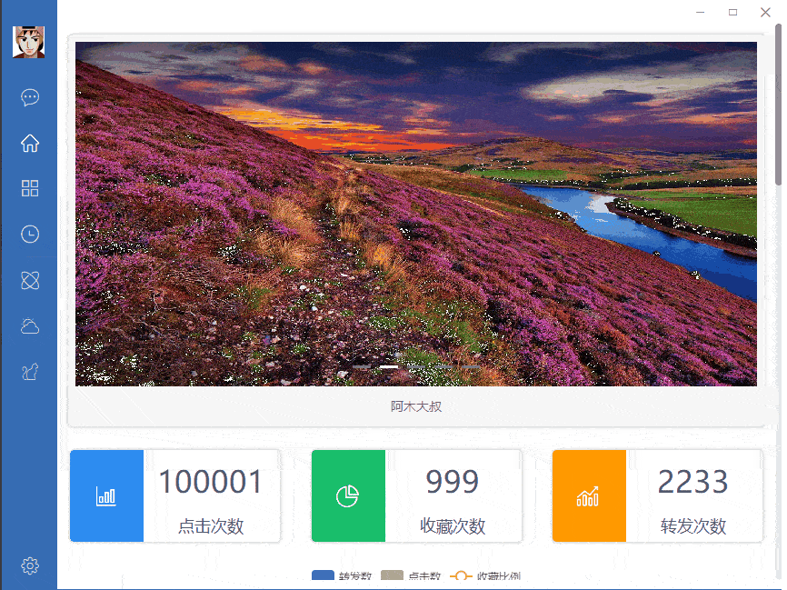

### 背景音乐(别撸代码了，听听歌吧)
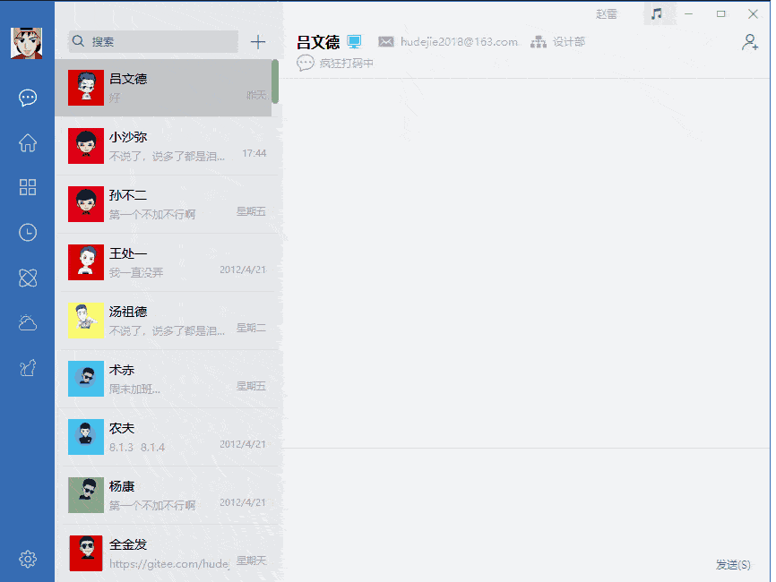

# 📝参考网址

#### [📗qt官网](https://doc.qt.io/)

#### [📘QTCN开发网](http://www.qtcn.org)

#### [📙飞扬青春](https://gitee.com/feiyangqingyun)

#### [📙ECharts](https://echarts.apache.org/zh/index.html)

# 📌CSDN

#### [🎉欢迎关注CSDN](https://blog.csdn.net/qq_25549309)

# 🧡Star

#### 如果你觉得项目用来学习不错，可以给项目点点star，谢谢。

