___
## 写在前面
* [相关博文]()
* [个人博客首页](http://hudejie.gitee.io/blog)
* 注：学习交流使用！

___
## 正文

> Qt [1]  是一个1991年由Qt Company开发的跨平台C++图形用户界面应用程序开发框架。它既可以开发GUI程序，也可用于开发非GUI程序，比如控制台工具和服务器。Qt是面向对象的框架，使用特殊的代码生成扩展（称为元对象编译器(Meta Object Compiler, moc)）以及一些宏，Qt很容易扩展，并且允许真正地组件编程。
2008年，Qt Company科技被诺基亚公司收购，Qt也因此成为诺基亚旗下的编程语言工具。2012年，Qt被Digia收购。
2014年4月，跨平台集成开发环境Qt Creator 3.1.0正式发布，实现了对于iOS的完全支持，新增WinRT、Beautifier等插件，废弃了无Python接口的GDB调试支持，集成了基于Clang的C/C++代码模块，并对Android支持做出了调整，至此实现了全面支持iOS、Android、WP,它提供给应用程序开发者建立艺术级的图形用户界面所需的所有功能。基本上，Qt 同 X Window 上的 Motif，Openwin，GTK 等图形界面库和 Windows 平台上的 MFC，OWL，VCL，ATL 是同类型的东西。 -- 百度百科

### 新建项目
- 选择新建项目
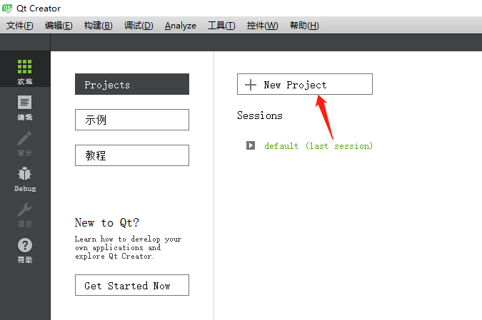

- 选择Qt Widgets Application
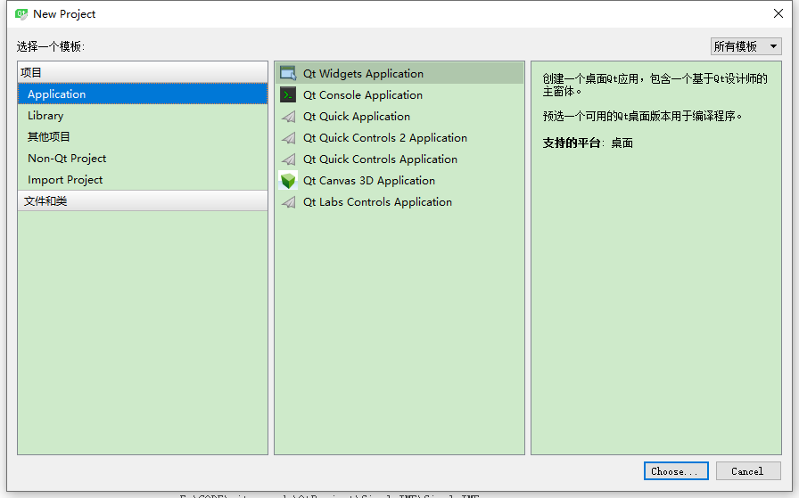

- 选择项目名称及项目路径
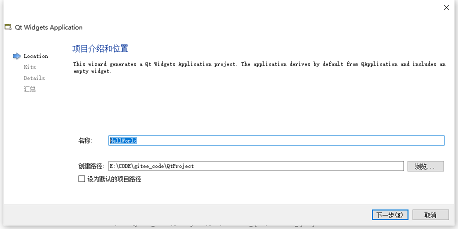

- 选择构建套件，即采用那种编译器，windows一般有MiniGw以及msvc，Linux下一般为GCC
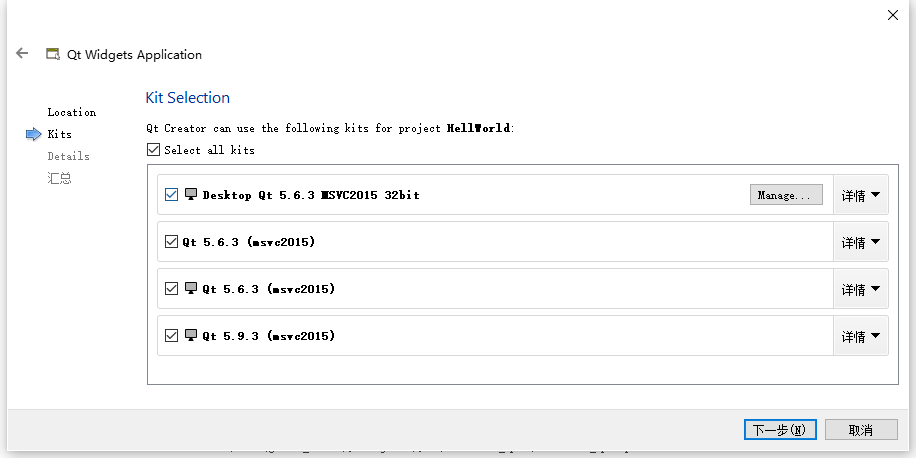

- 选择创建的主窗口类名及继承的类型，可以为QMainWindow，QDialog，QWidget
- 可以选择需不需要创建ui文件，ui文件即可使用Qt Ui工具直接编辑界面，前期可以使用此种
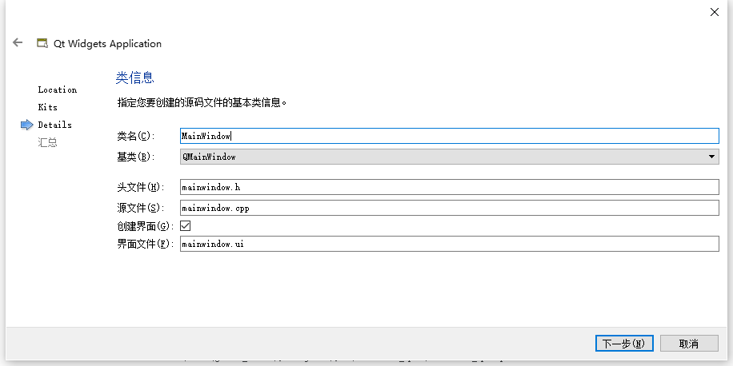

- 创建完成的项目
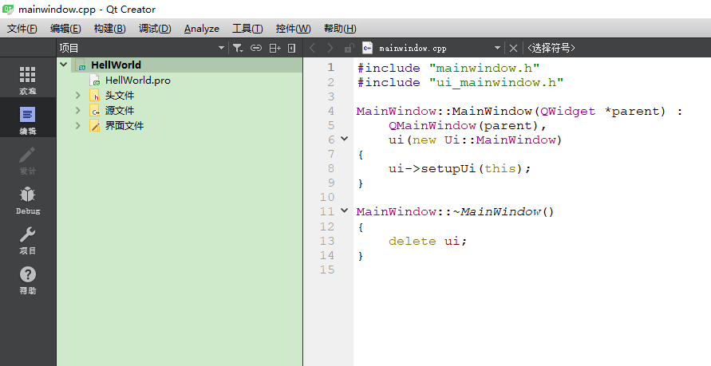

### 编译运行
- 使用左下角三个按钮即可编译运行项目，分别为运行，调试，编译
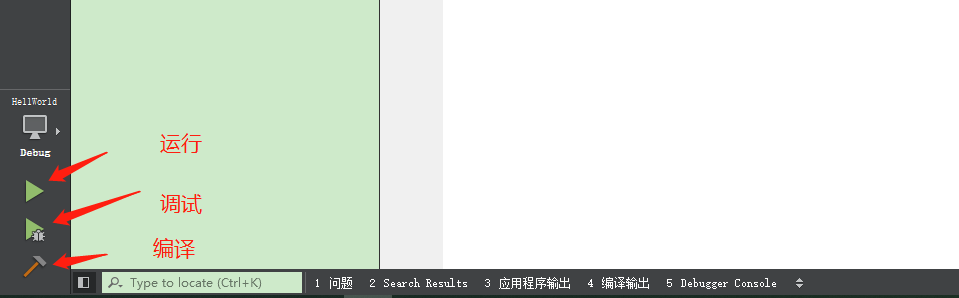

- 运行完成界面
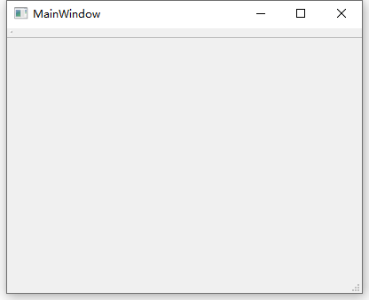

### 简单展示Hello World
- 双击mainwindow.ui文件，打开设计模式
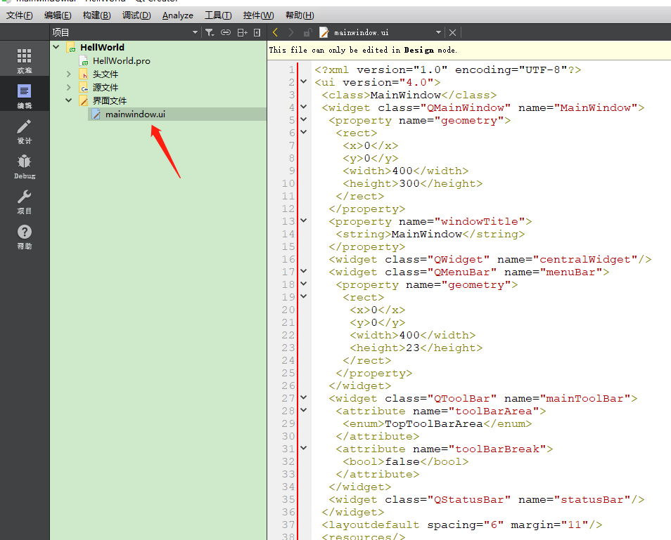

- 拖动一个label到界面，然后双击可修改文字内容
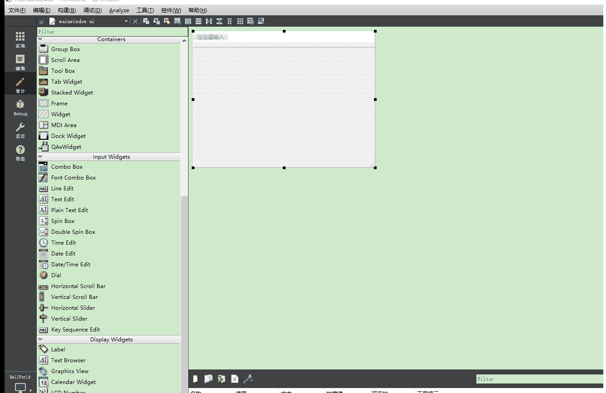

- 编译，运行完成界面
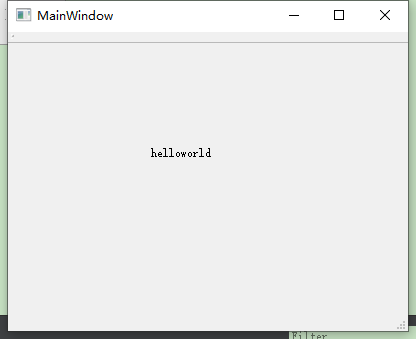

- 至此第一个Qt程序创建完成，恭喜你已经迈出了第一步，接下来一起学习Qt的各种高级用法吧。
___
## 交个朋友
* [Gitee首页](https://gitee.com/hudejie)
-----------------------------------
版权声明：本文为「阿木大叔」的原创文章，遵循CC 4.0 BY-SA版权协议，转载请附上原文出处链接及本声明。
