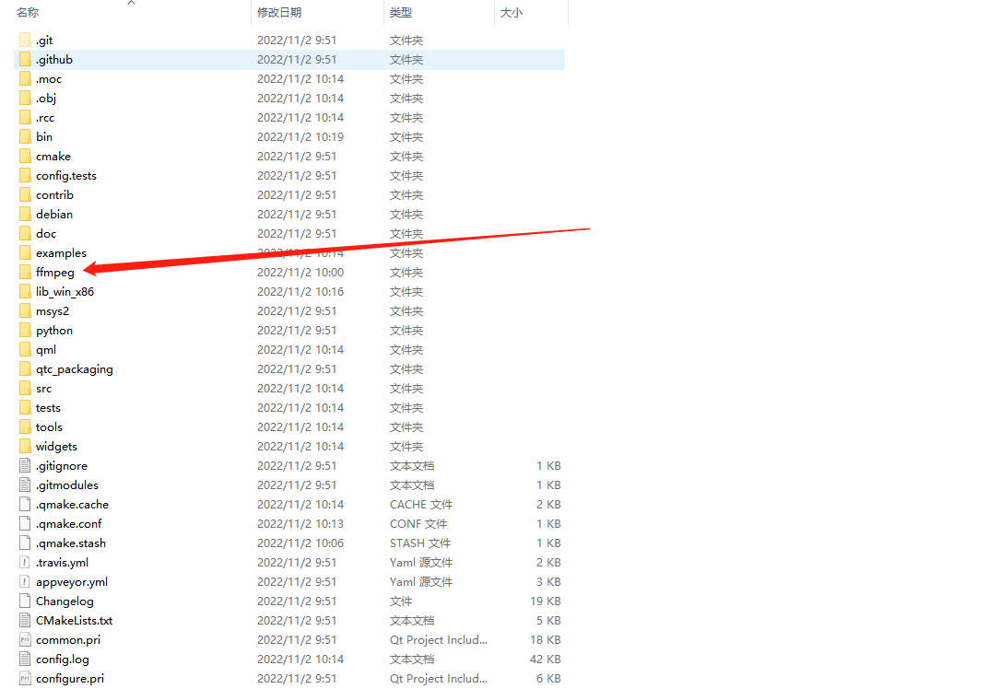
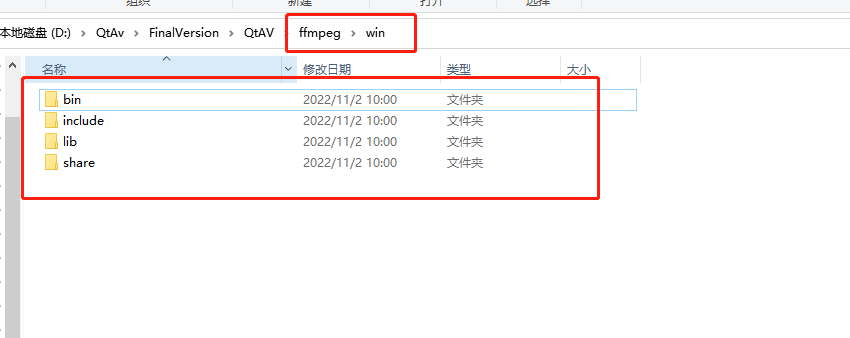
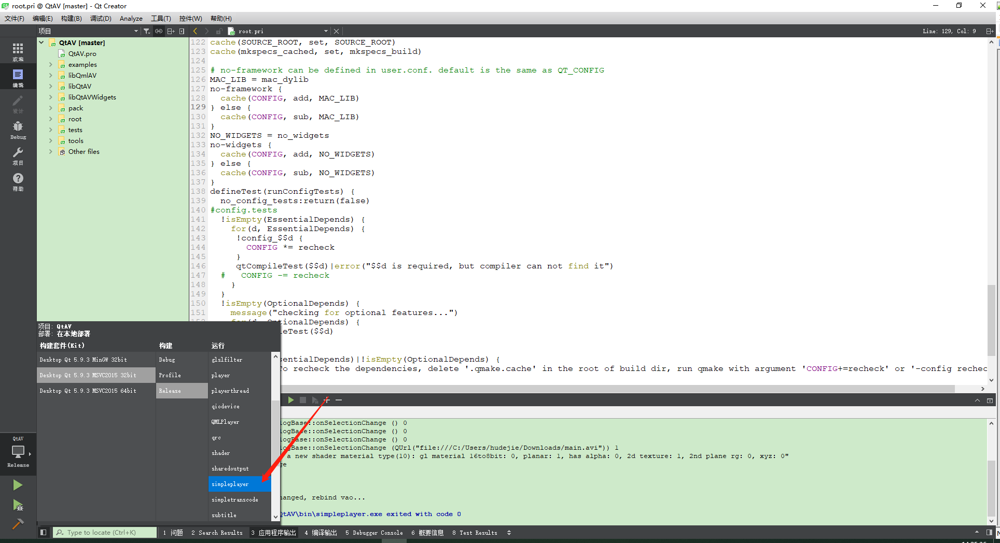
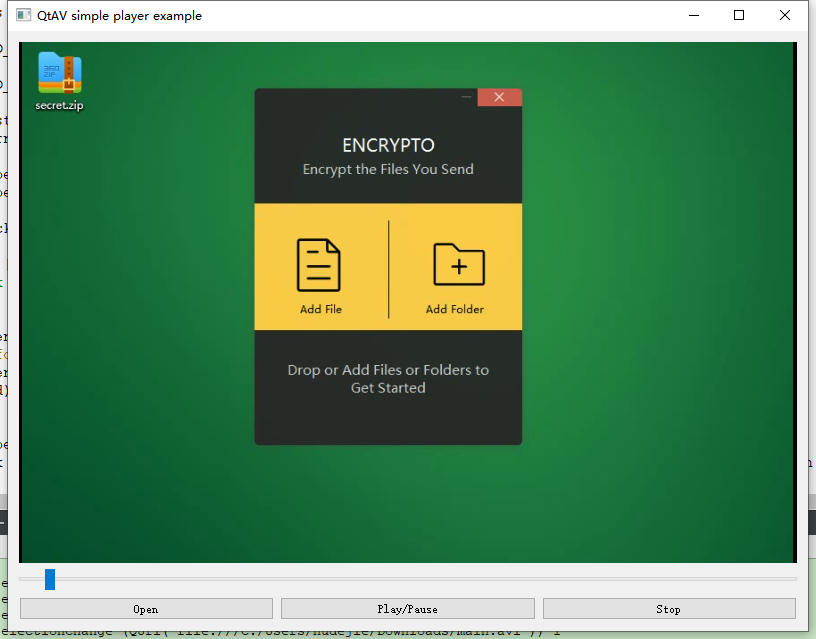

___
## 简介
> QtAV是基于Qt和FFmpeg的多媒体播放库。它可以帮助您以前所未有的精力编写播放器。

## QtAV强大的功能
> QtAV可以满足您的最大需求
> 
> - 硬件解码支持：DXVA2，VAAPI，VDA / VideoToolbox，CedarX，CUDA（第一个播放器在Linux上支持CUDA吗？）
> - OpenGL和ES2支持几乎所有格式，包括Hi10P视频（第一个播放器/库在ES2中支持10bit？VLC，XBMC，mplayer现在不支持）
> - 实时预览
> - RGB和YUV格式的视频捕获
> - OSD和自定义过滤器
> - libavfilter中的过滤器，例如stero3d，模糊
> - 字幕轨道选择。动态更改FFmpeg和libass引擎
> - 逐帧播放
> - 播放速度控制
> - 各种流：区域设置文件，http，rtsp等以及您的自定义流
> - 音频通道，轨道和外部音频轨道
> - 播放时动态更改渲染引擎。
> - 动态更改视频解码器
> - 1个播放器的多个视频输出
> - 视频均衡器（软件和OpenGL）：亮度，对比度，饱和度，色相
> - QML支持。大多数播放API与QtMultimedia模块兼容
> - 兼容性：QtAV可以同时使用Qt4和Qt5，FFmpeg（> = 1.0）和Libav（> = 9.0）来构建。建议使用最新的FFmpeg版本。
> 
___
## 编译准备
作者目前所使用的的环境为Qt5.9.3 + vs2015编译器

### 下载FFmpeg
#### 直接下载官方提供的开发库
下载地址：
    - https://ffmpeg.zeranoe.com/builds/win64/dev/ffmpeg-3.4.2-win64-dev.zip
    - https://ffmpeg.zeranoe.com/builds/win64/shared/ffmpeg-3.4.2-win64-shared.zip

#### 使用QtAv提供的开发库（推荐）
    - 文件名：QtAV-depends-windows-x86+x64.7z
    - http://sourceforge.net/projects/qtav/files/depends/QtAV-depends-windows-x86+x64.7z/download
    - 本教程采用此种方式编译QtAv

#### 自行编译FFmpeg
    - 自行编译比较麻烦，感兴趣的可以自行尝试，这里不再赘述

### 下载QtAv源码
    - 访问QtAv github地址：https://github.com/wang-bin/QtAV/
    - 可以使用git clone或者直接下载源代码

## 配置环境
- 进入QtAv代码根目录
- 创建ffmpeg/win目录

- 解压上面下载的FFmpeg依赖库：QtAV-depends-windows-x86+x64.7z，解压到上面创建ffmpeg/win目录
- 目录结构如下

- 修改QtAv/.qmake.conf文件
- 在最后加上下面两行，即设置FFmpeg的动态库路径及头文件路径
```
INCLUDEPATH += $$PWD/ffmpeg/win/include
LIBS +=  -L$$PWD/ffmpeg/win/lib
```
- 完整文件如下
```
QTAV_MAJOR_VERSION = 1
QTAV_MINOR_VERSION = 13
QTAV_PATCH_VERSION = 0

QTAV_VERSION = $${QTAV_MAJOR_VERSION}.$${QTAV_MINOR_VERSION}.$${QTAV_PATCH_VERSION}
#MODULE_VERSION = $$QTAV_VERSION

# set runpath instead of rpath for gcc for elf targets. Qt>=5.5
CONFIG *= enable_new_dtags
# OSX10.6 is not supported in Qt5.4
macx:isEqual(QT_MAJOR_VERSION,5):greaterThan(QT_MINOR_VERSION, 3): CONFIG *= c++11
android: CONFIG*=c++11
QMAKE_MACOSX_DEPLOYMENT_TARGET = 10.8
QMAKE_IOS_DEPLOYMENT_TARGET = 6.0

# 阿木大叔
INCLUDEPATH += $$PWD/ffmpeg/win/include
LIBS +=  -L$$PWD/ffmpeg/win/lib
```


## 开始编译
- 使用QtCreator打开QtAv.pro文件
- 进行编译即可

## 运行&测试
- 将QtAV\ffmpeg\win\bin下面的所有dll文件拷贝到QtAV\bin目录
- 选择simpleplayer项目，点击运行即可


- 可以看见一个简易的视频播放器就出现了，可以去播放测试了

## 使用QtAv动态库
- 在QtAV\lib_win_x86目录下有生成的QmlAV.dll及QmlAV.lib，QtAVWidgets1.lib，QtAVWidgets1.lib，这四个文件即我们需要的动态库文件
- QtAV\src\QtAV和QtAV\widgets\QtAVWidgets两个目录为上面两个动态库的头文件
- 有了上面这些文件，你就可以集成到自己的程序里，开发自己的播放器了，具体开发过程这里就不再说明了，有机会可以再写一篇教程，具体可以看官方示例就行


