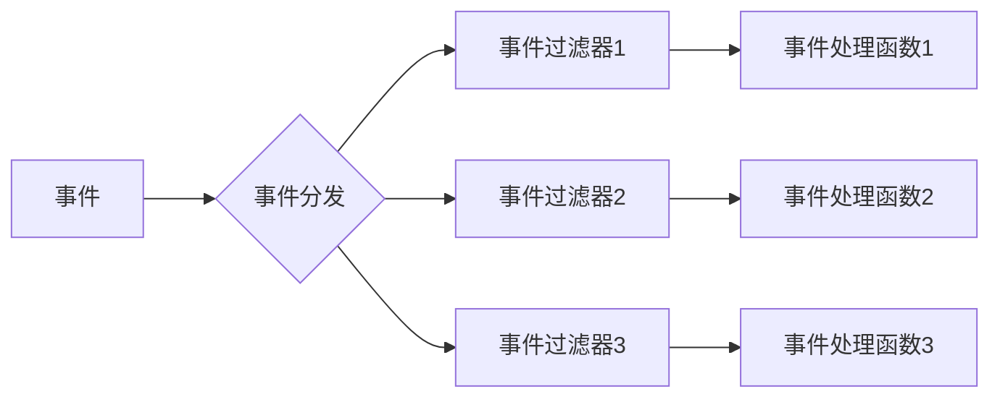

# Qt事件处理机制流程

Qt事件处理机制是实现GUI程序的重要组成部分。在Qt中，所有的用户操作（例如鼠标点击、键盘输入等）都会被转换为事件，然后交给相应的对象进行处理。因此，了解Qt事件处理机制对于理解Qt编程至关重要。

## 事件处理函数

在Qt中，事件处理函数是指重载QObject类的event()函数或QWidget类的paintEvent()函数等一系列事件处理函数。事件处理函数可以接收到Qt各种事件类型，我们可以通过这些函数来处理事件并决定如何响应这些事件。

在Qt中，每个QObject对象都可以有自己的事件处理函数，例如：

```c++
class MyObject : public QObject
{
    Q_OBJECT

protected:
    bool event(QEvent *event);
};
```

在上述代码中，MyObject类继承自QObject，并重载了event()函数。当该类接收到事件时，会调用event()函数进行事件处理。

## 事件循环

Qt事件循环是指一个无限循环，在该循环中，Qt会不断地从操作系统取出事件并将其发送给相应的接收者（即事件处理函数）。Qt事件循环的实现由QCoreApplication类完成。在Qt应用程序中，我们通常需要创建一个QApplication或QGuiApplication对象来初始化Qt事件循环。

事件循环的代码如下：

```c++
while (true) {
    if (!QCoreApplication::hasPendingEvents())
        QCoreApplication::processEvents(QEventLoop::WaitForMoreEvents);
    else
        QCoreApplication::processEvents(QEventLoop::AllEvents);
}
```

在上述代码中，QCoreApplication会不断地调用processEvents()函数来处理事件。当有新的事件到达时，该函数会将事件发送给相应的对象进行处理。

## 事件过滤器

在Qt中，事件过滤器是指通过重载QObject类的eventFilter()函数来实现对事件的拦截和处理。通过事件过滤器，我们可以监视所有QObject对象的事件，并做出相应的响应。

例如：

```c++
class MyFilter : public QObject
{
    Q_OBJECT

public:
    bool eventFilter(QObject *obj, QEvent *event);
};
```

在上述代码中，MyFilter类继承自QObject，并重载了eventFilter()函数。当一个QObject对象接收到事件时，会首先将事件发送给MyFilter对象进行处理。如果MyFilter对象需要拦截该事件，则返回true，否则返回false，让该事件被传递到原本的事件处理函数进行处理。

## 事件分发

在Qt事件处理机制中，事件分发是指将事件分发给相应的接收者进行处理。通过事件分发，我们可以保证每个事件都能正确地被处理。

在Qt中，事件分发由QCoreApplication::sendEvent()函数完成。该函数负责将事件分发给相应的接收者（即事件处理函数）进行处理。如果事件处理函数返回true，则说明该事件已被处理；否则，该事件会被传递给父对象进行处理。

## 流程图

下面是一个使用mermaid语法绘制的Qt事件处理机制流程图：



在上述流程图中，事件首先通过事件分发器（即B节点）进行分发。然后，事件可能会被传递给一系列事件过滤器（即C1、C2和C3节点），这些事件过滤器可以拦截并处理事件。最终，事件会被传递给对应的事件处理函数（即D1、D2和D3节点）进行处理。

## 总结

Qt事件处理机制是一种高效而可靠的机制，它能够确保GUI程序能够正确地响应用户的操作。通过了解Qt事件处理机制的流程，我们可以更好地理解Qt编程，同时也能够更加灵活地控制程序的行为。

以上是关于Qt事件处理机制流程的详细介绍，如有不足之处，欢迎指正。
