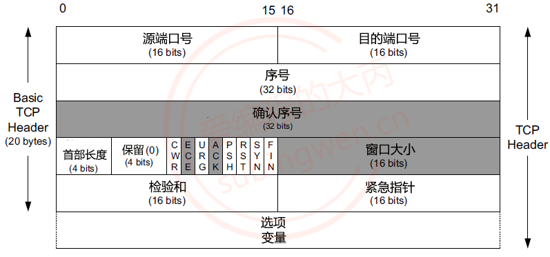
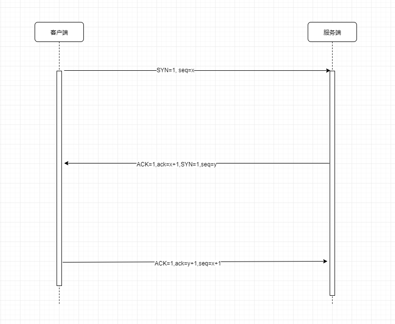
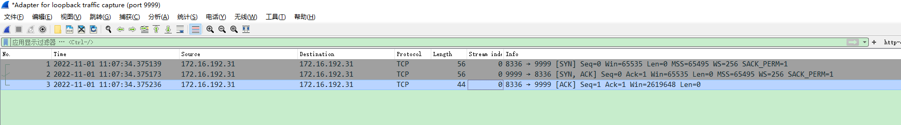
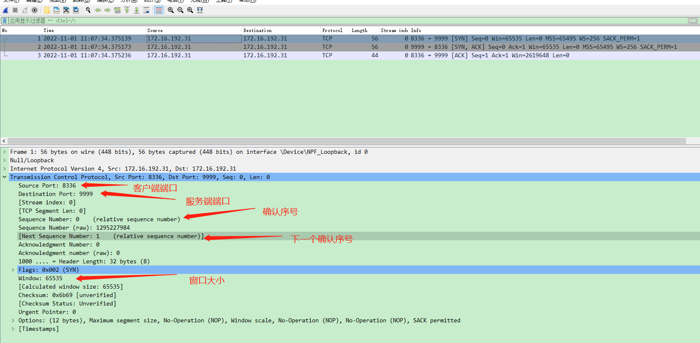
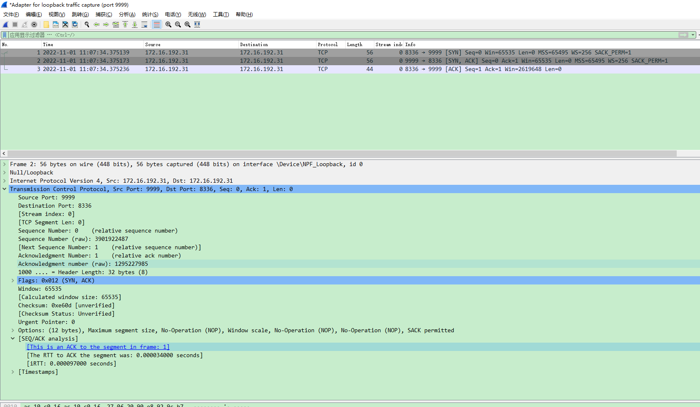
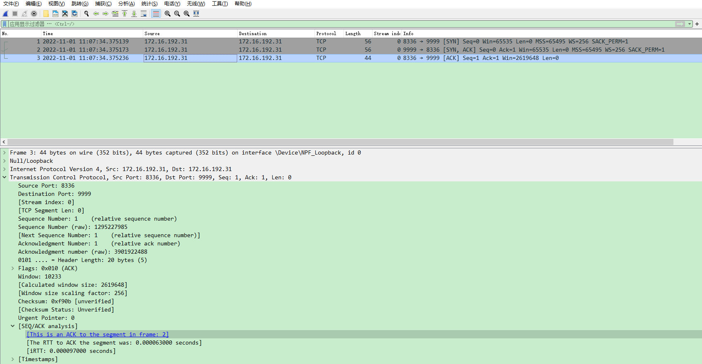

> TCP 协议是一个安全的、面向连接的、流式传输协议，所谓的面向连接就是三次握手，对于程序猿来说只需要在客户端调用 connect() 函数，三次握手就自动进行了。先通过下图看一下 TCP 协议的格式，然后再介绍三次握手的具体流程。

### 在 Tcp 协议中，比较重要的字段有：

- 源端口：表示发送端端口号，字段长 16 位，2 个字节

- 目的端口：表示接收端端口号，字段长 16 位，2 个字节

- 序号（sequence number）：字段长 32 位，占 4 个字节，序号的范围为 [0，4284967296]。
    > 由于 TCP 是面向字节流的，在一个 TCP 连接中传送的字节流中的每一个字节都按顺序编号
    首部中的序号字段则是指本报文段所发送的数据的第一个字节的序号，这是随机生成的。
    序号是循环使用的，当序号增加到最大值时，下一个序号就又回到了 0
    确认序号（acknowledgement number）：占 32 位（4 字节），表示收到的下一个报文段的第一个数据字节的序号，如果确认序号为 N，序号为 S，则表明到序号 N-S 为止的所有数据字节都已经被正确地接收到了。

- 8 个标志位（Flag）:
    - CWR：CWR 标志与后面的 ECE 标志都用于 IP 首部的 ECN 字段，ECE 标志为 1 时，则通知对方已将拥塞窗口缩小；
    - ECE：若其值为 1 则会通知对方，从对方到这边的网络有阻塞。在收到数据包的 IP 首部中 ECN 为 1 时将 TCP 首部中的 ECE 设为 1.；
    - URG：该位设为 1，表示包中有需要紧急处理的数据，对于需要紧急处理的数据，与后面的紧急指针有关；
    - ACK：该位设为 1，确认应答的字段有效，TCP 规定除了最初建立连接时的 SYN 包之外该位必须设为 1；
    - PSH：该位设为 1，表示需要将收到的数据立刻传给上层应用协议，若设为 0，则先将数据进行缓存；
    - RST：该位设为 1，表示 TCP 连接出现异常必须强制断开连接；
    - SYN：用于建立连接，该位设为 1，表示希望建立连接，并在其序列号的字段进行序列号初值设定；
    - FIN：该位设为 1，表示今后不再有数据发送，希望断开连接。
- 窗口大小：该字段长 16 位，表示从确认序号所指位置开始能够接收的数据大小，TCP 不允许发送超过该窗口大小的数据。

|   标志位  | 解释  |
|  ----  | ----  |
| SYN  | synchronous建立联机 |
| ACK  | acknowledgement 确认 |
| PSH  | push传送  |
| PSH  | push传送  |
| URG  | urgent紧急  |
| RST  | reset重置  |
| FIN  | finish结束  |
| seq  | Sequence number(顺序号码)  |
| ack  | Acknowledge number(确认号码)  |

### 三次握手具体过程如下：

#### 第一次握手：

- 客户端：客户端向服务器端发起连接请求将报文中的 SYN 字段置为 1，生成随机序号 x，seq=x
- 服务器端：接收客户端发送的请求数据，解析 tcp 协议，校验 SYN 标志位是否为 1，并得到序号 x

#### 第二次握手：

- 服务器端：给客户端回复数据
    - 回复 ACK, 将 tcp 协议 ACK 对应的标志位设置为 1，表示同意了客户端建立连接的请求
    - 回复了 ack=x+1, 这是确认序号
        - x: 客户端生成的随机序号
        - 1: 客户端给服务器发送的数据的量，SYN 标志位存储到某一个字节中，因此按照一个字节计算，表示客户端给服务器发送的 1 个字节服务器收到了。
    - 将 tcp 协议中的 SYN 对应的标志位设置为 1, 服务器向客户端发起了连接请求
    - 服务器端生成了一个随机序号 y, 发送给了客户端
- 客户端：接收回复的数据，并解析 tcp 协议
    - 校验 ACK 标志位，为 1 表示服务器接收了客户端的连接请求
    - 数据校验，确认发送给服务器的数据服务器收到了没有，计算公式如下：
    - 发送的数据的量 = 使用服务器回复的确认序号 - 客户端生成的随机序号 ===> 1=x+1-x
    - 校验 SYN 标志位，为 1 表示服务器请求和客户端建立连接
    - 得到服务器生成的随机序号: y

#### 第三次握手：

- 客户端：发送数据给服务器
    - 将 tcp 协议中 ACK 标志位设置为 1，表示同意了服务器的连接请求
    - 给服务器回复了一个确认序号 ack = y+1
        - y：服务器端生成的随机序号
        - 1：服务器给客户端发送的数据量，服务器给客户端发送了 ACK 和 SYN, 都存储在这一个字节中
    - 发送给服务器的序号就是上一次从服务器端收的确认序号因此 seq = x+1
- 服务器端：接收数据，并解析 tcp 协议
    - 查看 ACK 对应的标志位是否为 1, 如果是 1 代表，客户端同意了服务器的连接请求
    - 数据校验，确认发送给客户端的数据客户端收到了没有，计算公式如下：
    - 给客户端发送的数据量 = 确认序号 - 服务器生成的随机序号 ===> 1=y+1-y
    - 得到客户端发送的序号：x+1

### wirshark抓包分析

- 服务端监听9999

上图为TCP三次握手过程
- 第一次握手
    - SYN请求，即客户端请求建立连接，可以看到SYN=1,seq=0
    

- 第二次握手
    - [SYN,ACK]请求，ACK说明服务端已经同意了客户端的请求，SYN说明服务端请求建立连接，可以看到ACK=1,SYN=1,seq=0,ack=1 (ack为确认序号，值为客户端发送过来的seq+1；这里的seq为服务端随机生成的序号)
    

- 第三次握手
    - [ACK]请求，ACK说明客户端已经同意了服务端的请求，可以看到ACK=1,seq=0,ack=1 (ack为确认序号，值为服务端户端发送过来的seq+1)
    

