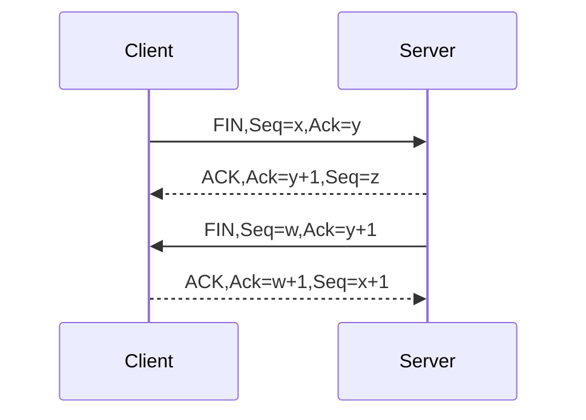
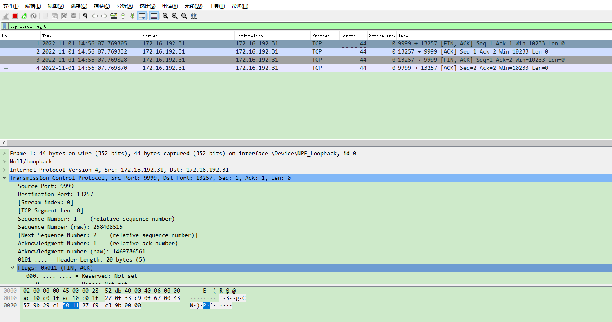
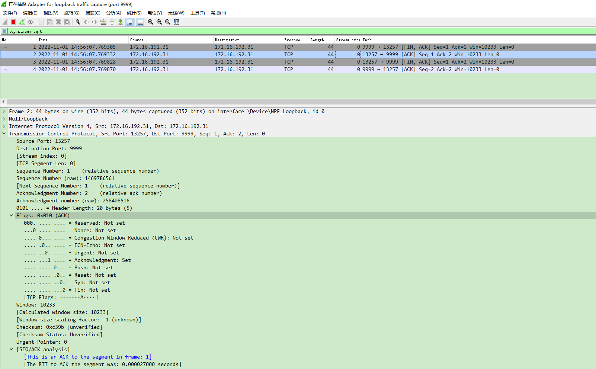
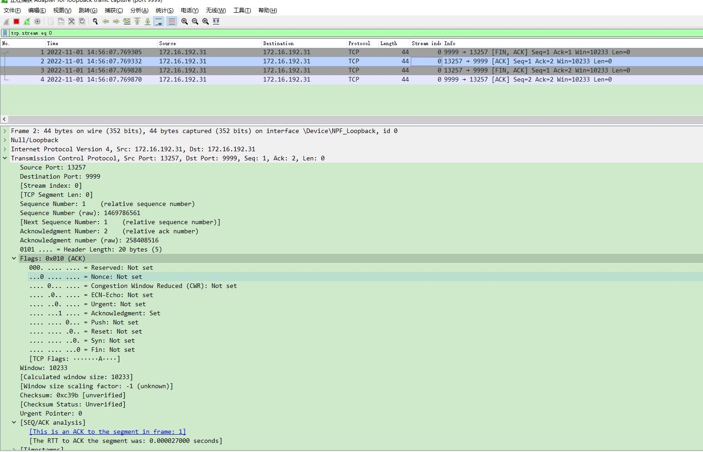
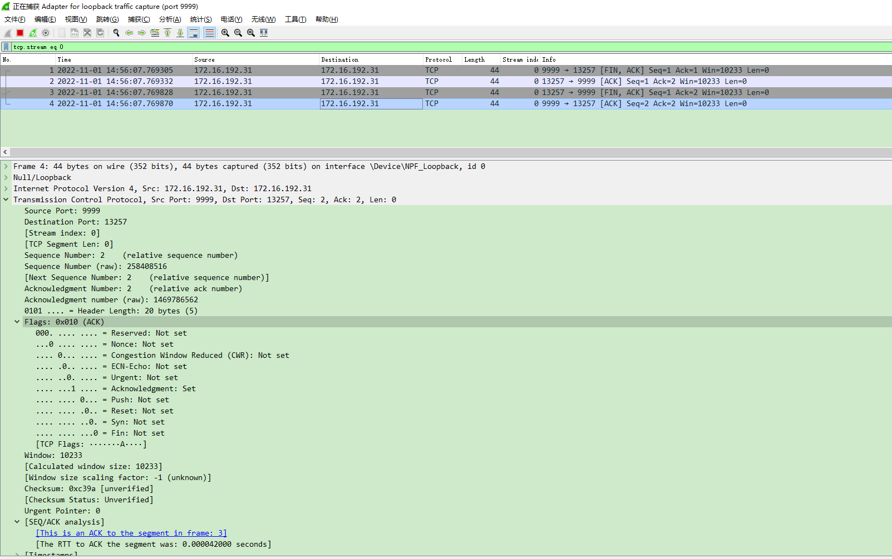

> 四次挥手是断开连接的过程，需要双向断开，关于由哪一端先断开连接是没有要求的。通信的两端如果想要断开连接就需要调用 close() 函数，当两端都调用了该函数，四次挥手也就完成了。
- 客户端和服务器断开连接 -> 单向断开
- 服务器和客户端断开连接 -> 单向断开
> 进行了两次单向断开，双向断开就完成了，每进行一次单向断开，就会完成两次挥手的动作。

### 在 Tcp 协议中，比较重要的字段有：

- 源端口：表示发送端端口号，字段长 16 位，2 个字节

- 目的端口：表示接收端端口号，字段长 16 位，2 个字节

- 序号（sequence number）：字段长 32 位，占 4 个字节，序号的范围为 [0，4284967296]。

    > 由于 TCP 是面向字节流的，在一个 TCP 连接中传送的字节流中的每一个字节都按顺序编号
    首部中的序号字段则是指本报文段所发送的数据的第一个字节的序号，这是随机生成的。
    序号是循环使用的，当序号增加到最大值时，下一个序号就又回到了 0
    确认序号（acknowledgement number）：占 32 位（4 字节），表示收到的下一个报文段的第一个数据字节的序号，如果确认序号为 N，序号为 S，则表明到序号 N-S 为止的所有数据字节都已经被正确地接收到了。

- 8 个标志位（Flag）:

    - CWR：CWR 标志与后面的 ECE 标志都用于 IP 首部的 ECN 字段，ECE 标志为 1 时，则通知对方已将拥塞窗口缩小；
    - ECE：若其值为 1 则会通知对方，从对方到这边的网络有阻塞。在收到数据包的 IP 首部中 ECN 为 1 时将 TCP 首部中的 ECE 设为 1.；
    - URG：该位设为 1，表示包中有需要紧急处理的数据，对于需要紧急处理的数据，与后面的紧急指针有关；
    - ACK：该位设为 1，确认应答的字段有效，TCP 规定除了最初建立连接时的 SYN 包之外该位必须设为 1；
    - PSH：该位设为 1，表示需要将收到的数据立刻传给上层应用协议，若设为 0，则先将数据进行缓存；
    - RST：该位设为 1，表示 TCP 连接出现异常必须强制断开连接；
    - SYN：用于建立连接，该位设为 1，表示希望建立连接，并在其序列号的字段进行序列号初值设定；
    - FIN：该位设为 1，表示今后不再有数据发送，希望断开连接。
- 窗口大小：该字段长 16 位，表示从确认序号所指位置开始能够接收的数据大小，TCP 不允许发送超过该窗口大小的数据。

|   标志位  | 解释  |
|  ----  | ----  |
| SYN  | synchronous建立联机 |
| ACK  | acknowledgement 确认 |
| PSH  | push传送  |
| PSH  | push传送  |
| URG  | urgent紧急  |
| RST  | reset重置  |
| FIN  | finish结束  |
| seq  | Sequence number(顺序号码)  |
| ack  | Acknowledge number(确认号码)  |

### TCP四次挥手具体过程如下：

#### 第一次握手：

- 客户端：客户端向服务器端发起连接请求将报文中的 SYN 字段置为 1，生成随机序号 x，seq=x
- 服务器端：接收客户端发送的请求数据，解析 tcp 协议，校验 SYN 标志位是否为 1，并得到序号 x

#### 第一次挥手:
- 主动断开连接的一方：发送断开连接的请求
    - 将 tcp 协议中 FIN 标志位设置为 1，表示请求断开连接
    - 发送序号 x 给对端，seq=x，基于这个序号用于客户端数据校验的计算
- 被动断开连接的一方：接收请求数据，并解析 TCP 协议
    - 校验 FIN 标志位是否为 1
    - 收到了序号 x，基于这个数据计算回复的确认序号 ack 的值

#### 第二次挥手:
- 被动断开连接的一方：回复数据
    - 同意了对方断开连接的请求，将 ACK 标志位设置为 1
    - 回复 ack=x+1，表示成功接受了客户端发送的一个字节数据
    - 向客户端发送序号 seq=y，基于这个序号用于服务器端数据校验的计算
- 主动断开连接的一方：接收回复数据，并解析 TCP 协议
    - 校验 ACK 标志位，如果为 1 表示断开连接的请求对方已经同意了
    - 校验 ack 确认发送的数据服务器是否收到了，发送的数据 = ack - x = x + 1 -x = 1

#### 第三次挥手:
- 被动断开连接的一方：将 tcp 协议中 FIN 标志位设置为 1，表示请求断开连接
- 主动断开连接的一方：接收请求数据，并解析 TCP 协议，校验 FIN 标志位是否为 1

#### 第四次挥手:
- 主动断开连接的一方：回复数据
    - 将 tcp 协议中 ACK 对应的标志位设置为 1，表示同意了断开连接的请求
    - ack=y+1，表示服务器发送给客户端的一个字节客户端接收到了
    - 序号 seq=h，此时的 h 应该等于 x+1，也就是第三次挥手时服务器回复的确认序号 ack 的值
- 被动断开连接的一方：收到回复的 ACK, 此时双向连接双向断开，通信的两端没有任何关系了

### wirshark抓包分析
TCP四次挥手过程，此抓包为服务端主动断开连接
- 第一次挥手
    - FIN请求，即服务端请求断开连接，可以看到seq=1， 这里的ASK标志，及ask=1说明断开的时候对之前收到的报文段进行确认
    

- 第二次挥手
    - [ACK]请求，即客户端同意断开连接，ACK说明客户端已经同意了服务端的请求
    

- 第三次挥手
    - FIN请求，即客户端请求断开连接，可以看到seq=1， 这里的ASK标志，及ask=2说明断开的时候对之前收到的报文段进行确认过来的seq+1)
    

- 第四次挥手
    - [ACK]请求，即服务端同意断开连接，ACK说明服务端已经同意了客户端的请求
    

### 总结
> TCP四次挥手可以由任意一方发起
> - 发起方先发送FIN标志来请求断开连接，然后接收方回复ASK来确认关闭连接
> - 接着接收方发送FIN来请求断开连接，然后发起方回复ASK来确认关闭连接
