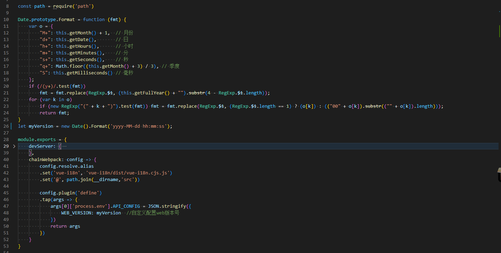
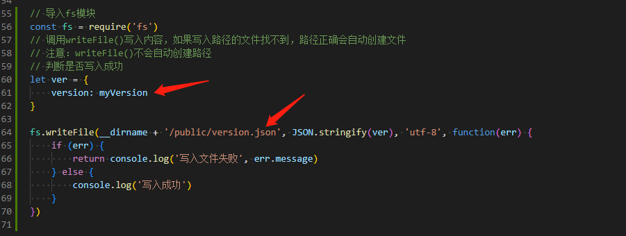

## 问题描述
- vue项目后端升级新的index.html及相应js/css后，前端已打开web是不感知的，所以在不刷新浏览器的情况下，前端的index.html是不会主动更新，从而造成前后端不一致的问题。

## 前端方案
- web每次编译时自动生成一个版本号，并且写入的配置文件中
- 每次打包配置文件一起发布
- web在需要的地方检测服务器上的配置文件和当前web的版本号是否一致，若不一致则主动刷新一下界面，或者提示用户刷新等

## 具体步骤
- 修改vue.config.js, 生成版本号，并注入项目中


- 修改vue.config.js, 生成配置文件，version.json


- 完整代码
``` javaScript
const path = require('path')

Date.prototype.Format = function (fmt) {
    var o = {
        "M+": this.getMonth() + 1,  // 月份
        "d+": this.getDate(),       // 日
        "h+": this.getHours(),      // 小时
        "m+": this.getMinutes(),    // 分
        "s+": this.getSeconds(),    // 秒
        "q+": Math.floor((this.getMonth() + 3) / 3), // 季度
        "S": this.getMilliseconds() // 毫秒
    };
    if (/(y+)/.test(fmt))
        fmt = fmt.replace(RegExp.$1, (this.getFullYear() + "").substr(4 - RegExp.$1.length));
    for (var k in o)
        if (new RegExp("(" + k + ")").test(fmt)) fmt = fmt.replace(RegExp.$1, (RegExp.$1.length == 1) ? (o[k]) : (("00" + o[k]).substr(("" + o[k]).length)));
        return fmt;
}
let myVersion = new Date().Format('yyyy-MM-dd hh:mm:ss');

module.exports = {
    chainWebpack: config => {
        config.resolve.alias
        .set('vue-i18n', 'vue-i18n/dist/vue-i18n.cjs.js')
        .set('@', path.join(__dirname,'src'))

        config.plugin('define')
        .tap(args => { 
            args[0]['process.env'].API_CONFIG = JSON.stringify({
                WEB_VERSION: myVersion  //自定义配置web版本号
            })
            return args
        })
    }
}

// 导入fs模块
const fs = require('fs')
// 调用writeFile()写入内容，如果写入路径的文件找不到，路径正确会自动创建文件
// 注意：writeFile()不会自动创建路径
// 判断是否写入成功
let ver = {
    version: myVersion
}

fs.writeFile(__dirname + '/public/version.json', JSON.stringify(ver), 'utf-8', function(err) {
    if (err) {
        return console.log('写入文件失败', err.message)
    } else {
        console.log('写入成功')
    }
})

```

- 在需要的地方请求配置文件，并校验
```javaScript
async function checkWebVersion() {
    const ver = await request.get(`/version.json?t=${new Date().getTime()}`);
    console.log(ver);
    let serverVersion = ver.version;
    let localWebVersion = process.env.API_CONFIG.WEB_VERSION;
    if (localWebVersion && serverVersion != localWebVersion) {
        window.location.reload();
        return;
    }
}
```
    - 此处为示例，可根据需求修改
    - 原理上就是获取一下服务器上的web版本号，注意后面加上时间戳
    - 然后对比当前web版本和服务器上web版本的却别
    - 若有区别则刷新界面，重新加载web
    - 此段代码可以加到axio的发送拦截器中，每条请求都校验一次，也可以增加定时器，间隔一定时间去检测，具体根据实际业务来处理
