#  vue3学习文档
  
##  ➡️ 创建项目
  
  
###  安装
  
> npm install @vue/cli -g
  
###  新建项目
  
- 选择vue3，自动进行新建项目
```
> vue create webui
  
Vue CLI v4.5.13
? Please pick a preset:
  Default ([Vue 2] babel, eslint)
> Default (Vue 3) ([Vue 3] babel, eslint) 
  Manually select features
  
  
  Vue CLI v4.5.13
? Please pick a preset: Default (Vue 3) ([Vue 3] babel, eslint)
  
  
Vue CLI v4.5.13
✨  Creating project in E:\code\workspace\vue\webui.
🗃  Initializing git repository...
⚙️  Installing CLI plugins. This might take a while...
  
  
> yorkie@2.0.0 install E:\code\workspace\vue\webui\node_modules\yorkie
> node bin/install.js
  
setting up Git hooks
done
  
> core-js@3.16.1 postinstall E:\code\workspace\vue\webui\node_modules\core-js
> node -e "try{require('./postinstall')}catch(e){}"
  
  
> ejs@2.7.4 postinstall E:\code\workspace\vue\webui\node_modules\ejs
> node ./postinstall.js
  
added 1258 packages from 656 contributors in 77.87s
  
81 packages are looking for funding
  run `npm fund` for details
  
🚀  Invoking generators...
📦  Installing additional dependencies...
  
added 80 packages from 86 contributors in 11.181s
  
88 packages are looking for funding
  run `npm fund` for details
  
⚓  Running completion hooks...
  
📄  Generating README.md...
  
🎉  Successfully created project webui.
👉  Get started with the following commands:
  
 $ cd webui
 $ npm run serve
```
  
- 默认目录结构
```
webui
├─node_modules          // npm 加载的项目依赖模块
├─public                // 公共资源目录
└─src                   // 源码目录
    ├─assets            // 资源目录
    └─components        // 组件目录
```
  
**public 和 assets 目录的主要区别是，public在打包后文件内容不会有任何改变(除了index.html，index.html会自动添加打包后需要引用的js，css等)，assets打包后会进行压缩，改名等。**
  
  
|  目录/文件  |	 说明   |
| ------------- |----------------|
|build|	项目构建(webpack)相关代码|
|config	|配置目录，包括端口号等。我们初学可以使用默认的。|
|node_modules	|npm 加载的项目依赖模块|
|src|这里是我们要开发的目录，基本上要做的事情都在这个目录里。里面包含了几个目录及文件：|
|src/assets| 放置一些图片，如logo等。|
|src/components|目录里面放了一个组件文件，可以不用。|
|src/App.vue|项目入口文件，我们也可以直接将组件写这里，而不使用 components 目录。|
|src/main.js|项目的核心文件。|
|index.html	|首页入口文件，你可以添加一些 meta 信息啥的。|
|package.json|项目配置文件。|
  
###  运行项目
  
> cd webui
> npm run serve     // 启动本地服务
  
```
 DONE  Compiled successfully in 11104ms 
 上午10:13:47
  
  App running at:
  - Local:   http://localhost:8080/ 
  - Network: unavailable
  
  Note that the development build is not optimized.
  To create a production build, run npm run build.
  
```
  
浏览器打开即可浏览网页。
  
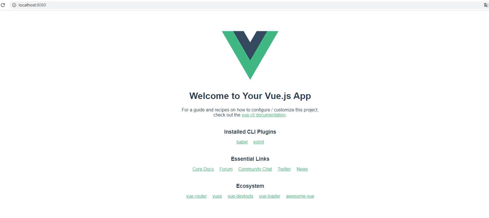
  
###  代码流程
  

```
Error: mermaid CLI is required to be installed.
Check https://github.com/mermaid-js/mermaid.cli for more information.

Error: Command failed: npx mmdc --theme default --input C:\Users\hudejie\AppData\Local\Temp\mume-mermaid2021713-8352-15nb1ty.drifi.mmd --output E:\code\doc\assets\5110930a681e95ebf71f91187936d3440.png
npm ERR! code E404
npm ERR! 404 Not Found - GET https://registry.npmjs.com/mmdc - Not found
npm ERR! 404 
npm ERR! 404  'mmdc@latest' is not in the npm registry.
npm ERR! 404 You should bug the author to publish it (or use the name yourself!)
npm ERR! 404 
npm ERR! 404 Note that you can also install from a
npm ERR! 404 tarball, folder, http url, or git url.

npm ERR! A complete log of this run can be found in:
npm ERR!     C:\Users\hudejie\AppData\Roaming\npm-cache\_logs\2021-08-13T05_40_51_671Z-debug.log
Install for [ 'mmdc@latest' ] failed with code 1

```  

  
---------------------------------------------
  
##  ➡️ 新建页面
  
  
###  创建文件
  
- 在src下创建views目录
- views下创建login.vue文件
  
```html
<template>
    <div class="login">
        <div id="loginDiv">
            <form action="" id="form">
                <h1 style="text-align: center;color: aliceblue;">LOGIN IN</h1>
                <div>username:<input id="username" type="text"></div>
                <div style="margin-top: 5px;">password:<input id="password" type="password"></div>
  
                <div style="text-align: center;margin-top: 30px;">
                    <input type="submit" class="button" value="login up">
                    <input type="reset" class="button" value="reset">
                </div>
            </form>
        </div>
    </div>
</template>
  
<script>
    export default {
        name: "",
        setup() {
            return {
  
            }
        },
    }
</script>
  
<style scoped>
    * {
        margin: 0;
        padding: 0;
    }
  
    .login {
        background-size: cover;
        display: flex;
        justify-content: center;
        align-items: center;
        height: 100%;
        background-image: linear-gradient(to right, #EBDFDB, #EBE9D9);
    }
  
    #loginDiv {
        width: 37%;
        display: flex;
        justify-content: center;
        align-items: center;
        height: 300px;
        background-color: rgba(75, 81, 95, 0.3);
        box-shadow: 7px 7px 17px rgba(52, 56, 66, 0.5);
        border-radius: 5px;
    }
  
    #name_trip {
        margin-left: 50px;
        color: red;
    }
  
    p {
        margin-top: 30px;
        margin-left: 20px;
        color: azure;
    }
  
    input {
        margin-left: 15px;
        border-radius: 5px;
        border-style: hidden;
        height: 30px;
        width: 140px;
        background-color: rgba(216, 191, 216, 0.5);
        outline: none;
        color: #f0edf3;
        padding-left: 10px;
    }
  
    .button {
        border-color: cornsilk;
        background-color: rgba(100, 149, 237, .7);
        color: aliceblue;
        border-style: hidden;
        border-radius: 5px;
        width: 100px;
        height: 31px;
        font-size: 16px;
    }
</style>
```
  
###  显示页面
  
- 将HelloWorld替换为Login界面
```html
<template>
  <Login/>
</template>
  
<script>
//import HelloWorld from './components/HelloWorld.vue'
import Login from './views/login.vue'
  
export default {
  name: 'App',
  components: {
    Login
  }
}
</script>
  
<style>
  html,
  body {
    width: 100%;
    height: 100%;
    padding: 0;
    margin: 0;
    overflow: hidden;
    font-family: Avenir, Helvetica, Arial, sans-serif;
  }
  
  #app {
    width: 100%;
    height: 100%;
    font-family: Avenir, Helvetica, Arial, sans-serif;
    -webkit-font-smoothing: antialiased;
    -moz-osx-font-smoothing: grayscale;
    text-align: center;
    color: #2c3e50;
  }
</style>
  
```
  
###  显示效果
  
  
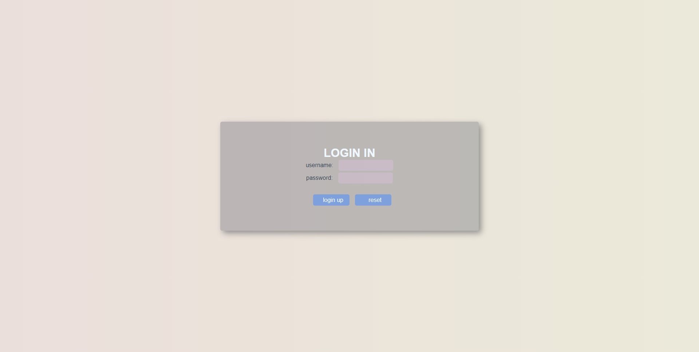
  
---------------------------------------------
  
##  ➡️ vue-router使用
  
  
###  简介
  
> - 嵌套的路由/视图表
> - 模块化的、基于组件的路由配置
> - 路由参数、查询、通配符
> - 基于 Vue.js 过渡系统的视图过渡效果
> - 细粒度的导航控制
> - 带有自动激活的 CSS class 的链接
> - HTML5 历史模式或 hash 模式，在 IE9 中自动降级
> - 自定义的滚动条行为
  
  
###  安装
  
> npm install --save vue-router@next
  
###  创建router
  
- 新建src/router目录
- 新建index.js文件
- 文件内容如下
  
```js
import { createRouter, createWebHashHistory } from 'vue-router';
import Login from "../views/Login.vue";
import HelloWorld from "../components/HelloWorld.vue";
  
// 路由表
const routes = [
    {
        path: "/",
        name: "Home",
        component: HelloWorld,
    },
    {
        path: "/login",
        name: "Login",
        meta: {
            title: '登录'
        },
        component: Login,
    }
]
  
// 创建路由
const router = createRouter({
    history: createWebHashHistory(),
    routes
});
  
// 路由拦截
// router.beforeEach((to, from, next) => {
//     const role = localStorage.getItem('username');           // 从localStorage获取用户名
//     console.log(role);
//     if (!role && to.path !== '/login') {                      // 如果用户名不存在，并且路由条状非login时，直接跳转login
//         next('/login');
//     } else {
//         next();
//     }
// });
  
export default router;
  
```
  
上述代码大概含义:
- 创建两条路由，分别指向HelloWorld，Login界面。
- 创建路由对象
- 路由拦截：当localStorage中不存在用户名时，认为未登录，所有链接都跳转到Login界面,暂时去掉
  
###  引入router
  
- 修改main.js如下，是app是用我们创建的路由
```js
import { createApp } from 'vue'
import App from './App.vue'
import router from './router'                               // 引入路由配置
  
const app = createApp(App)
  
app.use(router)                 // 载入路由配置
    .mount('#app')
```
  
- 修改main.js如下，app使用我们创建的路由
  
###  显示路由页面
  
- 修改App.vue中html块如下
```html
<template>
  <router-view />
</template>
```
此时界面就会显示当前路由对应界面
  
- 在浏览器中输入http://localhost:8080/ 展示的是HelloWord中内容
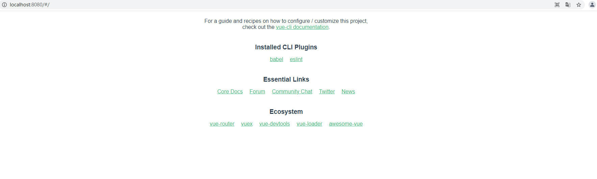
- 在浏览器中输入http://localhost:8080/#/login/ 展示的是Login中内容
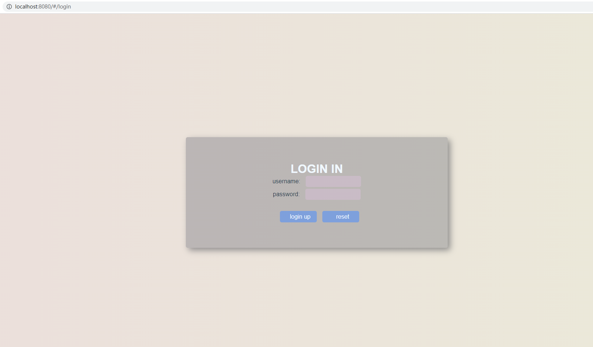
  
###  路由跳转
  
- 在HelloWord.vue中增加跳转连接
```html
<router-link to="/login">Go to Login</router-link>
```
  
点击页面Go to Login标签即可跳转到登录界面。
  
---------------------------------------------
  
##  ➡️ vue3使用i18n
  
  
###  简介
  
  
> 在信息技术领域，国际化与本地化（英文：internationalization and localization）是指修改软件使之能适应目标市场的语言、地区差异以及技术需要。
国际化是指在设计软件，将软件与特定语言及地区脱钩的过程。当软件被移植到不同的语言及地区时，软件本身不用做内部工程上的改变或修正。本地化则是指当移植软件时，加上与特定区域设置有关的信息和翻译文件的过程。
国际化和本地化之间的区别虽然微妙，但却很重要。国际化意味着产品有适用于任何地方的“潜力”；本地化则是为了更适合于“特定”地方的使用，而另外增添的特色。用一项产品来说，国际化只需做一次，但本地化则要针对不同的区域各做一次。这两者之间是互补的，并且两者合起来才能让一个系统适用于各地 [1]  。
基于他们的英文单字长度过长，常被分别简称成i18n（18意味着在“internationalization”这个单字中，i和n之间有18个字母）及L10n。使用大写的L以利区分i18n中的i和易于分辨小写l与1。
  
###  安装
  
> npm install i18n --save
  
  
###  使用步骤
  
####  1、创建I18n
  
``` js
import { createI18n } from 'vue-i18n'
  
  
const i18n = createI18n({
  locale: localeZH.name,            // 默认中文
  fallbackLocale: localeEN.name,    // 中文不存在时，显示英文
  messages,                         // 自定义语言包
})  
```
  
####  2、创建自定义语言包
  
``` js
export default {
    'zh-cn': {
        main: {
            prjname:'后台管理系统',
            breadcrumb: '国际化产品',
            tips: '通过切换语言按钮，来改变当前内容的语言。',
            btn: '切换英文',
            title1: '常用用法',
            p1: '要是你把你的秘密告诉了风，那就别怪风把它带给树。',
            p2: '没有什么比信念更能支撑我们度过艰难的时光了。',
            p3: '只要能把自己的事做好，并让自己快乐，你就领先于大多数人了。'
        },
        siderbar: {
            dashboard:'系统首页',
            table:'基础表格',
            tabs:'tab选项卡',
            froms:'表单相关',
            icon:'自定义图标',
            charts:'schart图表',
            i18n:'国际化功能',
            error:'错误处理',
            framestyle:'画面风格',
            iconfont:'iconfont',
            donate:'支持作者',
        }
    },
    'en': {
        main:{
            prjname:'Management System',
            breadcrumb: 'International Products',
            tips: 'Click on the button to change the current language. ',
            btn: 'Switch Chinese',
            title1: 'Common usage',
            p1: "If you reveal your secrets to the wind you should not blame the wind for  revealing them to the trees.",
            p2: "Nothing can help us endure dark times better than our faith. ",
            p3: "If you can do what you do best and be happy, you're further along in life  than most people."
        },
        siderbar: {
            dashboard:'dashboard',
            table:'table',
            tabs:'tabs',
            froms:'froms',
            icon:'icon',
            charts:'charts',
            i18n:'i18n',
            error:'error',
            framestyle:'framestyle',
            iconfont:'iconfont',
            donate:'donate',
        },
    }
}
```
  
如上，创建了两个语言包，分别为zh-cn，en.
  
####  3、使用语言
  
``` html
<div class="logo">{{$t('main.prjname')}}</div>
```
此时就用到语言包中main.prjnam标签
  
####  4、切换语言
  
#####  4.1、html
  
``` html
<el-button
    type="primary"
    @click="$i18n.locale = $i18n.locale === 'zh-cn'?'en':'zh-cn';">
    切换语言
    </el-button>
```
  
#####  4.2、js
  
``` js
import { getCurrentInstance } from "vue";
const { proxy } = getCurrentInstance();
  
const handleLangCommand = (command) => {
    proxy.$i18n.locale = command;  // command:zh-cn 或 en
    console.log(proxy);
};
```
  
  
  
---------------------------------------------
  
##  ➡️ vue3+element-ui使用iconfont
  
  
###  创建图标项目
  
  
- 登录官网 
> https://www.iconfont.cn
- 创建项目
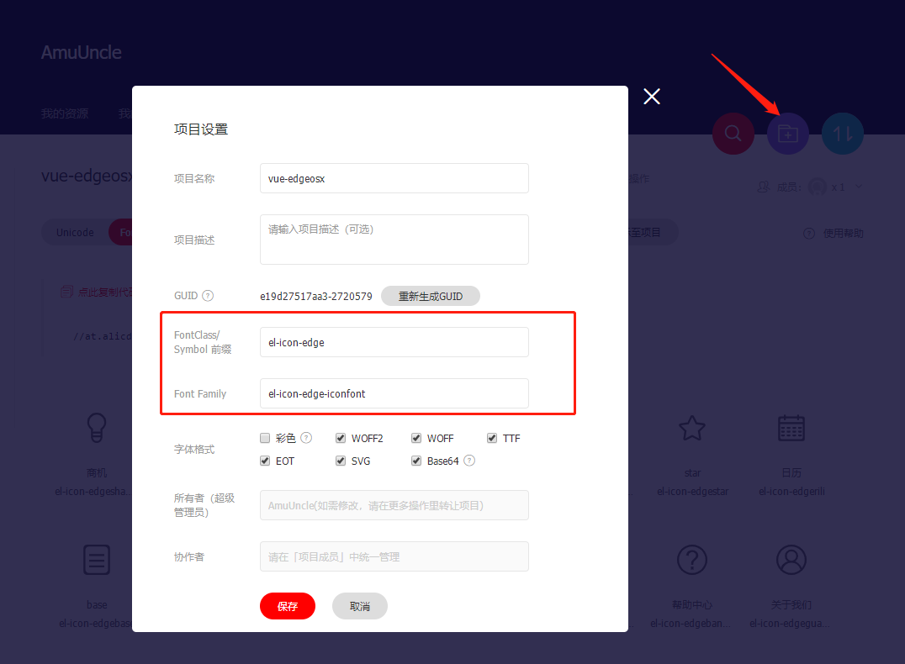
- 注意前缀请使用el-icon-开头，font-family可随意,因为element-ui中对图标样式控制采用el-icon开头，这样可以和element-ui中图标保持相同样式
  
``` css
element-ui css 源码
[class*=" el-icon-"],[class^=el-icon-] {
	font-family: element-icons!important;
	speak: none;
	font-style: normal;
	font-weight: 400;
	font-variant: normal;
	text-transform: none;
	line-height: 1;
	vertical-align: baseline;
	display: inline-block;
	-webkit-font-smoothing: antialiased;
	-moz-osx-font-smoothing: grayscale
    ...
}
```
  
- 勾选Base64
- 生成在线链接，也可下载下来本地使用
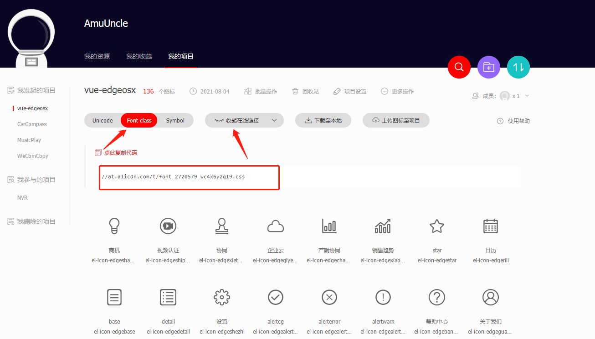
  
###  引入iconfont图标
  
- 在index.html中加入如下链接，链接地址换成自己项目地址
``` html
 <link rel="stylesheet" href="https://at.alicdn.com/t/font_2720579_wc4x6y2ql9.css">
 ```
 - 新建iconfont.css（文件名随意），添加如下内容，指定样式为el-icon-edge开头的元素采用el-icon-edge-iconfon字符集
 ``` css
[class*=" el-icon-edge"],
[class^=el-icon-edge] {
    font-family: el-icon-edge-iconfont !important;
}
```
- main.js中引用上述iconfont.css文件
  
  
###  实际使用
  
- 实际使用和element-ui中图标方式一致，如下
``` html
<i class="el-icon-edgechanrongxietong"></i>
```
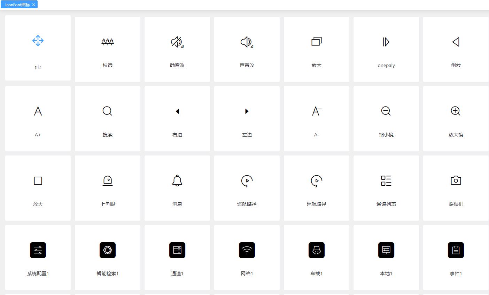
  
---------------------------------------------
  
##  ➡️ vue3+element-ui使用Animate.css
  
  
###  简介
  
> animate.css 是一个来自国外的 CSS3 动画库，它预设了抖动（shake）、闪烁（flash）、弹跳（bounce）、翻转（flip）、旋转（rotateIn/rotateOut）、淡入淡出（fadeIn/fadeOut）等多达 60 多种动画效果，几乎包含了所有常见的动画效果。
> 
> 虽然借助 animate.css 能够很方便、快速的制作 CSS3 动画效果，但还是建议看看 animate.css 的代码，也许你能从中学到一些东西。
  
###  兼容
  
> 浏览器兼容：当然是只兼容支持 CSS3 animate 属性的浏览器，他们分别是：IE10+、Firefox、Chrome、Opera、Safari。
  
###  使用方法
  
####  1、引入文件
  
  
> ``` cpp
> <link rel="stylesheet" href="animate.min.css">
>  
>  或者cdn方式引用
>  
> <link rel="stylesheet" 
>       href="https://cdnjs.cloudflare.com/ajax/libs/animate.css/3.7.2/animate.min.css">
 > ```
  
####  2、使用动画
  
#####  2.1、结合transition使用动画
  
 ``` html
<transition enter-active-class="animated bounceInDown" 
            leave-active-class="animated bounceOutDown" 
            :duration="200"><!--入场和离场的时间-->
            <div> 测试 </div>
</transition>
 ```
 > 说明：结合**transition**标签可以设置元素入场和离场动画
  
#####  2.2、直接使用
  
 ``` html
<el-card class="animated bounceIn" shadow="hover">
    <schart ref="bar" class="schart" canvasId="bar" :options="options"></schart>
</el-card>
 ```
  
---------------------------------------------
  
##  ➡️ 全屏组件screenfull
  
  
###  安装
  
> npm install screenfull --save
  
###  使用步骤
  
####  1、引入文件
  
``` js
import screenfull from 'screenfull';
```
  
####  2、使用
  
#####  2.1、整个页面全屏
  
 ``` js
// 全屏点击时
const onScreenfullClick = () => {
    if (!screenfull.isEnabled) {
        ElMessage.warning('暂不不支持全屏');
        return false;
    }
  
    screenfull.toggle();        // 触发全屏切换，即在全屏与非全屏状态切换
    screenfull.on('change', () => {
        // 响应全屏状态，可根据此状态，更换按钮图标等操作
        if (screenfull.isFullscreen) 
            state.isScreenfull = true;     
        else 
            state.isScreenfull = false;
    });
};
 ```
  
#####  2.2、单个元素全屏
  
 ``` js
<div class="text"  @dblclick="FuncDbClick($event)">
    <el-image style="width: 100%;height:100%;" src="../src/assets/img/camera.png" :fit="fit">
    </el-image>
</div>
  
const FuncDbClick = (event) => {
    state.bSignalFull ? screenfull.exit() : screenfull.request(event.currentTarget);
    state.bSignalFull = !state.bSignalFull;
};
 ```
 > 双击全屏及退出全屏
  
  
---------------------------------------------
  
##  ➡️ vue3知识图谱
  
  
###  学前了解
  
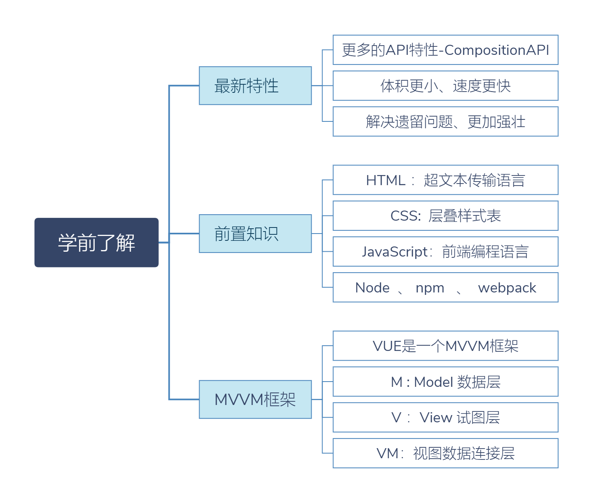
###  基础知识
  
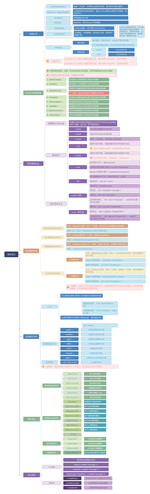
###  组件相关语法
  
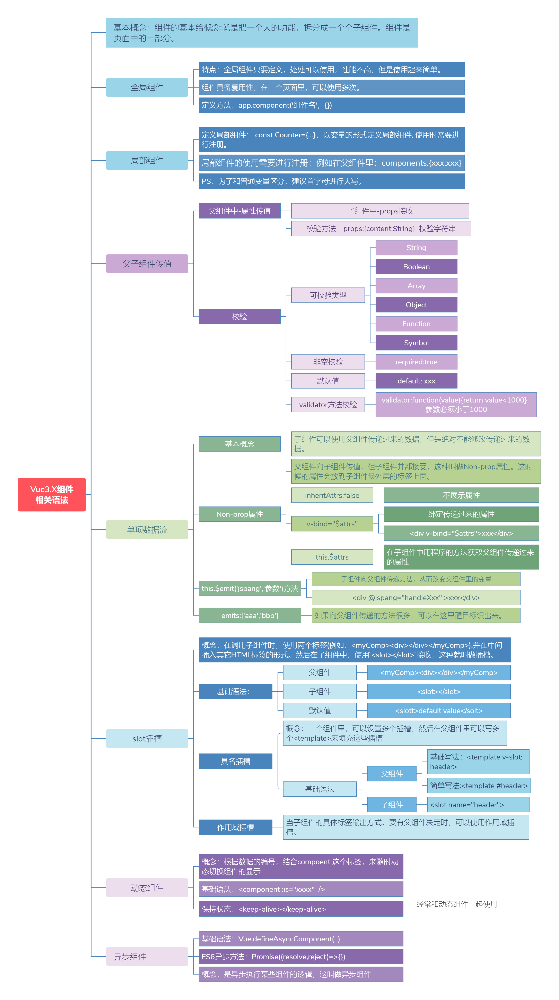
###  高级语法
  

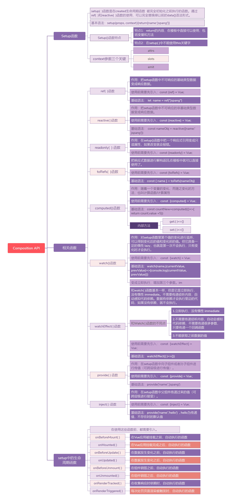
###  配套工具
  
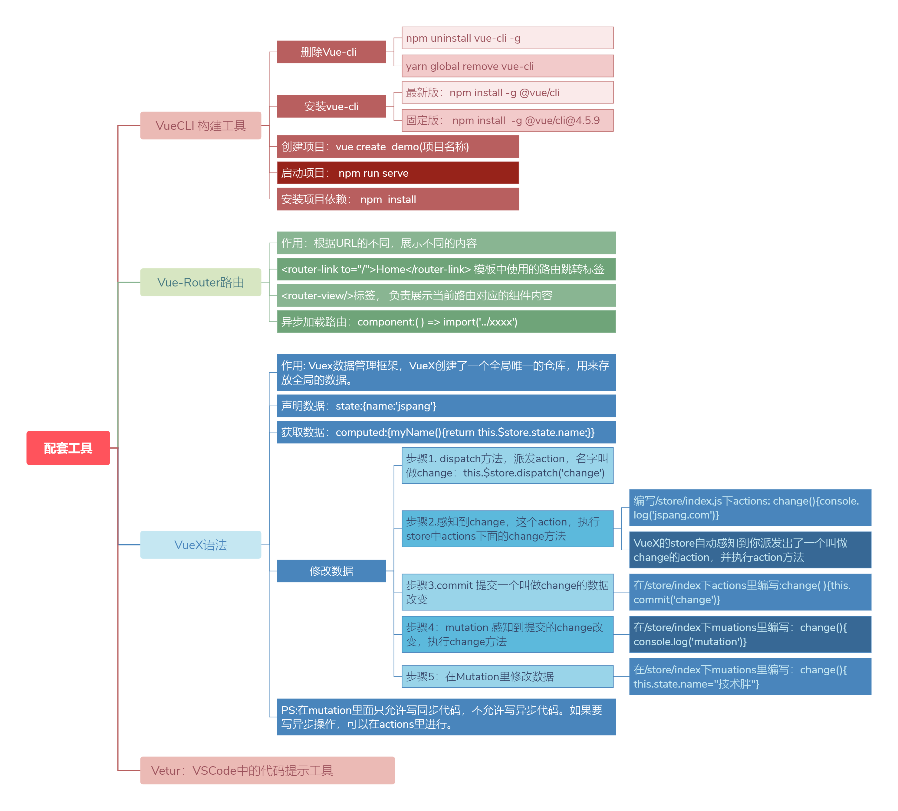
  
---------------------------------------------
  