## 编译环境

- 操作系统: Window10 64位
- 需要下载的文件
    - vs2017
    - MSYS2

## 编译步骤

### 安装vs2017
> 网络上很多安装教程，这里不再赘述，自行安装

----
### 安装MSYS2
- MSYS2官网
https://www.msys2.org/
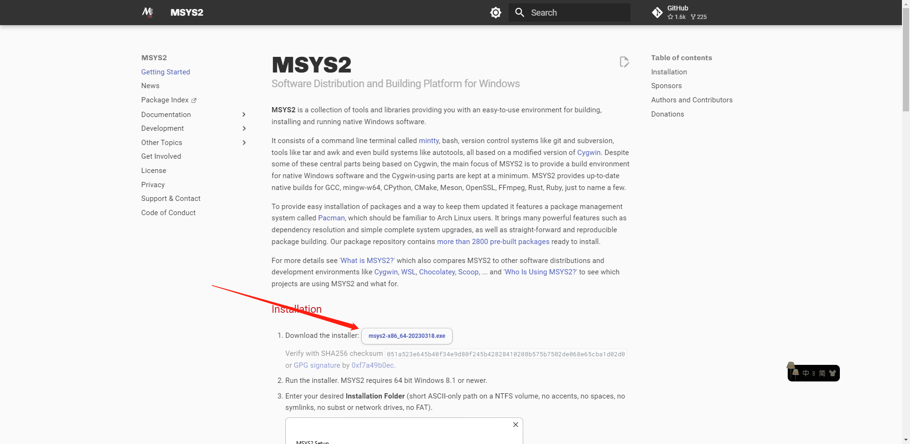
下载上图安装包，默认安装即可，安装路径C:\msys64

- 如何启动 msys2 ？ 
打开WinCMD 进入 C:\msys64 目录，执行以下命令 进入 mingw32 或者 mingw64位环境。
    - .\msys2_shell.cmd -mingw32
    - .\msys2_shell.cmd -mingw64
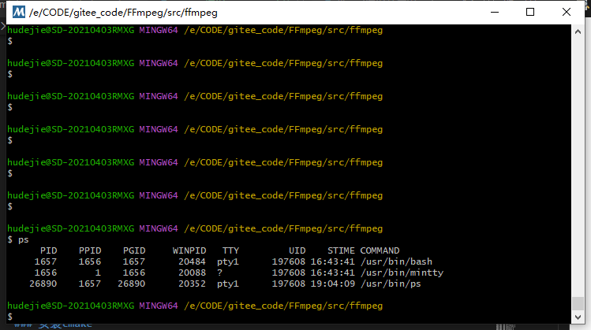
msys2 实际上是一个 在 Windows 系统模拟 Linux 的一个命令窗口程序

----
### msvc+MSYS2编译ffmpeg
#### 准备环境
- 修改C:\msys64\msys2_shell.cmd文件
将rem set MSYS2_PATH_TYPE=inherit前面的rem去除
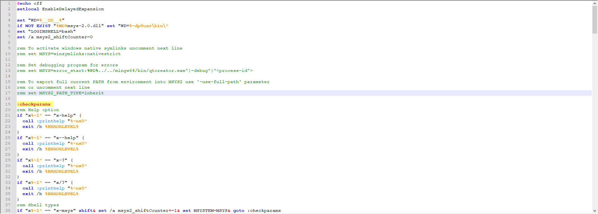
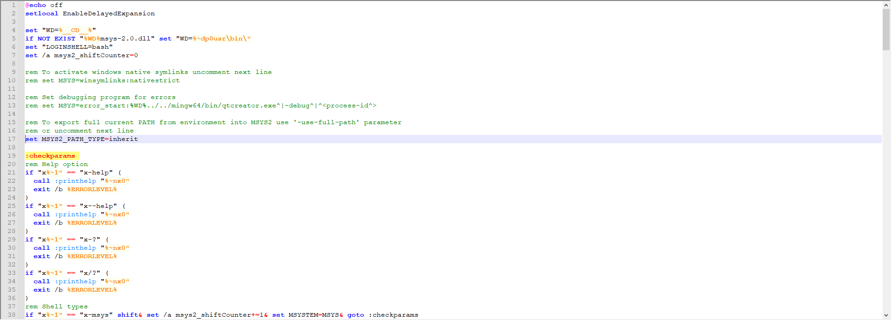

- 执行vs2017命令行工具
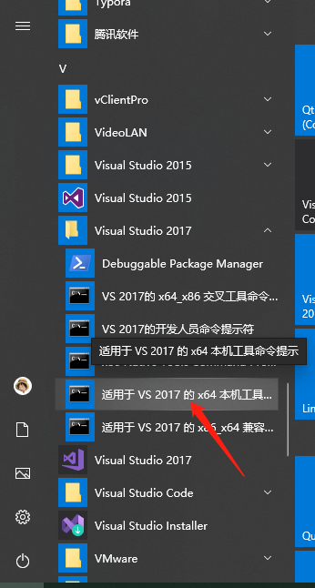
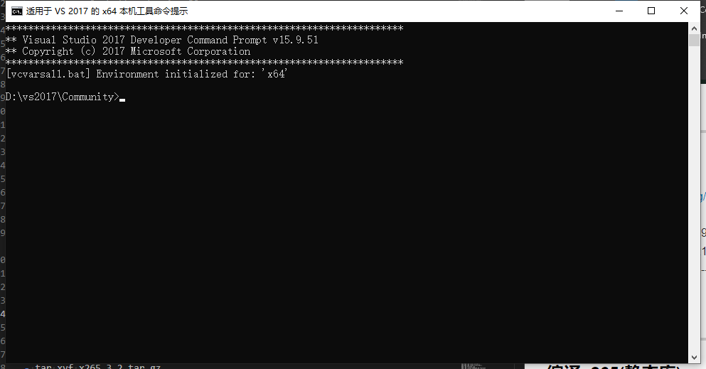

- 执行以下命令，启动msys2模拟mingw64环境
```
cd c:\msys64\
.\msys2_shell.cmd -mingw64
```
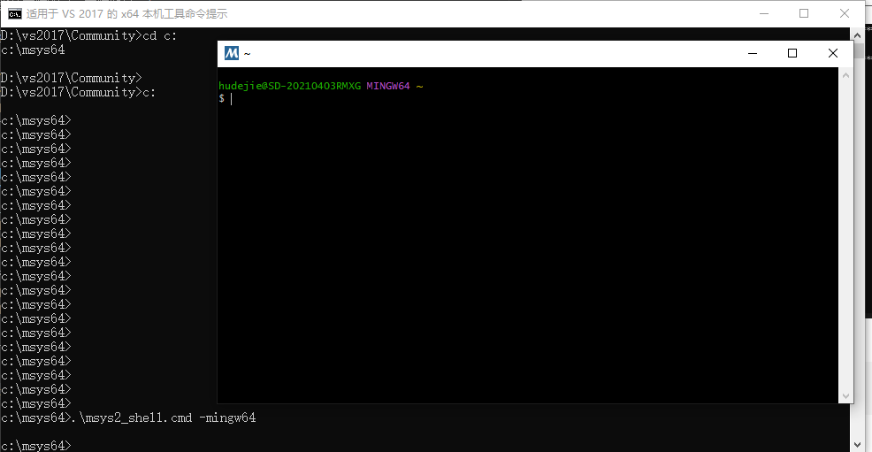

- 测试环境
```
which cl.exe
```
在msys2命令行窗口输入上方命令，输出如下界面即为成功
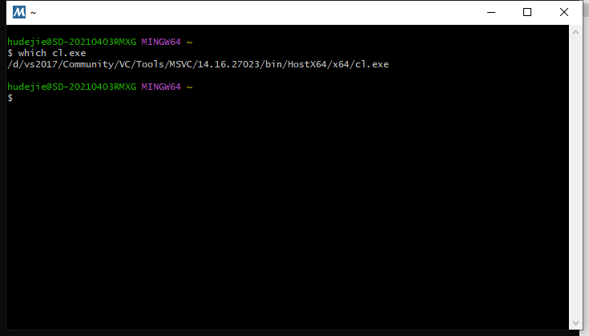

- 安装依赖
输入以下命令，安装依赖组件
```
pacman -S diffutils make pkg-config yasm
```
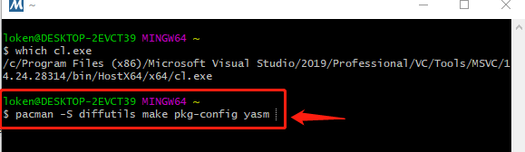

#### 开始编译
- 下载ffmpeg源码
ffmpeg开源地址：https://github.com/FFmpeg/FFmpeg
可以下载最新代码

演示代码目录：E:\CODE\gitee_code\FFmpeg\src\ffmpeg
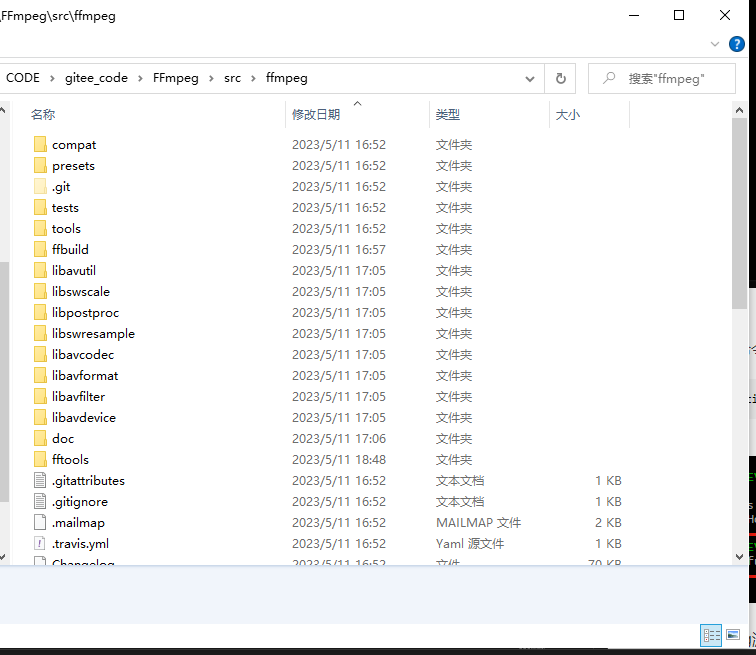

- 修改源码
修改fftools\ffprobe.c、fftools\opt_common.c两个文件
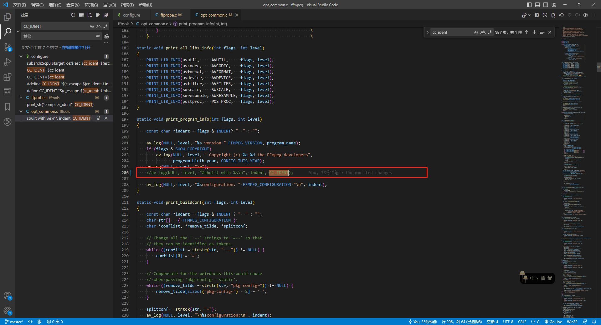
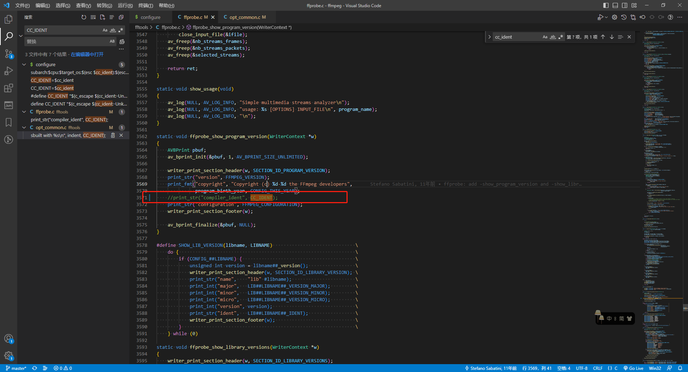
将包含 CC_IDENT 的行注释掉，不影响功能，只是打印输出编码有点问题，注释掉即可

- 进入目录
```
cd E:\CODE\gitee_code\FFmpeg\src\ffmpeg
```
创建编译输出目录：E:/CODE/gitee_code/FFmpeg/build64/ffmepg-4.4-msvc
- 开始编译
```
./configure \
--prefix=E:/CODE/gitee_code/FFmpeg/build64/ffmepg-4.4-msvc \
--enable-gpl \
--enable-nonfree \
--enable-shared \
--disable-optimizations \
--disable-asm \
--disable-stripping \
--toolchain=msvc

make -j8
# 要执行 make install
make install
```

顺利的话，执行完以上命令，便可编译完成，在E:/CODE/gitee_code/FFmpeg/build64/ffmepg-4.4-msvc目录可以看见输出文件

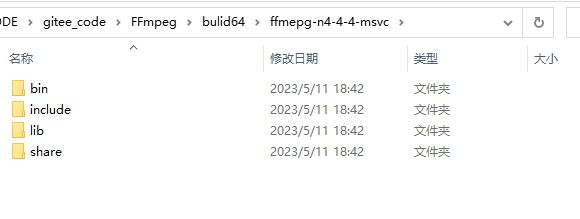

## 测试
- ffmpeg.exe -i http://devimages.apple.com.edgekey.net/streaming/examples/bipbop_4x3/gear2/prog_index.m3u8 -vcodec copy -f mp4 1.mp4 // 苹果测试源，此命令为将在线视频源保存为mp4文件
```
ffmpeg version N-108922-ge27bef9a56 Copyright (c) 2000-2022 the FFmpeg developers
  built with gcc 9 (Ubuntu 9.4.0-1ubuntu1~20.04.1)
  configuration: --enable-shared --enable-nonfree --enable-gpl --enable-pthreads --enable-libx264 --enable-libx265 --prefix=../ffmpeg_output
  libavutil      57. 40.100 / 57. 40.100
  libavcodec     59. 51.101 / 59. 51.101
  libavformat    59. 34.101 / 59. 34.101
  libavdevice    59.  8.101 / 59.  8.101
  libavfilter     8. 49.101 /  8. 49.101
  libswscale      6.  8.112 /  6.  8.112
  libswresample   4.  9.100 /  4.  9.100
  libpostproc    56.  7.100 / 56.  7.100
[hls @ 0x563459342040] Skip ('#EXT-X-VERSION:3')
[hls @ 0x563459342040] Opening 'http://devimages.apple.com.edgekey.net/streaming/examples/bipbop_4x3/gear2/fileSequence0.ts' for reading
[hls @ 0x563459342040] Opening 'http://devimages.apple.com.edgekey.net/streaming/examples/bipbop_4x3/gear2/fileSequence1.ts' for reading
[mpegts @ 0x56345935c4c0] Invalid timestamps stream=0, pts=903000, dts=906000, size=1077
[hls @ 0x563459342040] Invalid timestamps stream=0, pts=903000, dts=906000, size=1078
[mpegts @ 0x56345935c4c0] Invalid timestamps stream=0, pts=909000, dts=912000, size=1445
[hls @ 0x563459342040] Invalid timestamps stream=0, pts=909000, dts=912000, size=1353
[mpegts @ 0x56345935c4c0] Invalid timestamps stream=0, pts=915000, dts=918000, size=1261
[hls @ 0x563459342040] Invalid timestamps stream=0, pts=915000, dts=918000, size=1260
[mpegts @ 0x56345935c4c0] Invalid timestamps stream=0, pts=921000, dts=924000, size=1261
[hls @ 0x563459342040] Invalid timestamps stream=0, pts=921000, dts=924000, size=1211
[mpegts @ 0x56345935c4c0] Invalid timestamps stream=0, pts=927000, dts=930150, size=1261
[hls @ 0x563459342040] Invalid timestamps stream=0, pts=927000, dts=930150, size=1271
[mpegts @ 0x56345935c4c0] Invalid timestamps stream=0, pts=933150, dts=936150, size=1077
[hls @ 0x563459342040] Invalid timestamps stream=0, pts=933150, dts=936150, size=1059
[mpegts @ 0x56345935c4c0] Invalid timestamps stream=0, pts=939150, dts=942150, size=1261
[hls @ 0x563459342040] Invalid timestamps stream=0, pts=939150, dts=942150, size=1381
[mpegts @ 0x56345935c4c0] Invalid timestamps stream=0, pts=945150, dts=948150, size=709
[hls @ 0x563459342040] Invalid timestamps stream=0, pts=945150, dts=948150, size=829
[mpegts @ 0x56345935c4c0] Invalid timestamps stream=0, pts=951150, dts=954150, size=1261
[hls @ 0x563459342040] Invalid timestamps stream=0, pts=951150, dts=954150, size=1303
[mpegts @ 0x56345935c4c0] Invalid timestamps stream=0, pts=957150, dts=960150, size=1261
[hls @ 0x563459342040] Invalid timestamps stream=0, pts=957150, dts=960150, size=1207
Input #0, hls, from 'http://devimages.apple.com.edgekey.net/streaming/examples/bipbop_4x3/gear2/prog_index.m3u8':
  Duration: 00:30:00.00, start: 9.904222, bitrate: 0 kb/s
  Program 0 
    Metadata:
      variant_bitrate : 0
  Stream #0:0: Video: h264 (Main) ([27][0][0][0] / 0x001B), yuv420p(tv, smpte170m/smpte170m/bt709), 640x480, Closed Captions, 29.92 fps, 29.92 tbr, 90k tbn
    Metadata:
      variant_bitrate : 0
  Stream #0:1: Audio: aac (LC) ([15][0][0][0] / 0x000F), 22050 Hz, stereo, fltp
    Metadata:
      variant_bitrate : 0
Stream mapping:
  Stream #0:0 -> #0:0 (copy)
  Stream #0:1 -> #0:1 (aac (native) -> aac (native))
Press [q] to stop, [?] for help
Output #0, mp4, to '1.mp4':
  Metadata:
    encoder         : Lavf59.34.101
  Stream #0:0: Video: h264 (Main) (avc1 / 0x31637661), yuv420p(tv, smpte170m/smpte170m/bt709), 640x480, q=2-31, 29.92 fps, 29.92 tbr, 90k tbn
    Metadata:
      variant_bitrate : 0
  Stream #0:1: Audio: aac (LC) (mp4a / 0x6134706D), 22050 Hz, stereo, fltp, 128 kb/s
    Metadata:
      variant_bitrate : 0
      encoder         : Lavc59.51.101 aac
[mp4 @ 0x563459363200] Invalid DTS: 14620 PTS: 11620 in output stream 0:0, replacing by guess    
[mp4 @ 0x563459363200] Invalid DTS: 20620 PTS: 17620 in output stream 0:0, replacing by guess
[mp4 @ 0x563459363200] Invalid DTS: 26620 PTS: 23620 in output stream 0:0, replacing by guess
[mp4 @ 0x563459363200] Invalid DTS: 32620 PTS: 29620 in output stream 0:0, replacing by guess
[mp4 @ 0x563459363200] Invalid DTS: 38770 PTS: 35620 in output stream 0:0, replacing by guess
[mp4 @ 0x563459363200] Invalid DTS: 44770 PTS: 41770 in output stream 0:0, replacing by guess
[mpegts @ 0x56345935c4c0] Invalid timestamps stream=0, pts=963150, dts=966150, size=893
[hls @ 0x563459342040] Invalid timestamps stream=0, pts=963150, dts=966150, size=898
[mp4 @ 0x563459363200] Invalid DTS: 50770 PTS: 47770 in output stream 0:0, replacing by guess
[mp4 @ 0x563459363200] Invalid DTS: 56770 PTS: 53770 in output stream 0:0, replacing by guess
[mp4 @ 0x563459363200] Invalid DTS: 62770 PTS: 59770 in output stream 0:0, replacing by guess
[mp4 @ 0x563459363200] Invalid DTS: 68770 PTS: 65770 in output stream 0:0, replacing by guess
[mp4 @ 0x563459363200] Invalid DTS: 74770 PTS: 71770 in output stream 0:0, replacing by guess
[mpegts @ 0x56345935c4c0] Invalid timestamps stream=0, pts=975150, dts=978150, size=1077
[hls @ 0x563459342040] Invalid timestamps stream=0, pts=975150, dts=978150, size=1192
[mpegts @ 0x56345935c4c0] Invalid timestamps stream=0, pts=981150, dts=984150, size=1445
[mp4 @ 0x563459363200] Invalid DTS: 86770 PTS: 83770 in output stream 0:0, replacing by guess
[hls @ 0x563459342040] Invalid timestamps stream=0, pts=981150, dts=984150, size=1270
[mpegts @ 0x56345935c4c0] Invalid timestamps stream=0, pts=987150, dts=990150, size=1077
[hls @ 0x563459342040] Invalid timestamps stream=0, pts=987150, dts=990150, size=1215
[mp4 @ 0x563459363200] Invalid DTS: 92770 PTS: 89770 in output stream 0:0, replacing by guess
[mpegts @ 0x56345935c4c0] Invalid timestamps stream=0, pts=993150, dts=996150, size=1077
[hls @ 0x563459342040] Invalid timestamps stream=0, pts=993150, dts=996150, size=1092
[mp4 @ 0x563459363200] Invalid DTS: 98770 PTS: 95770 in output stream 0:0, replacing by guess
[mp4 @ 0x563459363200] Invalid DTS: 104770 PTS: 101770 in output stream 0:0, replacing by guess
[mpegts @ 0x56345935c4c0] Invalid timestamps stream=0, pts=999150, dts=1002150, size=1445
[hls @ 0x563459342040] Invalid timestamps stream=0, pts=999150, dts=1002150, size=1436
[mpegts @ 0x56345935c4c0] Invalid timestamps stream=0, pts=1005150, dts=1008150, size=1261
[hls @ 0x563459342040] Invalid timestamps stream=0, pts=1005150, dts=1008150, size=1291
[mp4 @ 0x563459363200] Invalid DTS: 110770 PTS: 107770 in output stream 0:0, replacing by guess
[mpegts @ 0x56345935c4c0] Invalid timestamps stream=0, pts=1011150, dts=1014150, size=1261
[hls @ 0x563459342040] Invalid timestamps stream=0, pts=1011150, dts=1014150, size=1214
[mp4 @ 0x563459363200] Invalid DTS: 116770 PTS: 113770 in output stream 0:0, replacing by guess
[mpegts @ 0x56345935c4c0] Invalid timestamps stream=0, pts=1017150, dts=1020150, size=1261
[hls @ 0x563459342040] Invalid timestamps stream=0, pts=1017150, dts=1020150, size=1274
[mpegts @ 0x56345935c4c0] Invalid timestamps stream=0, pts=1023150, dts=1026150, size=1077
[mp4 @ 0x563459363200] Invalid DTS: 122770 PTS: 119770 in output stream 0:0, replacing by guess
[hls @ 0x563459342040] Invalid timestamps stream=0, pts=1023150, dts=1026150, size=1025
[mp4 @ 0x563459363200] Invalid DTS: 128770 PTS: 125770 in output stream 0:0, replacing by guess
[mp4 @ 0x563459363200] Invalid DTS: 134770 PTS: 131770 in output stream 0:0, replacing by guess
[mpegts @ 0x56345935c4c0] Invalid timestamps stream=0, pts=1029150, dts=1032150, size=1629
[hls @ 0x563459342040] Invalid timestamps stream=0, pts=1029150, dts=1032150, size=1468
[mpegts @ 0x56345935c4c0] Invalid timestamps stream=0, pts=1035150, dts=1038150, size=893
[mp4 @ 0x563459363200] Invalid DTS: 140770 PTS: 137770 in output stream 0:0, replacing by guess
[hls @ 0x563459342040] Invalid timestamps stream=0, pts=1035150, dts=1038150, size=921
[mp4 @ 0x563459363200] Invalid DTS: 146770 PTS: 143770 in output stream 0:0, replacing by guess
[mpegts @ 0x56345935c4c0] Invalid timestamps stream=0, pts=1047150, dts=1050150, size=1261
[hls @ 0x563459342040] Invalid timestamps stream=0, pts=1047150, dts=1050150, size=1208
[mpegts @ 0x56345935c4c0] Invalid timestamps stream=0, pts=1053150, dts=1056150, size=1077
[hls @ 0x563459342040] Invalid timestamps stream=0, pts=1053150, dts=1056150, size=951
[mp4 @ 0x563459363200] Invalid DTS: 158770 PTS: 155770 in output stream 0:0, replacing by guess
[mpegts @ 0x56345935c4c0] Invalid timestamps stream=0, pts=1059150, dts=1062150, size=1261
[hls @ 0x563459342040] Invalid timestamps stream=0, pts=1059150, dts=1062150, size=1222
[mp4 @ 0x563459363200] Invalid DTS: 164770 PTS: 161770 in output stream 0:0, replacing by guess
[mp4 @ 0x563459363200] Invalid DTS: 170770 PTS: 167770 in output stream 0:0, replacing by guess
[mpegts @ 0x56345935c4c0] Invalid timestamps stream=0, pts=1065150, dts=1068150, size=1261
[hls @ 0x563459342040] Invalid timestamps stream=0, pts=1065150, dts=1068150, size=1155
[mpegts @ 0x56345935c4c0] Invalid timestamps stream=0, pts=1071150, dts=1074150, size=1445
[mp4 @ 0x563459363200] Invalid DTS: 176770 PTS: 173770 in output stream 0:0, replacing by guess
[hls @ 0x563459342040] Invalid timestamps stream=0, pts=1071150, dts=1074150, size=1289
[mpegts @ 0x56345935c4c0] Invalid timestamps stream=0, pts=1077150, dts=1080300, size=1077
[mp4 @ 0x563459363200] Invalid DTS: 182770 PTS: 179770 in output stream 0:0, replacing by guess
[hls @ 0x563459342040] Invalid timestamps stream=0, pts=1077150, dts=1080300, size=1100
[mpegts @ 0x56345935c4c0] Invalid timestamps stream=0, pts=1083300, dts=1086300, size=893
[mp4 @ 0x563459363200] Invalid DTS: 188920 PTS: 185770 in output stream 0:0, replacing by guess
[hls @ 0x563459342040] Invalid timestamps stream=0, pts=1083300, dts=1086300, size=1074
[mpegts @ 0x56345935c4c0] Invalid timestamps stream=0, pts=1089300, dts=1092300, size=1261
[mp4 @ 0x563459363200] Invalid DTS: 194920 PTS: 191920 in output stream 0:0, replacing by guess
[hls @ 0x563459342040] Invalid timestamps stream=0, pts=1089300, dts=1092300, size=1360
[mpegts @ 0x56345935c4c0] Invalid timestamps stream=0, pts=1095300, dts=1098300, size=1261
[mp4 @ 0x563459363200] Invalid DTS: 200920 PTS: 197920 in output stream 0:0, replacing by guess
[hls @ 0x563459342040] Invalid timestamps stream=0, pts=1095300, dts=1098300, size=1257
[mpegts @ 0x56345935c4c0] Invalid timestamps stream=0, pts=1101300, dts=1104300, size=1077
[hls @ 0x563459342040] Invalid timestamps stream=0, pts=1101300, dts=1104300, size=1226
[mp4 @ 0x563459363200] Invalid DTS: 206920 PTS: 203920 in output stream 0:0, replacing by guess
[mp4 @ 0x563459363200] Invalid DTS: 212920 PTS: 209920 in output stream 0:0, replacing by guess
[mpegts @ 0x56345935c4c0] Invalid timestamps stream=0, pts=1107300, dts=1110300, size=1261
[hls @ 0x563459342040] Invalid timestamps stream=0, pts=1107300, dts=1110300, size=1263
[mp4 @ 0x563459363200] Invalid DTS: 218920 PTS: 215920 in output stream 0:0, replacing by guess
[mpegts @ 0x56345935c4c0] Invalid timestamps stream=0, pts=1119300, dts=1122300, size=1261
[hls @ 0x563459342040] Invalid timestamps stream=0, pts=1119300, dts=1122300, size=1317
[mpegts @ 0x56345935c4c0] Invalid timestamps stream=0, pts=1125300, dts=1128300, size=893
[hls @ 0x563459342040] Invalid timestamps stream=0, pts=1125300, dts=1128300, size=820
[mp4 @ 0x563459363200] Invalid DTS: 230920 PTS: 227920 in output stream 0:0, replacing by guess
[mp4 @ 0x563459363200] Invalid DTS: 236920 PTS: 233920 in output stream 0:0, replacing by guess
[mpegts @ 0x56345935c4c0] Invalid timestamps stream=0, pts=1131300, dts=1134300, size=1261
[hls @ 0x563459342040] Invalid timestamps stream=0, pts=1131300, dts=1134300, size=1325
[mpegts @ 0x56345935c4c0] Invalid timestamps stream=0, pts=1137300, dts=1140300, size=1261
[hls @ 0x563459342040] Invalid timestamps stream=0, pts=1137300, dts=1140300, size=1173
[mpegts @ 0x56345935c4c0] Invalid timestamps stream=0, pts=1143300, dts=1146300, size=893
[mp4 @ 0x563459363200] Invalid DTS: 242920 PTS: 239920 in output stream 0:0, replacing by guess
[mp4 @ 0x563459363200] Invalid DTS: 248920 PTS: 245920 in output stream 0:0, replacing by guess
[hls @ 0x563459342040] Invalid timestamps stream=0, pts=1143300, dts=1146300, size=925
[mpegts @ 0x56345935c4c0] Invalid timestamps stream=0, pts=1149300, dts=1152300, size=1261
[hls @ 0x563459342040] Invalid timestamps stream=0, pts=1149300, dts=1152300, size=1160
[mpegts @ 0x56345935c4c0] Invalid timestamps stream=0, pts=1155300, dts=1158300, size=1077
[mp4 @ 0x563459363200] Invalid DTS: 254920 PTS: 251920 in output stream 0:0, replacing by guess
[mp4 @ 0x563459363200] Invalid DTS: 260920 PTS: 257920 in output stream 0:0, replacing by guess
[hls @ 0x563459342040] Invalid timestamps stream=0, pts=1155300, dts=1158300, size=1109
[mpegts @ 0x56345935c4c0] Invalid timestamps stream=0, pts=1161300, dts=1164300, size=1261
[mp4 @ 0x563459363200] Invalid DTS: 266920 PTS: 263920 in output stream 0:0, replacing by guess
[hls @ 0x563459342040] Invalid timestamps stream=0, pts=1161300, dts=1164300, size=1275
[mpegts @ 0x56345935c4c0] Invalid timestamps stream=0, pts=1167300, dts=1170300, size=1077
[mp4 @ 0x563459363200] Invalid DTS: 272920 PTS: 269920 in output stream 0:0, replacing by guess
[hls @ 0x563459342040] Invalid timestamps stream=0, pts=1167300, dts=1170300, size=1169
[mpegts @ 0x56345935c4c0] Invalid timestamps stream=0, pts=1173300, dts=1176300, size=893
[hls @ 0x563459342040] Invalid timestamps stream=0, pts=1173300, dts=1176300, size=1044
[mp4 @ 0x563459363200] Invalid DTS: 278920 PTS: 275920 in output stream 0:0, replacing by guess
[mp4 @ 0x563459363200] Invalid DTS: 284920 PTS: 281920 in output stream 0:0, replacing by guess
[mpegts @ 0x56345935c4c0] Invalid timestamps stream=0, pts=1179300, dts=1182300, size=1445
[hls @ 0x563459342040] Invalid timestamps stream=0, pts=1179300, dts=1182300, size=1410
[mpegts @ 0x56345935c4c0] Invalid timestamps stream=0, pts=1191300, dts=1194300, size=1077
[hls @ 0x563459342040] Invalid timestamps stream=0, pts=1191300, dts=1194300, size=1140
[mpegts @ 0x56345935c4c0] Invalid timestamps stream=0, pts=1197300, dts=1200300, size=1261
[mp4 @ 0x563459363200] Invalid DTS: 290920 PTS: 287920 in output stream 0:0, replacing by guess
[mp4 @ 0x563459363200] Invalid DTS: 302920 PTS: 299920 in output stream 0:0, replacing by guess
[hls @ 0x563459342040] Invalid timestamps stream=0, pts=1197300, dts=1200300, size=1239
[mpegts @ 0x56345935c4c0] Invalid timestamps stream=0, pts=1203300, dts=1206300, size=1077
[hls @ 0x563459342040] Invalid timestamps stream=0, pts=1203300, dts=1206300, size=1004
[mpegts @ 0x56345935c4c0] Invalid timestamps stream=0, pts=1209300, dts=1212300, size=1445
[hls @ 0x563459342040] Invalid timestamps stream=0, pts=1209300, dts=1212300, size=1383
[mpegts @ 0x56345935c4c0] Invalid timestamps stream=0, pts=1215300, dts=1218300, size=893
[mp4 @ 0x563459363200] Invalid DTS: 308920 PTS: 305920 in output stream 0:0, replacing by guess
[hls @ 0x563459342040] Invalid timestamps stream=0, pts=1215300, dts=1218300, size=894
[mpegts @ 0x56345935c4c0] Invalid timestamps stream=0, pts=1221300, dts=1224300, size=1261
[hls @ 0x563459342040] Invalid timestamps stream=0, pts=1221300, dts=1224300, size=1317
[mpegts @ 0x56345935c4c0] Invalid timestamps stream=0, pts=1227300, dts=1230450, size=1077
[mp4 @ 0x563459363200] Invalid DTS: 314920 PTS: 311920 in output stream 0:0, replacing by guess
[mp4 @ 0x563459363200] Invalid DTS: 320920 PTS: 317920 in output stream 0:0, replacing by guess
[mp4 @ 0x563459363200] Invalid DTS: 326920 PTS: 323920 in output stream 0:0, replacing by guess
[mp4 @ 0x563459363200] Invalid DTS: 332920 PTS: 329920 in output stream 0:0, replacing by guess
[hls @ 0x563459342040] Invalid timestamps stream=0, pts=1227300, dts=1230450, size=1221
[mpegts @ 0x56345935c4c0] Invalid timestamps stream=0, pts=1233450, dts=1236450, size=893
[hls @ 0x563459342040] Invalid timestamps stream=0, pts=1233450, dts=1236450, size=948
[mpegts @ 0x56345935c4c0] Invalid timestamps stream=0, pts=1239450, dts=1242450, size=1077
[hls @ 0x563459342040] Invalid timestamps stream=0, pts=1239450, dts=1242450, size=1218
[mpegts @ 0x56345935c4c0] Invalid timestamps stream=0, pts=1245450, dts=1248450, size=1077
[hls @ 0x563459342040] Invalid timestamps stream=0, pts=1245450, dts=1248450, size=1146
[mp4 @ 0x563459363200] Invalid DTS: 339070 PTS: 335920 in output stream 0:0, replacing by guess
[mp4 @ 0x563459363200] Invalid DTS: 345070 PTS: 342070 in output stream 0:0, replacing by guess
[mp4 @ 0x563459363200] Invalid DTS: 351070 PTS: 348070 in output stream 0:0, replacing by guess
[mp4 @ 0x563459363200] Invalid DTS: 357070 PTS: 354070 in output stream 0:0, replacing by guess
[mpegts @ 0x56345935c4c0] Invalid timestamps stream=0, pts=1251450, dts=1254450, size=1261
[hls @ 0x563459342040] Invalid timestamps stream=0, pts=1251450, dts=1254450, size=1297
[mp4 @ 0x563459363200] Invalid DTS: 363070 PTS: 360070 in output stream 0:0, replacing by guess
[mpegts @ 0x56345935c4c0] Invalid timestamps stream=0, pts=1263450, dts=1266450, size=1077
[hls @ 0x563459342040] Invalid timestamps stream=0, pts=1263450, dts=1266450, size=1076
[mp4 @ 0x563459363200] Invalid DTS: 375070 PTS: 372070 in output stream 0:0, replacing by guess
[mpegts @ 0x56345935c4c0] Invalid timestamps stream=0, pts=1269450, dts=1272450, size=1445
[hls @ 0x563459342040] Invalid timestamps stream=0, pts=1269450, dts=1272450, size=1348
[mpegts @ 0x56345935c4c0] Invalid timestamps stream=0, pts=1275450, dts=1278450, size=1261
[hls @ 0x563459342040] Invalid timestamps stream=0, pts=1275450, dts=1278450, size=1260
[mpegts @ 0x56345935c4c0] Invalid timestamps stream=0, pts=1281450, dts=1284450, size=1077
[mp4 @ 0x563459363200] Invalid DTS: 381070 PTS: 378070 in output stream 0:0, replacing by guess
[hls @ 0x563459342040] Invalid timestamps stream=0, pts=1281450, dts=1284450, size=1214
[mpegts @ 0x56345935c4c0] Invalid timestamps stream=0, pts=1287450, dts=1290450, size=1261
[mp4 @ 0x563459363200] Invalid DTS: 387070 PTS: 384070 in output stream 0:0, replacing by guess
[hls @ 0x563459342040] Invalid timestamps stream=0, pts=1287450, dts=1290450, size=1284
[mpegts @ 0x56345935c4c0] Invalid timestamps stream=0, pts=1293450, dts=1296450, size=893
[hls @ 0x563459342040] Invalid timestamps stream=0, pts=1293450, dts=1296450, size=1053
[mpegts @ 0x56345935c4c0] Invalid timestamps stream=0, pts=1299450, dts=1302450, size=1261
[hls @ 0x563459342040] Invalid timestamps stream=0, pts=1299450, dts=1302450, size=1426
[mpegts @ 0x56345935c4c0] Invalid timestamps stream=0, pts=1305450, dts=1308450, size=709
[mp4 @ 0x563459363200] Invalid DTS: 393070 PTS: 390070 in output stream 0:0, replacing by guess
[hls @ 0x563459342040] Invalid timestamps stream=0, pts=1305450, dts=1308450, size=829
[mpegts @ 0x56345935c4c0] Invalid timestamps stream=0, pts=1311450, dts=1314450, size=1261
[hls @ 0x563459342040] Invalid timestamps stream=0, pts=1311450, dts=1314450, size=1281
[mpegts @ 0x56345935c4c0] Invalid timestamps stream=0, pts=1317450, dts=1320450, size=1261
[hls @ 0x563459342040] Invalid timestamps stream=0, pts=1317450, dts=1320450, size=1207
[mpegts @ 0x56345935c4c0] Invalid timestamps stream=0, pts=1323450, dts=1326450, size=893
[mp4 @ 0x563459363200] Invalid DTS: 399070 PTS: 396070 in output stream 0:0, replacing by guess
[mp4 @ 0x563459363200] Invalid DTS: 405070 PTS: 402070 in output stream 0:0, replacing by guess
[hls @ 0x563459342040] Invalid timestamps stream=0, pts=1323450, dts=1326450, size=903
[mp4 @ 0x563459363200] Invalid DTS: 411070 PTS: 408070 in output stream 0:0, replacing by guess
[mp4 @ 0x563459363200] Invalid DTS: 417070 PTS: 414070 in output stream 0:0, replacing by guess
[mp4 @ 0x563459363200] Invalid DTS: 423070 PTS: 420070 in output stream 0:0, replacing by guess
[mp4 @ 0x563459363200] Invalid DTS: 429070 PTS: 426070 in output stream 0:0, replacing by guess
[mp4 @ 0x563459363200] Invalid DTS: 435070 PTS: 432070 in output stream 0:0, replacing by guess
[mpegts @ 0x56345935c4c0] Invalid timestamps stream=0, pts=1335450, dts=1338450, size=1077
[hls @ 0x563459342040] Invalid timestamps stream=0, pts=1335450, dts=1338450, size=1194
[mp4 @ 0x563459363200] Invalid DTS: 447070 PTS: 444070 in output stream 0:0, replacing by guess
[mpegts @ 0x56345935c4c0] Invalid timestamps stream=0, pts=1341450, dts=1344450, size=1261
[hls @ 0x563459342040] Invalid timestamps stream=0, pts=1341450, dts=1344450, size=1356
[mpegts @ 0x56345935c4c0] Invalid timestamps stream=0, pts=1347450, dts=1350450, size=1261
[mp4 @ 0x563459363200] Invalid DTS: 453070 PTS: 450070 in output stream 0:0, replacing by guess
[hls @ 0x563459342040] Invalid timestamps stream=0, pts=1347450, dts=1350450, size=1200
[mpegts @ 0x56345935c4c0] Invalid timestamps stream=0, pts=1353450, dts=1356450, size=1077
[mp4 @ 0x563459363200] Invalid DTS: 459070 PTS: 456070 in output stream 0:0, replacing by guess
[hls @ 0x563459342040] Invalid timestamps stream=0, pts=1353450, dts=1356450, size=1095
[mp4 @ 0x563459363200] Invalid DTS: 465070 PTS: 462070 in output stream 0:0, replacing by guess
[mpegts @ 0x56345935c4c0] Invalid timestamps stream=0, pts=1359450, dts=1362450, size=1445
[hls @ 0x563459342040] Invalid timestamps stream=0, pts=1359450, dts=1362450, size=1445
[mpegts @ 0x56345935c4c0] Invalid timestamps stream=0, pts=1365450, dts=1368450, size=1261
[hls @ 0x563459342040] Invalid timestamps stream=0, pts=1365450, dts=1368450, size=1286
[mp4 @ 0x563459363200] Invalid DTS: 471070 PTS: 468070 in output stream 0:0, replacing by guess
[mpegts @ 0x56345935c4c0] Invalid timestamps stream=0, pts=1371450, dts=1374450, size=1261
[hls @ 0x563459342040] Invalid timestamps stream=0, pts=1371450, dts=1374450, size=1207
[mpegts @ 0x56345935c4c0] Invalid timestamps stream=0, pts=1377450, dts=1380600, size=1261
[mp4 @ 0x563459363200] Invalid DTS: 477070 PTS: 474070 in output stream 0:0, replacing by guess
[hls @ 0x563459342040] Invalid timestamps stream=0, pts=1377450, dts=1380600, size=1287
[mpegts @ 0x56345935c4c0] Invalid timestamps stream=0, pts=1383600, dts=1386600, size=893
[mp4 @ 0x563459363200] Invalid DTS: 483070 PTS: 480070 in output stream 0:0, replacing by guess
[hls @ 0x563459342040] Invalid timestamps stream=0, pts=1383600, dts=1386600, size=1020
[mpegts @ 0x56345935c4c0] Invalid timestamps stream=0, pts=1389600, dts=1392600, size=1445
[mp4 @ 0x563459363200] Invalid DTS: 489220 PTS: 486070 in output stream 0:0, replacing by guess
[hls @ 0x563459342040] Invalid timestamps stream=0, pts=1389600, dts=1392600, size=1429
[mpegts @ 0x56345935c4c0] Invalid timestamps stream=0, pts=1395600, dts=1398600, size=893
[mp4 @ 0x563459363200] Invalid DTS: 495220 PTS: 492220 in output stream 0:0, replacing by guess
[hls @ 0x563459342040] Invalid timestamps stream=0, pts=1395600, dts=1398600, size=862
[mp4 @ 0x563459363200] Invalid DTS: 501220 PTS: 498220 in output stream 0:0, replacing by guess
[mp4 @ 0x563459363200] Invalid DTS: 507220 PTS: 504220 in output stream 0:0, replacing by guess
[mpegts @ 0x56345935c4c0] Invalid timestamps stream=0, pts=1407600, dts=1410600, size=1261
[hls @ 0x563459342040] Invalid timestamps stream=0, pts=1407600, dts=1410600, size=1196
[mpegts @ 0x56345935c4c0] Invalid timestamps stream=0, pts=1413600, dts=1416600, size=1077
[mp4 @ 0x563459363200] Invalid DTS: 519220 PTS: 516220 in output stream 0:0, replacing by guess
[hls @ 0x563459342040] Invalid timestamps stream=0, pts=1413600, dts=1416600, size=944
[mpegts @ 0x56345935c4c0] Invalid timestamps stream=0, pts=1419600, dts=1422600, size=1261
[mp4 @ 0x563459363200] Invalid DTS: 525220 PTS: 522220 in output stream 0:0, replacing by guess
[hls @ 0x563459342040] Invalid timestamps stream=0, pts=1419600, dts=1422600, size=1200
[mpegts @ 0x56345935c4c0] Invalid timestamps stream=0, pts=1425600, dts=1428600, size=1077
[hls @ 0x563459342040] Invalid timestamps stream=0, pts=1425600, dts=1428600, size=1155
[mpegts @ 0x56345935c4c0] Invalid timestamps stream=0, pts=1431600, dts=1434600, size=1261
[mp4 @ 0x563459363200] Invalid DTS: 531220 PTS: 528220 in output stream 0:0, replacing by guess
[mp4 @ 0x563459363200] Invalid DTS: 537220 PTS: 534220 in output stream 0:0, replacing by guess
[hls @ 0x563459342040] Invalid timestamps stream=0, pts=1431600, dts=1434600, size=1296
[mpegts @ 0x56345935c4c0] Invalid timestamps stream=0, pts=1437600, dts=1440600, size=1077
[hls @ 0x563459342040] Invalid timestamps stream=0, pts=1437600, dts=1440600, size=1103
[mp4 @ 0x563459363200] Invalid DTS: 543220 PTS: 540220 in output stream 0:0, replacing by guess
[mpegts @ 0x56345935c4c0] Invalid timestamps stream=0, pts=1443600, dts=1446600, size=1077
[hls @ 0x563459342040] Invalid timestamps stream=0, pts=1443600, dts=1446600, size=1065
[mp4 @ 0x563459363200] Invalid DTS: 549220 PTS: 546220 in output stream 0:0, replacing by guess
[mpegts @ 0x56345935c4c0] Invalid timestamps stream=0, pts=1449600, dts=1452600, size=1261
[mp4 @ 0x563459363200] Invalid DTS: 555220 PTS: 552220 in output stream 0:0, replacing by guess
[hls @ 0x563459342040] Invalid timestamps stream=0, pts=1449600, dts=1452600, size=1358
[mpegts @ 0x56345935c4c0] Invalid timestamps stream=0, pts=1455600, dts=1458600, size=1261
[hls @ 0x563459342040] Invalid timestamps stream=0, pts=1455600, dts=1458600, size=1260
[mpegts @ 0x56345935c4c0] Invalid timestamps stream=0, pts=1461600, dts=1464600, size=1261
[mp4 @ 0x563459363200] Invalid DTS: 561220 PTS: 558220 in output stream 0:0, replacing by guess
[mp4 @ 0x563459363200] Invalid DTS: 567220 PTS: 564220 in output stream 0:0, replacing by guess
[hls @ 0x563459342040] Invalid timestamps stream=0, pts=1461600, dts=1464600, size=1220
[mpegts @ 0x56345935c4c0] Invalid timestamps stream=0, pts=1467600, dts=1470600, size=1261
[hls @ 0x563459342040] Invalid timestamps stream=0, pts=1467600, dts=1470600, size=1256
[mp4 @ 0x563459363200] Invalid DTS: 573220 PTS: 570220 in output stream 0:0, replacing by guess
[mpegts @ 0x56345935c4c0] Invalid timestamps stream=0, pts=1479600, dts=1482600, size=1445
[hls @ 0x563459342040] Invalid timestamps stream=0, pts=1479600, dts=1482600, size=1360
[mpegts @ 0x56345935c4c0] Invalid timestamps stream=0, pts=1485600, dts=1488600, size=893
[hls @ 0x563459342040] Invalid timestamps stream=0, pts=1485600, dts=1488600, size=819
[mpegts @ 0x56345935c4c0] Invalid timestamps stream=0, pts=1491600, dts=1494600, size=1261
[hls @ 0x563459342040] Invalid timestamps stream=0, pts=1491600, dts=1494600, size=1279
[mpegts @ 0x56345935c4c0] Invalid timestamps stream=0, pts=1497600, dts=1500600, size=1077
[mp4 @ 0x563459363200] Invalid DTS: 579220 PTS: 576220 in output stream 0:0, replacing by guess
[mp4 @ 0x563459363200] Invalid DTS: 591220 PTS: 588220 in output stream 0:0, replacing by guess
[mp4 @ 0x563459363200] Invalid DTS: 597220 PTS: 594220 in output stream 0:0, replacing by guess
[mp4 @ 0x563459363200] Invalid DTS: 603220 PTS: 600220 in output stream 0:0, replacing by guess
[hls @ 0x563459342040] Invalid timestamps stream=0, pts=1497600, dts=1500600, size=1169
[mpegts @ 0x56345935c4c0] Invalid timestamps stream=0, pts=1503600, dts=1506600, size=1077
[hls @ 0x563459342040] Invalid timestamps stream=0, pts=1503600, dts=1506600, size=926
[mpegts @ 0x56345935c4c0] Invalid timestamps stream=0, pts=1509600, dts=1512600, size=1077
[hls @ 0x563459342040] Invalid timestamps stream=0, pts=1509600, dts=1512600, size=1151
[mpegts @ 0x56345935c4c0] Invalid timestamps stream=0, pts=1515600, dts=1518600, size=1077
[hls @ 0x563459342040] Invalid timestamps stream=0, pts=1515600, dts=1518600, size=1112
[mpegts @ 0x56345935c4c0] Invalid timestamps stream=0, pts=1521600, dts=1524600, size=1261
[mp4 @ 0x563459363200] Invalid DTS: 609220 PTS: 606220 in output stream 0:0, replacing by guess
[mp4 @ 0x563459363200] Invalid DTS: 615220 PTS: 612220 in output stream 0:0, replacing by guess
[mp4 @ 0x563459363200] Invalid DTS: 621220 PTS: 618220 in output stream 0:0, replacing by guess
[mp4 @ 0x563459363200] Invalid DTS: 627220 PTS: 624220 in output stream 0:0, replacing by guess
[hls @ 0x563459342040] Invalid timestamps stream=0, pts=1521600, dts=1524600, size=1279
[mp4 @ 0x563459363200] Invalid DTS: 633220 PTS: 630220 in output stream 0:0, replacing by guess
[mpegts @ 0x56345935c4c0] Invalid timestamps stream=0, pts=1527600, dts=1530750, size=1077
[hls @ 0x563459342040] Invalid timestamps stream=0, pts=1527600, dts=1530750, size=1183
[mpegts @ 0x56345935c4c0] Invalid timestamps stream=0, pts=1533750, dts=1536750, size=1077
[mp4 @ 0x563459363200] Invalid DTS: 639370 PTS: 636220 in output stream 0:0, replacing by guess
[hls @ 0x563459342040] Invalid timestamps stream=0, pts=1533750, dts=1536750, size=1056
[mp4 @ 0x563459363200] Invalid DTS: 645370 PTS: 642370 in output stream 0:0, replacing by guess
[mpegts @ 0x56345935c4c0] Invalid timestamps stream=0, pts=1539750, dts=1542750, size=1445
[hls @ 0x563459342040] Invalid timestamps stream=0, pts=1539750, dts=1542750, size=1398
[mpegts @ 0x56345935c4c0] Invalid timestamps stream=0, pts=1551750, dts=1554750, size=1077
[hls @ 0x563459342040] Invalid timestamps stream=0, pts=1551750, dts=1554750, size=1099
[mp4 @ 0x563459363200] Invalid DTS: 651370 PTS: 648370 in output stream 0:0, replacing by guess
[mpegts @ 0x56345935c4c0] Invalid timestamps stream=0, pts=1557750, dts=1560750, size=1077
[hls @ 0x563459342040] Invalid timestamps stream=0, pts=1557750, dts=1560750, size=1220
[mpegts @ 0x56345935c4c0] Invalid timestamps stream=0, pts=1563750, dts=1566750, size=1077
[hls @ 0x563459342040] Invalid timestamps stream=0, pts=1563750, dts=1566750, size=974
[mpegts @ 0x56345935c4c0] Invalid timestamps stream=0, pts=1569750, dts=1572750, size=1445
[mp4 @ 0x563459363200] Invalid DTS: 663370 PTS: 660370 in output stream 0:0, replacing by guess
[mp4 @ 0x563459363200] Invalid DTS: 669370 PTS: 666370 in output stream 0:0, replacing by guess
[mp4 @ 0x563459363200] Invalid DTS: 675370 PTS: 672370 in output stream 0:0, replacing by guess
[hls @ 0x563459342040] Invalid timestamps stream=0, pts=1569750, dts=1572750, size=1384
[mpegts @ 0x56345935c4c0] Invalid timestamps stream=0, pts=1575750, dts=1578750, size=893
[hls @ 0x563459342040] Invalid timestamps stream=0, pts=1575750, dts=1578750, size=837
[mp4 @ 0x563459363200] Invalid DTS: 681370 PTS: 678370 in output stream 0:0, replacing by guess
[mpegts @ 0x56345935c4c0] Invalid timestamps stream=0, pts=1581750, dts=1584750, size=1445
[hls @ 0x563459342040] Invalid timestamps stream=0, pts=1581750, dts=1584750, size=1323
[mp4 @ 0x563459363200] Invalid DTS: 687370 PTS: 684370 in output stream 0:0, replacing by guess
[mpegts @ 0x56345935c4c0] Invalid timestamps stream=0, pts=1587750, dts=1590750, size=1077
[hls @ 0x563459342040] Invalid timestamps stream=0, pts=1587750, dts=1590750, size=1180
[mp4 @ 0x563459363200] Invalid DTS: 693370 PTS: 690370 in output stream 0:0, replacing by guess
[mpegts @ 0x56345935c4c0] Invalid timestamps stream=0, pts=1593750, dts=1596750, size=893
[hls @ 0x563459342040] Invalid timestamps stream=0, pts=1593750, dts=1596750, size=914
[mp4 @ 0x563459363200] Invalid DTS: 699370 PTS: 696370 in output stream 0:0, replacing by guess
[mpegts @ 0x56345935c4c0] Invalid timestamps stream=0, pts=1599750, dts=1602750, size=1261
[hls @ 0x563459342040] Invalid timestamps stream=0, pts=1599750, dts=1602750, size=1225
[mp4 @ 0x563459363200] Invalid DTS: 705370 PTS: 702370 in output stream 0:0, replacing by guess
[mpegts @ 0x56345935c4c0] Invalid timestamps stream=0, pts=1605750, dts=1608750, size=1077
[mp4 @ 0x563459363200] Invalid DTS: 711370 PTS: 708370 in output stream 0:0, replacing by guess
[hls @ 0x563459342040] Invalid timestamps stream=0, pts=1605750, dts=1608750, size=1167
[mpegts @ 0x56345935c4c0] Invalid timestamps stream=0, pts=1611750, dts=1614750, size=1261
[mp4 @ 0x563459363200] Invalid DTS: 717370 PTS: 714370 in output stream 0:0, replacing by guess
[hls @ 0x563459342040] Invalid timestamps stream=0, pts=1611750, dts=1614750, size=1295
[mp4 @ 0x563459363200] Invalid DTS: 723370 PTS: 720370 in output stream 0:0, replacing by guess
[mpegts @ 0x56345935c4c0] Invalid timestamps stream=0, pts=1623750, dts=1626750, size=1575.8x    
[mpegts @ 0x56345935c4c0] Invalid timestamps stream=0, pts=1623750, dts=1626750, size=1077
[hls @ 0x563459342040] Invalid timestamps stream=0, pts=1623750, dts=1626750, size=1079
[mpegts @ 0x56345935c4c0] Invalid timestamps stream=0, pts=1629750, dts=1632750, size=1445
[mp4 @ 0x563459363200] Invalid DTS: 735370 PTS: 732370 in output stream 0:0, replacing by guess
[hls @ 0x563459342040] Invalid timestamps stream=0, pts=1629750, dts=1632750, size=1349
[mp4 @ 0x563459363200] Invalid DTS: 741370 PTS: 738370 in output stream 0:0, replacing by guess
[mpegts @ 0x56345935c4c0] Invalid timestamps stream=0, pts=1635750, dts=1638750, size=1261
[hls @ 0x563459342040] Invalid timestamps stream=0, pts=1635750, dts=1638750, size=1279
[mpegts @ 0x56345935c4c0] Invalid timestamps stream=0, pts=1641750, dts=1644750, size=1261
[mp4 @ 0x563459363200] Invalid DTS: 747370 PTS: 744370 in output stream 0:0, replacing by guess
[hls @ 0x563459342040] Invalid timestamps stream=0, pts=1641750, dts=1644750, size=1235
[mpegts @ 0x56345935c4c0] Invalid timestamps stream=0, pts=1647750, dts=1650750, size=1261
[hls @ 0x563459342040] Invalid timestamps stream=0, pts=1647750, dts=1650750, size=1284
[mpegts @ 0x56345935c4c0] Invalid timestamps stream=0, pts=1653750, dts=1656750, size=1077
[mp4 @ 0x563459363200] Invalid DTS: 753370 PTS: 750370 in output stream 0:0, replacing by guess
[mp4 @ 0x563459363200] Invalid DTS: 759370 PTS: 756370 in output stream 0:0, replacing by guess
[hls @ 0x563459342040] Invalid timestamps stream=0, pts=1653750, dts=1656750, size=1060
[mpegts @ 0x56345935c4c0] Invalid timestamps stream=0, pts=1659750, dts=1662750, size=1261
[hls @ 0x563459342040] Invalid timestamps stream=0, pts=1659750, dts=1662750, size=1387
[mp4 @ 0x563459363200] Invalid DTS: 765370 PTS: 762370 in output stream 0:0, replacing by guess
[mpegts @ 0x56345935c4c0] Invalid timestamps stream=0, pts=1665750, dts=1668750, size=709
[mp4 @ 0x563459363200] Invalid DTS: 771370 PTS: 768370 in output stream 0:0, replacing by guess
[hls @ 0x563459342040] Invalid timestamps stream=0, pts=1665750, dts=1668750, size=825
[mpegts @ 0x56345935c4c0] Invalid timestamps stream=0, pts=1671750, dts=1674750, size=1261
[mp4 @ 0x563459363200] Invalid DTS: 777370 PTS: 774370 in output stream 0:0, replacing by guess
[hls @ 0x563459342040] Invalid timestamps stream=0, pts=1671750, dts=1674750, size=1292
[mpegts @ 0x56345935c4c0] Invalid timestamps stream=0, pts=1677750, dts=1680900, size=1077
[mp4 @ 0x563459363200] Invalid DTS: 783370 PTS: 780370 in output stream 0:0, replacing by guess
[hls @ 0x563459342040] Invalid timestamps stream=0, pts=1677750, dts=1680900, size=1206
[mpegts @ 0x56345935c4c0] Invalid timestamps stream=0, pts=1683900, dts=1686900, size=893
[mp4 @ 0x563459363200] Invalid DTS: 789520 PTS: 786370 in output stream 0:0, replacing by guess
[hls @ 0x563459342040] Invalid timestamps stream=0, pts=1683900, dts=1686900, size=906
[mp4 @ 0x563459363200] Invalid DTS: 795520 PTS: 792520 in output stream 0:0, replacing by guess
[mpegts @ 0x56345935c4c0] Invalid timestamps stream=0, pts=1695900, dts=1698900, size=1077
[hls @ 0x563459342040] Invalid timestamps stream=0, pts=1695900, dts=1698900, size=1214
[mpegts @ 0x56345935c4c0] Invalid timestamps stream=0, pts=1701900, dts=1704900, size=1261
[mp4 @ 0x563459363200] Invalid DTS: 807520 PTS: 804520 in output stream 0:0, replacing by guess
[hls @ 0x563459342040] Invalid timestamps stream=0, pts=1701900, dts=1704900, size=1269
[mp4 @ 0x563459363200] Invalid DTS: 813520 PTS: 810520 in output stream 0:0, replacing by guess
[mpegts @ 0x56345935c4c0] Invalid timestamps stream=0, pts=1707900, dts=1710900, size=1261
[hls @ 0x563459342040] Invalid timestamps stream=0, pts=1707900, dts=1710900, size=1204
[mpegts @ 0x56345935c4c0] Invalid timestamps stream=0, pts=1713900, dts=1716900, size=1077
[hls @ 0x563459342040] Invalid timestamps stream=0, pts=1713900, dts=1716900, size=1091
[mp4 @ 0x563459363200] Invalid DTS: 819520 PTS: 816520 in output stream 0:0, replacing by guess
[mp4 @ 0x563459363200] Invalid DTS: 825520 PTS: 822520 in output stream 0:0, replacing by guess
[mpegts @ 0x56345935c4c0] Invalid timestamps stream=0, pts=1719900, dts=1722900, size=1445
[hls @ 0x563459342040] Invalid timestamps stream=0, pts=1719900, dts=1722900, size=1428
[mpegts @ 0x56345935c4c0] Invalid timestamps stream=0, pts=1725900, dts=1728900, size=1261
[hls @ 0x563459342040] Invalid timestamps stream=0, pts=1725900, dts=1728900, size=1299
[mpegts @ 0x56345935c4c0] Invalid timestamps stream=0, pts=1731900, dts=1734900, size=1077
[mp4 @ 0x563459363200] Invalid DTS: 831520 PTS: 828520 in output stream 0:0, replacing by guess
[mp4 @ 0x563459363200] Invalid DTS: 837520 PTS: 834520 in output stream 0:0, replacing by guess
[hls @ 0x563459342040] Invalid timestamps stream=0, pts=1731900, dts=1734900, size=1209
[mpegts @ 0x56345935c4c0] Invalid timestamps stream=0, pts=1737900, dts=1740900, size=1261
[hls @ 0x563459342040] Invalid timestamps stream=0, pts=1737900, dts=1740900, size=1277
[mpegts @ 0x56345935c4c0] Invalid timestamps stream=0, pts=1743900, dts=1746900, size=1077
[mp4 @ 0x563459363200] Invalid DTS: 843520 PTS: 840520 in output stream 0:0, replacing by guess
[mp4 @ 0x563459363200] Invalid DTS: 849520 PTS: 846520 in output stream 0:0, replacing by guess
[hls @ 0x563459342040] Invalid timestamps stream=0, pts=1743900, dts=1746900, size=1021
[mp4 @ 0x563459363200] Invalid DTS: 855520 PTS: 852520 in output stream 0:0, replacing by guess
[mpegts @ 0x56345935c4c0] Invalid timestamps stream=0, pts=1749900, dts=1752900, size=1261
[hls @ 0x563459342040] Invalid timestamps stream=0, pts=1749900, dts=1752900, size=1382
[mpegts @ 0x56345935c4c0] Invalid timestamps stream=0, pts=1755900, dts=1758900, size=893
[hls @ 0x563459342040] Invalid timestamps stream=0, pts=1755900, dts=1758900, size=869
[mp4 @ 0x563459363200] Invalid DTS: 861520 PTS: 858520 in output stream 0:0, replacing by guess
[mp4 @ 0x563459363200] Invalid DTS: 867520 PTS: 864520 in output stream 0:0, replacing by guess
[mpegts @ 0x56345935c4c0] Invalid timestamps stream=0, pts=1767900, dts=1770900, size=1261
[hls @ 0x563459342040] Invalid timestamps stream=0, pts=1767900, dts=1770900, size=1204
[mpegts @ 0x56345935c4c0] Invalid timestamps stream=0, pts=1773900, dts=1776900, size=1077
[hls @ 0x563459342040] Invalid timestamps stream=0, pts=1773900, dts=1776900, size=945
[mpegts @ 0x56345935c4c0] Invalid timestamps stream=0, pts=1779900, dts=1782900, size=1261
[mp4 @ 0x563459363200] Invalid DTS: 879520 PTS: 876520 in output stream 0:0, replacing by guess
[hls @ 0x563459342040] Invalid timestamps stream=0, pts=1779900, dts=1782900, size=1205
[mpegts @ 0x56345935c4c0] Invalid timestamps stream=0, pts=1785900, dts=1788900, size=1261
[hls @ 0x563459342040] Invalid timestamps stream=0, pts=1785900, dts=1788900, size=1162
[http @ 0x563459365740] Opening 'http://devimages.apple.com.edgekey.net/streaming/examples/bipbop_4x3/gear2/fileSequence2.ts' for reading
[mp4 @ 0x563459363200] Invalid DTS: 885520 PTS: 882520 in output stream 0:0, replacing by guess
[mp4 @ 0x563459363200] Invalid DTS: 891520 PTS: 888520 in output stream 0:0, replacing by guess
[mp4 @ 0x563459363200] Invalid DTS: 897520 PTS: 894520 in output stream 0:0, replacing by guess
[mpegts @ 0x56345935c4c0] Invalid timestamps stream=0, pts=1791900, dts=1794900, size=1391
[hls @ 0x563459342040] Invalid timestamps stream=0, pts=1791900, dts=1794900, size=1290
[mpegts @ 0x56345935c4c0] Invalid timestamps stream=0, pts=1797900, dts=1800900, size=1077
[hls @ 0x563459342040] Invalid timestamps stream=0, pts=1797900, dts=1800900, size=1106
[mp4 @ 0x563459363200] Invalid DTS: 903520 PTS: 900520 in output stream 0:0, replacing by guess
[mp4 @ 0x563459363200] Invalid DTS: 909520 PTS: 906520 in output stream 0:0, replacing by guess
[mpegts @ 0x56345935c4c0] Invalid timestamps stream=0, pts=1803900, dts=1806900, size=893
[hls @ 0x563459342040] Invalid timestamps stream=0, pts=1803900, dts=1806900, size=1072
[mpegts @ 0x56345935c4c0] Invalid timestamps stream=0, pts=1809900, dts=1812900, size=1261
[hls @ 0x563459342040] Invalid timestamps stream=0, pts=1809900, dts=1812900, size=1380
[mpegts @ 0x56345935c4c0] Invalid timestamps stream=0, pts=1815900, dts=1818900, size=1261
[hls @ 0x563459342040] Invalid timestamps stream=0, pts=1815900, dts=1818900, size=1273
[mp4 @ 0x563459363200] Invalid DTS: 915520 PTS: 912520 in output stream 0:0, replacing by guess
[mp4 @ 0x563459363200] Invalid DTS: 921520 PTS: 918520 in output stream 0:0, replacing by guess
[mp4 @ 0x563459363200] Invalid DTS: 927520 PTS: 924520 in output stream 0:0, replacing by guess
[mpegts @ 0x56345935c4c0] Invalid timestamps stream=0, pts=1821900, dts=1824900, size=1261
[hls @ 0x563459342040] Invalid timestamps stream=0, pts=1821900, dts=1824900, size=1212
[mpegts @ 0x56345935c4c0] Invalid timestamps stream=0, pts=1827900, dts=1831050, size=1261
[hls @ 0x563459342040] Invalid timestamps stream=0, pts=1827900, dts=1831050, size=1324
[mp4 @ 0x563459363200] Invalid DTS: 933520 PTS: 930520 in output stream 0:0, replacing by guess
[mp4 @ 0x563459363200] Invalid DTS: 939670 PTS: 936520 in output stream 0:0, replacing by guess
[mpegts @ 0x56345935c4c0] Invalid timestamps stream=0, pts=1840050, dts=1843050, size=1445
[hls @ 0x563459342040] Invalid timestamps stream=0, pts=1840050, dts=1843050, size=1330
[mpegts @ 0x56345935c4c0] Invalid timestamps stream=0, pts=1846050, dts=1849050, size=893
[hls @ 0x563459342040] Invalid timestamps stream=0, pts=1846050, dts=1849050, size=821
[mpegts @ 0x56345935c4c0] Invalid timestamps stream=0, pts=1852050, dts=1855050, size=1261
[mp4 @ 0x563459363200] Invalid DTS: 951670 PTS: 948670 in output stream 0:0, replacing by guess
[mp4 @ 0x563459363200] Invalid DTS: 957670 PTS: 954670 in output stream 0:0, replacing by guess
[hls @ 0x563459342040] Invalid timestamps stream=0, pts=1852050, dts=1855050, size=1326
[mpegts @ 0x56345935c4c0] Invalid timestamps stream=0, pts=1858050, dts=1861050, size=1261
[hls @ 0x563459342040] Invalid timestamps stream=0, pts=1858050, dts=1861050, size=1178
[mpegts @ 0x56345935c4c0] Invalid timestamps stream=0, pts=1864050, dts=1867050, size=893
[hls @ 0x563459342040] Invalid timestamps stream=0, pts=1864050, dts=1867050, size=917
[mpegts @ 0x56345935c4c0] Invalid timestamps stream=0, pts=1870050, dts=1873050, size=1077
[hls @ 0x563459342040] Invalid timestamps stream=0, pts=1870050, dts=1873050, size=1163
[mpegts @ 0x56345935c4c0] Invalid timestamps stream=0, pts=1876050, dts=1879050, size=1077
[mp4 @ 0x563459363200] Invalid DTS: 963670 PTS: 960670 in output stream 0:0, replacing by guess
[mp4 @ 0x563459363200] Invalid DTS: 969670 PTS: 966670 in output stream 0:0, replacing by guess
[mp4 @ 0x563459363200] Invalid DTS: 975670 PTS: 972670 in output stream 0:0, replacing by guess
[mp4 @ 0x563459363200] Invalid DTS: 981670 PTS: 978670 in output stream 0:0, replacing by guess
[hls @ 0x563459342040] Invalid timestamps stream=0, pts=1876050, dts=1879050, size=1102
[mpegts @ 0x56345935c4c0] Invalid timestamps stream=0, pts=1882050, dts=1885050, size=1261
[hls @ 0x563459342040] Invalid timestamps stream=0, pts=1882050, dts=1885050, size=1263
[mpegts @ 0x56345935c4c0] Invalid timestamps stream=0, pts=1888050, dts=1891050, size=1077
[hls @ 0x563459342040] Invalid timestamps stream=0, pts=1888050, dts=1891050, size=1184
[mpegts @ 0x56345935c4c0] Invalid timestamps stream=0, pts=1894050, dts=1897050, size=1077
[mp4 @ 0x563459363200] Invalid DTS: 987670 PTS: 984670 in output stream 0:0, replacing by guess
[mp4 @ 0x563459363200] Invalid DTS: 993670 PTS: 990670 in output stream 0:0, replacing by guess
[mp4 @ 0x563459363200] Invalid DTS: 999670 PTS: 996670 in output stream 0:0, replacing by guess
[hls @ 0x563459342040] Invalid timestamps stream=0, pts=1894050, dts=1897050, size=1043
[mp4 @ 0x563459363200] Invalid DTS: 1005670 PTS: 1002670 in output stream 0:0, replacing by guess
[mpegts @ 0x56345935c4c0] Invalid timestamps stream=0, pts=1900050, dts=1903050, size=1261.7x    
[hls @ 0x563459342040] Invalid timestamps stream=0, pts=1900050, dts=1903050, size=1417
[mp4 @ 0x563459363200] Invalid DTS: 1011670 PTS: 1008670 in output stream 0:0, replacing by guess
[mpegts @ 0x56345935c4c0] Invalid timestamps stream=0, pts=1912050, dts=1915050, size=1077
[hls @ 0x563459342040] Invalid timestamps stream=0, pts=1912050, dts=1915050, size=1122
[mpegts @ 0x56345935c4c0] Invalid timestamps stream=0, pts=1918050, dts=1921050, size=1077
[hls @ 0x563459342040] Invalid timestamps stream=0, pts=1918050, dts=1921050, size=1223
[mp4 @ 0x563459363200] Invalid DTS: 1023670 PTS: 1020670 in output stream 0:0, replacing by guess
[mpegts @ 0x56345935c4c0] Invalid timestamps stream=0, pts=1924050, dts=1927050, size=1077
[hls @ 0x563459342040] Invalid timestamps stream=0, pts=1924050, dts=1927050, size=1055
[mp4 @ 0x563459363200] Invalid DTS: 1029670 PTS: 1026670 in output stream 0:0, replacing by guess
[mp4 @ 0x563459363200] Invalid DTS: 1035670 PTS: 1032670 in output stream 0:0, replacing by guess
[mpegts @ 0x56345935c4c0] Invalid timestamps stream=0, pts=1930050, dts=1933050, size=1445
[hls @ 0x563459342040] Invalid timestamps stream=0, pts=1930050, dts=1933050, size=1406
[mpegts @ 0x56345935c4c0] Invalid timestamps stream=0, pts=1936050, dts=1939050, size=893
[mp4 @ 0x563459363200] Invalid DTS: 1041670 PTS: 1038670 in output stream 0:0, replacing by guess
[hls @ 0x563459342040] Invalid timestamps stream=0, pts=1936050, dts=1939050, size=870
[mpegts @ 0x56345935c4c0] Invalid timestamps stream=0, pts=1942050, dts=1945050, size=1445
[mp4 @ 0x563459363200] Invalid DTS: 1047670 PTS: 1044670 in output stream 0:0, replacing by guess
[hls @ 0x563459342040] Invalid timestamps stream=0, pts=1942050, dts=1945050, size=1299
[mpegts @ 0x56345935c4c0] Invalid timestamps stream=0, pts=1948050, dts=1951050, size=1077
[mp4 @ 0x563459363200] Invalid DTS: 1053670 PTS: 1050670 in output stream 0:0, replacing by guess
[hls @ 0x563459342040] Invalid timestamps stream=0, pts=1948050, dts=1951050, size=1198
[mpegts @ 0x56345935c4c0] Invalid timestamps stream=0, pts=1954050, dts=1957050, size=893
[mp4 @ 0x563459363200] Invalid DTS: 1059670 PTS: 1056670 in output stream 0:0, replacing by guess
[hls @ 0x563459342040] Invalid timestamps stream=0, pts=1954050, dts=1957050, size=935
[mpegts @ 0x56345935c4c0] Invalid timestamps stream=0, pts=1960050, dts=1963050, size=1261
[mp4 @ 0x563459363200] Invalid DTS: 1065670 PTS: 1062670 in output stream 0:0, replacing by guess
[hls @ 0x563459342040] Invalid timestamps stream=0, pts=1960050, dts=1963050, size=1224
[mpegts @ 0x56345935c4c0] Invalid timestamps stream=0, pts=1966050, dts=1969050, size=1261
[mp4 @ 0x563459363200] Invalid DTS: 1071670 PTS: 1068670 in output stream 0:0, replacing by guess
[hls @ 0x563459342040] Invalid timestamps stream=0, pts=1966050, dts=1969050, size=1136
[mpegts @ 0x56345935c4c0] Invalid timestamps stream=0, pts=1972050, dts=1975050, size=1261
[mp4 @ 0x563459363200] Invalid DTS: 1077670 PTS: 1074670 in output stream 0:0, replacing by guess
[hls @ 0x563459342040] Invalid timestamps stream=0, pts=1972050, dts=1975050, size=1258
[mp4 @ 0x563459363200] Invalid DTS: 1083670 PTS: 1080670 in output stream 0:0, replacing by guess
[mpegts @ 0x56345935c4c0] Invalid timestamps stream=0, pts=1984200, dts=1987200, size=1077
[hls @ 0x563459342040] Invalid timestamps stream=0, pts=1984200, dts=1987200, size=1080
[mpegts @ 0x56345935c4c0] Invalid timestamps stream=0, pts=1990200, dts=1993200, size=1261
[hls @ 0x563459342040] Invalid timestamps stream=0, pts=1990200, dts=1993200, size=1356
[mp4 @ 0x563459363200] Invalid DTS: 1095820 PTS: 1092820 in output stream 0:0, replacing by guess
[mp4 @ 0x563459363200] Invalid DTS: 1101820 PTS: 1098820 in output stream 0:0, replacing by guess
[mpegts @ 0x56345935c4c0] Invalid timestamps stream=0, pts=1996200, dts=1999200, size=1261
[hls @ 0x563459342040] Invalid timestamps stream=0, pts=1996200, dts=1999200, size=1264
[mpegts @ 0x56345935c4c0] Invalid timestamps stream=0, pts=2002200, dts=2005200, size=1261
[mp4 @ 0x563459363200] Invalid DTS: 1107820 PTS: 1104820 in output stream 0:0, replacing by guess
[hls @ 0x563459342040] Invalid timestamps stream=0, pts=2002200, dts=2005200, size=1231
[mpegts @ 0x56345935c4c0] Invalid timestamps stream=0, pts=2008200, dts=2011200, size=1261
[hls @ 0x563459342040] Invalid timestamps stream=0, pts=2008200, dts=2011200, size=1270
[mpegts @ 0x56345935c4c0] Invalid timestamps stream=0, pts=2014200, dts=2017200, size=1077
[mp4 @ 0x563459363200] Invalid DTS: 1113820 PTS: 1110820 in output stream 0:0, replacing by guess
[mp4 @ 0x563459363200] Invalid DTS: 1119820 PTS: 1116820 in output stream 0:0, replacing by guess
[hls @ 0x563459342040] Invalid timestamps stream=0, pts=2014200, dts=2017200, size=1055
[mpegts @ 0x56345935c4c0] Invalid timestamps stream=0, pts=2020200, dts=2023200, size=1261
[hls @ 0x563459342040] Invalid timestamps stream=0, pts=2020200, dts=2023200, size=1366
[mpegts @ 0x56345935c4c0] Invalid timestamps stream=0, pts=2026200, dts=2029200, size=893
[mp4 @ 0x563459363200] Invalid DTS: 1125820 PTS: 1122820 in output stream 0:0, replacing by guess
[hls @ 0x563459342040] Invalid timestamps stream=0, pts=2026200, dts=2029200, size=825
[mpegts @ 0x56345935c4c0] Invalid timestamps stream=0, pts=2032200, dts=2035200, size=1445
[mp4 @ 0x563459363200] Invalid DTS: 1131820 PTS: 1128820 in output stream 0:0, replacing by guess
[hls @ 0x563459342040] Invalid timestamps stream=0, pts=2032200, dts=2035200, size=1303
[mpegts @ 0x56345935c4c0] Invalid timestamps stream=0, pts=2038200, dts=2041200, size=1261
[mp4 @ 0x563459363200] Invalid DTS: 1137820 PTS: 1134820 in output stream 0:0, replacing by guess
[hls @ 0x563459342040] Invalid timestamps stream=0, pts=2038200, dts=2041200, size=1200
[mpegts @ 0x56345935c4c0] Invalid timestamps stream=0, pts=2044200, dts=2047200, size=1077
[mp4 @ 0x563459363200] Invalid DTS: 1143820 PTS: 1140820 in output stream 0:0, replacing by guess
[hls @ 0x563459342040] Invalid timestamps stream=0, pts=2044200, dts=2047200, size=913
[mp4 @ 0x563459363200] Invalid DTS: 1149820 PTS: 1146820 in output stream 0:0, replacing by guess
[mp4 @ 0x563459363200] Invalid DTS: 1155820 PTS: 1152820 in output stream 0:0, replacing by guess
[mpegts @ 0x56345935c4c0] Invalid timestamps stream=0, pts=2056200, dts=2059200, size=1077
[hls @ 0x563459342040] Invalid timestamps stream=0, pts=2056200, dts=2059200, size=1193
[mpegts @ 0x56345935c4c0] Invalid timestamps stream=0, pts=2062200, dts=2065200, size=1261
[hls @ 0x563459342040] Invalid timestamps stream=0, pts=2062200, dts=2065200, size=1265
[mpegts @ 0x56345935c4c0] Invalid timestamps stream=0, pts=2068200, dts=2071200, size=1261
[mp4 @ 0x563459363200] Invalid DTS: 1167820 PTS: 1164820 in output stream 0:0, replacing by guess
[mp4 @ 0x563459363200] Invalid DTS: 1173820 PTS: 1170820 in output stream 0:0, replacing by guess
[hls @ 0x563459342040] Invalid timestamps stream=0, pts=2068200, dts=2071200, size=1206
[mpegts @ 0x56345935c4c0] Invalid timestamps stream=0, pts=2074200, dts=2077200, size=1077
[hls @ 0x563459342040] Invalid timestamps stream=0, pts=2074200, dts=2077200, size=1092
[mp4 @ 0x563459363200] Invalid DTS: 1179820 PTS: 1176820 in output stream 0:0, replacing by guess
[mp4 @ 0x563459363200] Invalid DTS: 1185820 PTS: 1182820 in output stream 0:0, replacing by guess
[mpegts @ 0x56345935c4c0] Invalid timestamps stream=0, pts=2080200, dts=2083200, size=1445
[hls @ 0x563459342040] Invalid timestamps stream=0, pts=2080200, dts=2083200, size=1435
[mpegts @ 0x56345935c4c0] Invalid timestamps stream=0, pts=2086200, dts=2089200, size=1261
[hls @ 0x563459342040] Invalid timestamps stream=0, pts=2086200, dts=2089200, size=1292
[mpegts @ 0x56345935c4c0] Invalid timestamps stream=0, pts=2092200, dts=2095200, size=1077
[mp4 @ 0x563459363200] Invalid DTS: 1191820 PTS: 1188820 in output stream 0:0, replacing by guess
[mp4 @ 0x563459363200] Invalid DTS: 1197820 PTS: 1194820 in output stream 0:0, replacing by guess
[hls @ 0x563459342040] Invalid timestamps stream=0, pts=2092200, dts=2095200, size=1092
[mpegts @ 0x56345935c4c0] Invalid timestamps stream=0, pts=2098200, dts=2101200, size=1261
[hls @ 0x563459342040] Invalid timestamps stream=0, pts=2098200, dts=2101200, size=1253
[mpegts @ 0x56345935c4c0] Invalid timestamps stream=0, pts=2104200, dts=2107200, size=893
[hls @ 0x563459342040] Invalid timestamps stream=0, pts=2104200, dts=2107200, size=1021
[mpegts @ 0x56345935c4c0] Invalid timestamps stream=0, pts=2110200, dts=2113200, size=1261
[mp4 @ 0x563459363200] Invalid DTS: 1203820 PTS: 1200820 in output stream 0:0, replacing by guess
[mp4 @ 0x563459363200] Invalid DTS: 1209820 PTS: 1206820 in output stream 0:0, replacing by guess
[mp4 @ 0x563459363200] Invalid DTS: 1215820 PTS: 1212820 in output stream 0:0, replacing by guess
[hls @ 0x563459342040] Invalid timestamps stream=0, pts=2110200, dts=2113200, size=1391
[mpegts @ 0x56345935c4c0] Invalid timestamps stream=0, pts=2116200, dts=2119200, size=893
[hls @ 0x563459342040] Invalid timestamps stream=0, pts=2116200, dts=2119200, size=860
[mp4 @ 0x563459363200] Invalid DTS: 1221820 PTS: 1218820 in output stream 0:0, replacing by guess
[mp4 @ 0x563459363200] Invalid DTS: 1227820 PTS: 1224820 in output stream 0:0, replacing by guess
[mpegts @ 0x56345935c4c0] Invalid timestamps stream=0, pts=2128200, dts=2131350, size=1077
[hls @ 0x563459342040] Invalid timestamps stream=0, pts=2128200, dts=2131350, size=1199
[mpegts @ 0x56345935c4c0] Invalid timestamps stream=0, pts=2134350, dts=2137350, size=893.56x    
[hls @ 0x563459342040] Invalid timestamps stream=0, pts=2134350, dts=2137350, size=944
[mp4 @ 0x563459363200] Invalid DTS: 1239970 PTS: 1236820 in output stream 0:0, replacing by guess
[mpegts @ 0x56345935c4c0] Invalid timestamps stream=0, pts=2140350, dts=2143350, size=1077
[mp4 @ 0x563459363200] Invalid DTS: 1245970 PTS: 1242970 in output stream 0:0, replacing by guess
[hls @ 0x563459342040] Invalid timestamps stream=0, pts=2140350, dts=2143350, size=1216
[mpegts @ 0x56345935c4c0] Invalid timestamps stream=0, pts=2146350, dts=2149350, size=157
[mpegts @ 0x56345935c4c0] Invalid timestamps stream=0, pts=2146350, dts=2149350, size=1077
[mp4 @ 0x563459363200] Invalid DTS: 1251970 PTS: 1248970 in output stream 0:0, replacing by guess
[hls @ 0x563459342040] Invalid timestamps stream=0, pts=2146350, dts=2149350, size=1149
[mpegts @ 0x56345935c4c0] Invalid timestamps stream=0, pts=2152350, dts=2155350, size=1261
[mp4 @ 0x563459363200] Invalid DTS: 1257970 PTS: 1254970 in output stream 0:0, replacing by guess
[hls @ 0x563459342040] Invalid timestamps stream=0, pts=2152350, dts=2155350, size=1298
[mpegts @ 0x56345935c4c0] Invalid timestamps stream=0, pts=2158350, dts=2161350, size=1077
[hls @ 0x563459342040] Invalid timestamps stream=0, pts=2158350, dts=2161350, size=1100
[mpegts @ 0x56345935c4c0] Invalid timestamps stream=0, pts=2164350, dts=2167350, size=1077
[mp4 @ 0x563459363200] Invalid DTS: 1263970 PTS: 1260970 in output stream 0:0, replacing by guess
[hls @ 0x563459342040] Invalid timestamps stream=0, pts=2164350, dts=2167350, size=1065
[mpegts @ 0x56345935c4c0] Invalid timestamps stream=0, pts=2170350, dts=2173350, size=1261
[hls @ 0x563459342040] Invalid timestamps stream=0, pts=2170350, dts=2173350, size=1358
[mpegts @ 0x56345935c4c0] Invalid timestamps stream=0, pts=2176350, dts=2179350, size=1261
[hls @ 0x563459342040] Invalid timestamps stream=0, pts=2176350, dts=2179350, size=1257
[mpegts @ 0x56345935c4c0] Invalid timestamps stream=0, pts=2182350, dts=2185350, size=1077
[hls @ 0x563459342040] Invalid timestamps stream=0, pts=2182350, dts=2185350, size=1202
[mpegts @ 0x56345935c4c0] Invalid timestamps stream=0, pts=2188350, dts=2191350, size=1261
[mp4 @ 0x563459363200] Invalid DTS: 1269970 PTS: 1266970 in output stream 0:0, replacing by guess
[mp4 @ 0x563459363200] Invalid DTS: 1275970 PTS: 1272970 in output stream 0:0, replacing by guess
[mp4 @ 0x563459363200] Invalid DTS: 1281970 PTS: 1278970 in output stream 0:0, replacing by guess
[mp4 @ 0x563459363200] Invalid DTS: 1287970 PTS: 1284970 in output stream 0:0, replacing by guess
[mp4 @ 0x563459363200] Invalid DTS: 1293970 PTS: 1290970 in output stream 0:0, replacing by guess
[hls @ 0x563459342040] Invalid timestamps stream=0, pts=2188350, dts=2191350, size=1270
[mp4 @ 0x563459363200] Invalid DTS: 1299970 PTS: 1296970 in output stream 0:0, replacing by guess
frame=  432 fps=248 q=-1.0 Lsize=    1136kB time=00:00:14.44 bitrate= 644.2kbits/s speed=8.29x    
video:1099kB audio:20kB subtitle:0kB other streams:0kB global headers:0kB muxing overhead: 1.557765%
[aac @ 0x5634593649c0] Qavg: 65403.508
Exiting normally, received signal 2.
```
- ctrl+c 停止后，ls，可以看到目录下存在1.mp4文件，可以播放文件看看效果

