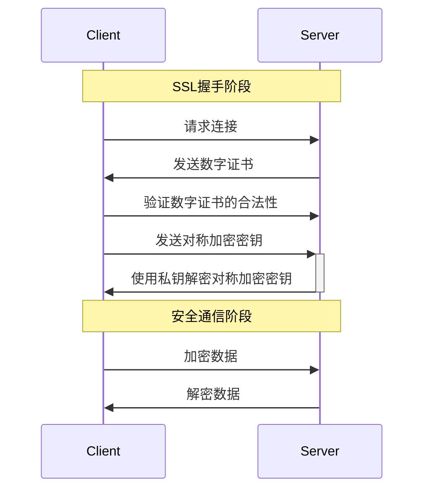

# HTTPS工作原理

HTTPS（HyperText Transfer Protocol Secure）是一种基于SSL/TLS协议的安全加密通信协议，用于保证网络通信的安全性和完整性。本文将详细介绍HTTPS的工作原理，并使用mermaid语法绘制交互时序图。

## HTTPS协议交互过程

HTTPS通信协议的交互流程如下：

1. 客户端发送连接请求。

2. 服务器发送数字证书给客户端。

3. 客户端验证数字证书的合法性。

4. 客户端生成对称加密密钥，并使用服务器的公钥进行加密后发送给服务器。

5. 服务器使用私钥解密对称加密密钥，并使用该密钥对随后的通信数据进行加密。

6. 双方开始安全通信，使用对称加密技术对通信数据进行加密和解密，以保证数据的机密性和完整性。

下面将通过mermaid语法绘制交互时序图，进一步解释HTTPS通信协议交互过程。

## 时序图

以上的时序图中，第一部分展示了HTTPS握手阶段，客户端请求连接并验证服务器发送的数字证书的合法性。在第二部分中，双方使用对称加密密钥进行安全通信，其中客户端负责加密数据，服务器则负责解密数据。

## 结论

HTTPS协议是一种基于SSL/TLS协议的加密通信协议，其工作原理包括握手阶段和安全通信阶段。在握手阶段中，客户端与服务器之间通过数字证书交换公钥，并生成对称加密密钥。在安全通信阶段中，双方使用对称加密密钥对通信数据进行加密和解密。

虽然HTTPS协议可以提供相对较高的安全级别，但仍存在着某些安全风险，如数字证书泄露、密码学算法弱化等问题。因此，在实际应用中，需要采取适当的措施来完善安全机制，以确保通信的安全性和可靠性。

## 总结

HTTPS是一种基于SSL/TLS协议的加密通信协议，用于保证网络通信的安全性和完整性。HTTPS的工作原理如下：

1. 客户端发起HTTPS请求

客户端使用HTTPS请求连接服务器时，会发送一个HTTPS请求给服务器。

2. 服务器提供SSL证书

服务器收到HTTPS请求后，会向客户端发送其数字证书，其中包含了服务器公钥、证书颁发机构、服务器名称等信息。

3. 客户端验证证书

客户端接收到服务器的数字证书后，会进行以下步骤来验证证书的合法性：

- 验证证书是否由受信任的证书颁发机构签名。
- 验证服务器名称与证书是否匹配。
- 验证证书是否已过期。

如果证书验证成功，则客户端可以开始使用证书中包含的公钥和服务器进行安全通信。

4. 建立安全连接

客户端使用服务器的公钥对随机生成的对称加密密钥进行加密，并将其发送给服务器。服务器使用私钥解密该密钥，并使用该密钥对通信数据进行加密。

此时客户端和服务器之间就建立了一个安全的加密通道，可以通过该通道进行安全的数据传输。

5. 安全通信

一旦安全连接建立，客户端和服务器就可以使用对称加密技术对通信数据进行加密和解密，以保证数据的机密性和完整性。在通信过程中，客户端和服务器还可以使用摘要算法对消息进行验证，从而保证数据的真实性和完整性。

需要注意的是，HTTPS协议是基于SSL或TLS协议的，因此它具有与这些协议相同的缺点和安全问题。例如，如果数字证书被篡改或伪造，则会导致通信的不安全性；如果密码学算法弱化或密钥管理不当，则也可能会导致加密数据泄露。因此，在使用HTTPS时，必须采取适当的安全措施来确保通信的安全性和可靠性。